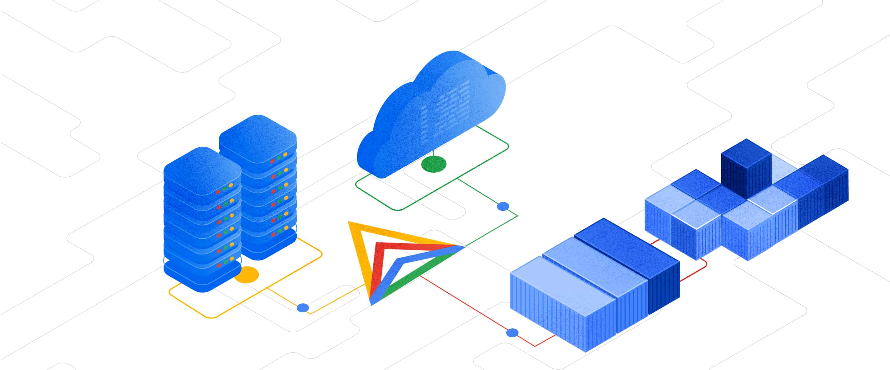
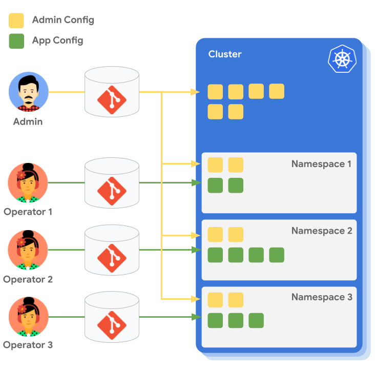

In this second installment of the Anthos series, we will talk about how we run
Anthos in [Kartverket](https://kartverket.no/en). We'll touch on the hardware,
the software, and the processes we use to keep it running.

By the end we hope that we'll have de-mystified Anthos a bit, and maybe given
you an idea of what it takes to run Anthos in production.

If you haven't read the first part, you can find it
[here](/blog/hybrid-kubernetes-in-production-part-1).

<!--truncate-->

This newsletter is the second of the three part series about Anthos in
Kartverket.

1. [Why we chose Anthos](/blog/hybrid-kubernetes-in-production-part-1)
2. How we run Anthos (You are here!)
3. Benefits and what we would have done differently (Coming soon)

## Installation and upgrades

We were some of the very early adopters of Anthos, so while doing the install we
did not have that many options for controlplane architecture. We wanted to use
existing underlying vmware infrastructure, so the nodes in our clusters are VMs,
provisioned by a script provided by Google. Our cluster is installed with
[kubeception](https://kubernetes.io/blog/2017/01/how-we-run-kubernetes-in-kubernetes-kubeception/) controlplane architechture, this
no longer the only, or recommended way. The recommended model is [Controlplane V2](https://cloud.google.com/anthos/clusters/docs/on-prem/latest/how-to/create-user-cluster-controlplane-v2),
here the controlplane nodes for the user cluster are in the user cluster itself. 

In the kubeception model, Kubernetes clusters are nested inside other Kubernetes clusters. Specifically, the control plane of the user clusters runs in the admin cluster on-premise. For each on-premise cluster created, a new set of nodes and a new control plane namespace are created on the admin cluster.

To install and make changes to the admin cluster, an admin workstation is required, which should be located in the same network as the admin cluster. All configurations are done using a CLI tool called “gkectl”. This tool handles most cluster administration tasks, and the configuration is provided with YAML files.

Our cluster setup is more or less static, and most cluster administration tasks involve upgrading or scaling existing clusters. The SKIP-Team has a cluster referred to as “sandbox”, which is always the first recipient of potentially breaking changes. After testing changes in both development and test environments, we roll out the changes to other clusters and do a production roll-out. This is mostly done outside work-hours, but we have not had downtime during cluster upgrades. Here is the general workflow for upgrading:

1. Upgrade your admin workstation to the target version of your upgrade.

2. From your admin workstation, upgrade your user clusters.

3. After all of the user clusters have been upgraded, you can upgrade your admin cluster from the admin workstation.

We have tried using [Terraform](https://www.terraform.io/) for as much of the configuration and configuration control as possible. This can not be done in the same way for clusters using the kubeception model. When we migrate to Controlplane V2 however, clusters can be managed via GCP, and we can finally start using terraform like we do for our GKE clusters, and GCP configuration in general.

Dataplane v2,
No Controlplane V2,
No Terraform

Updates, what are they like

## GCP integration

IAM / Groups / AIS

GUI screenshots

## Deployment

Deployment is a very interesting subject when it comes to Anthos. As a platform
team, it is our job to make sure that deployment is as quick and convenient as
possible for the product teams. This ambition has led us to iterate on our
processes, which has finally led us to a solution that both we and the
developers enjoy using.

### Iteration 1 - Terraform

When we first started out with Anthos, we had a very manual process for
deploying applications. A service account was provisioned in GCP, which allowed
the developers to impersonate a service account in Kubernetes, which in turn
allowed them to deploy apps using Terraform. This approach worked, but had a
decent amount of rough edges, and also would fail in ways that was hard to
debug.

With this approach the developers would have to manage their own Terraform
files, which most of the time was not within their area of expertise. And while
SKIP was able to build modules and tools to make this easier, it was still a
complex system that was hard to understand. Observability and discoverability
was also an issue.

Because of this we would consistently get feedback that this way of deploying
was too complicated and slow, in addition handling Terraform state was a pain.
As a platform team we're commited to our teams' well being, so we took this
seriously and looked at alternatives. It was around this time we adopted Anthos,
so thus Anthos Config Managment was a natural choice.

### Iteration 2 - Anthos Config Managment (ACM)

ACM is a set of tools that allows you to declaratively manage your Kubernetes
resources. Here we're mostly going to talk about Config Sync, which is a
[GitOps](https://about.gitlab.com/topics/gitops/) system for Kubernetes.

In a GitOps system, a team will have a Git repository that contains all the
Kubernetes resources that they want to deploy. This repository is then synced
to the Kubernetes cluster, and the resources are applied.

This can be likened to a pull-based system, where the GitOps tool (Config sync)
watches the repo for changes and pulls them into the cluster. This is in
contrast to a push-based system, where a script pushes the changes to a
cluster. It is therefore a dedicated system for deployment to Kubernetes, and
following the [UNIX philosophy](https://en.wikipedia.org/wiki/Unix_philosophy)
which focuses on doing that one thing well.

Using this kind of a workflow solves a lot of the issues around the terraform
based deployment that we had in the previous iteration. No longer do developers
need to set up a complicated integration with GCP service accounts and
impersonation, commiting a file to a Git repo will trigger a deployment. The
Git repo and the manifests in them also works as a state of truth for the
cluster, instead of having to reverse engineer what was deployed based on
terraform diffs and state.

It started well, however we soon ran into issues. The system would often take
a long time to reconcile the sync, and during the sync we would not have any
visibility into what was happening. This was not a deal breaker, but at the
same time this was not a particularily good developer experience.

We also ran into issues with implementing self-service. We wanted to give the
developers the ability to provision their own namespaces, but due to the
multi-tenant nature of our clusters, we also had to make sure that the teams
were not able to write to each others' namespaces. This was not a feature we
were able to implement, but luckily our next iteration had this built in, and
we'll get back to that.

The final nail was the user interface. We simply expected more from a deployment
system than what ACM was able to provide. The only view into the deployment was
a long list of resources, which to a developer that is not well versed in
Kubernetes was intuitive enough.

### Final iteration - Argo CD

This finally brought us to our current iteration. We had heard about Argo CD
before, but initially we were hesitant to add another system to our stack.
After ACM had introduced us to GitOps and we looked deeper into Argo CD, it was
obvious to us that Argo was more mature and would give our developers a better
user experience.

## Hybrid Mesh

## Monitoring

Used to use Stackdriver, now using LGTM

## Summary

_Disclaimer - Google, GKE and Anthos are trademarks of Google LLC and this website is not
endorsed by or affiliated with Google in any way._