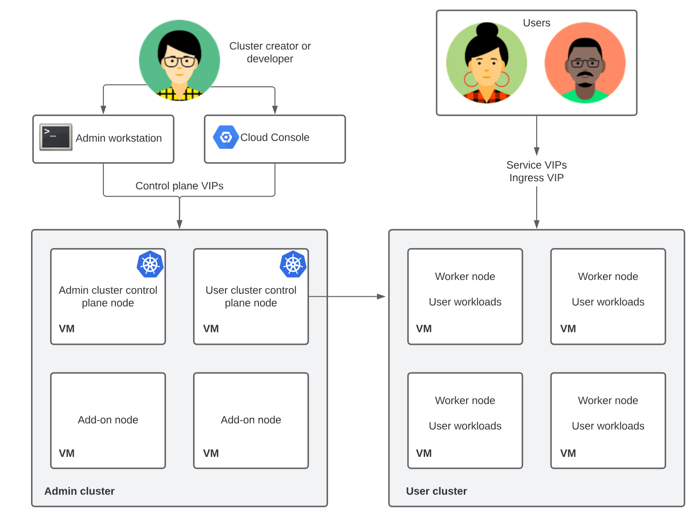
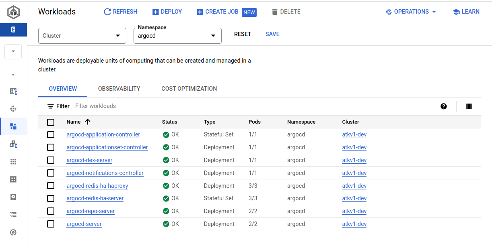
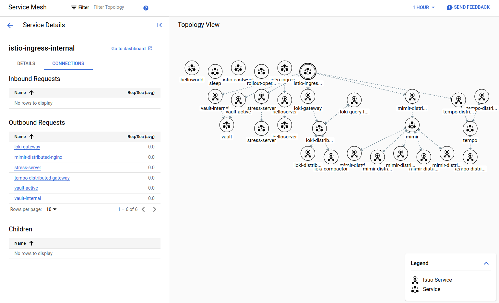
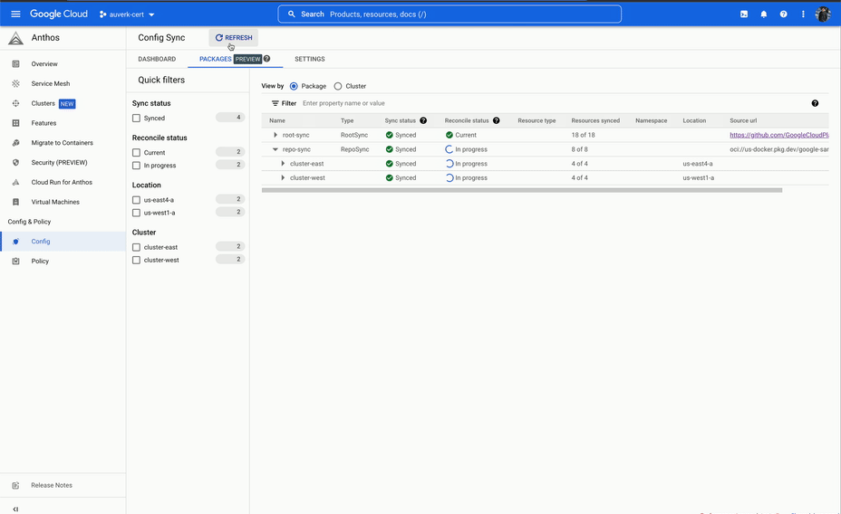
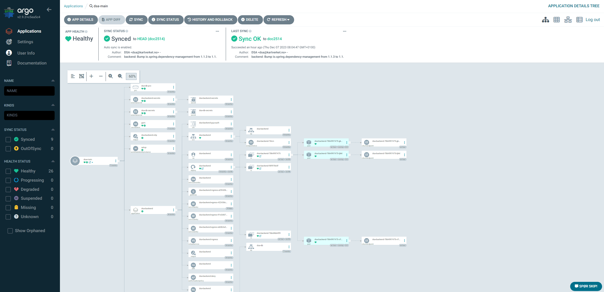
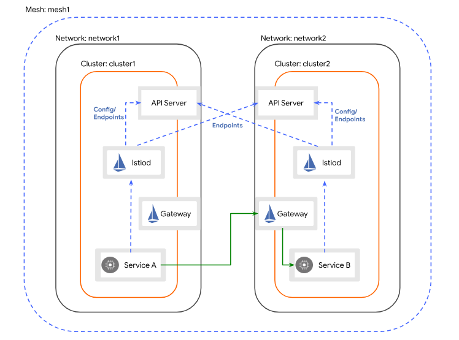
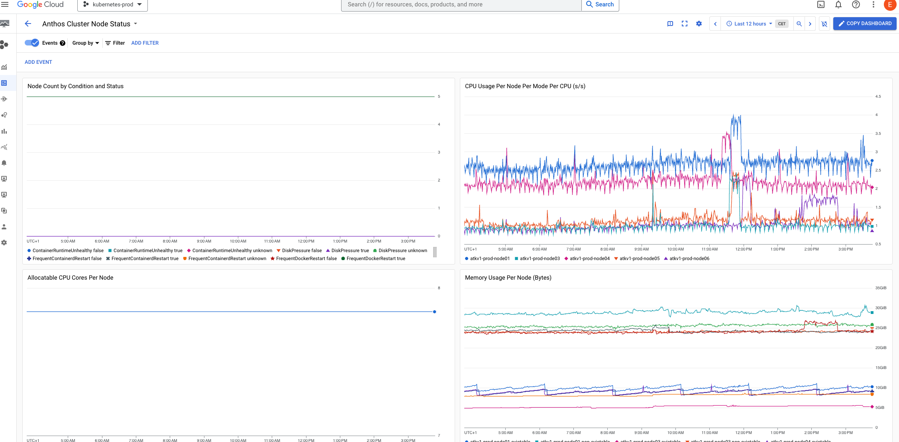

In this second installment of the Anthos series, we will talk about how we run
Anthos at [Kartverket](https://kartverket.no/en). We'll touch on the hardware,
the software, and the processes we use to keep it running.

By the end we hope that we'll have de-mystified Anthos a bit, and maybe given
you an idea of what it takes to run Anthos in production.

If you haven't read the first part, you can find it
[here](/blog/hybrid-kubernetes-in-production-part-1).

<!--truncate-->

This newsletter is the second of the three part series about Anthos in
Kartverket.

1. [Why we chose Anthos](/blog/hybrid-kubernetes-in-production-part-1)
2. How we run Anthos (You are here!)
3. Benefits and what we would have done differently (Coming soon)

## Installation and upgrades

We have been early adopters of Anthos, so when doing the install we did not have options for controlplane architecture. We wanted to use existing underlying vmware infrastructure, so the nodes in our clusters are VMs, provisioned by scripts provided by Google. Our cluster is installed with [kubeception](https://kubernetes.io/blog/2017/01/how-we-run-kubernetes-in-kubernetes-kubeception/) controlplane architechture, this no longer the only, or recommended way. The recommended model is [Controlplane V2](https://cloud.google.com/anthos/clusters/docs/on-prem/latest/how-to/create-user-cluster-controlplane-v2), where the controlplane nodes for the user cluster are in the user cluster itself. 

In the kubeception model, Kubernetes clusters are nested inside other Kubernetes clusters. Specifically, the control plane of the user clusters runs in an admin-cluster. For each on-premise cluster created, a new set of nodes and a namespace are created in the admin cluster.

To install and make changes to the admin cluster, an admin workstation is required, which must be located in the same network as the admin cluster. All configurations are done using a CLI tool called `gkectl`. This tool handles most cluster administration tasks, and the cluster specific configuration is provided in YAML files.

Our cluster setup is more or less static, and most cluster administration tasks involve upgrading or scaling existing clusters. The SKIP team has a cluster referred to as “sandbox”, which is always the first recipient of potentially breaking changes. After testing in sandbox, we'll deploy changes to both development and test environments, and if nothing breaks, we roll out the changes to our production environment. This is mostly done outside work-hours, although we have not experienced downtime during cluster upgrades. Here is the general workflow for upgrading:

1. Upgrade your admin workstation to the target version of your upgrade.

2. From your admin workstation, upgrade your user clusters.

3. After all of the user clusters have been upgraded, you can upgrade your admin cluster from the admin workstation.

We have tried using [Terraform](https://www.terraform.io/) for as much of the configuration and configuration control as possible. This can not be done in the same way for clusters using the kubeception model. When we migrate to Controlplane V2 however, clusters can be managed via GCP, and we can finally start using terraform for our on-premise cluster config in the same way as for our GKE clusters, and GCP configuration in general.

## GCP integration

When working with an on-premise Anthos cluster, some of the nice-to-have features of a standard GKE cluster have been lost. However, recently Anthos on VMware clusters have gradually received more and more features compared to GKE clusters. 

### IAM and Groups
Since we were early adaptors of Anthos, we had to endure not being able to delegate clusterroles to IAM groups, and had to add single users to clusterrole/rolebindings in Kubernetes. This was not a huge problem for us, since we were working with a very limited number of teams and devs, but it was apparent that this was not going to scale well. Luckily we got support for groups before it was a problem, and our config files went from containing way too many names and email addresses, to only containing groups.

Our Google Workspace receives groups and users from our Microsoft Active Directory. Groups are initially created either in Entra ID, or on our local Domain Controllers, and at set intervals changes are pushed to Google Workspace. [Role-based access control (RBAC)](https://en.wikipedia.org/wiki/Role-based_access_control) based on membership in these groups was needed. We wanted to manage this through Terraform, and created a repo with where we store and configure our entire IAM configuration. Since we have had growing adoption of Kubernetes and public cloud in our organization, more teams, projects and apps have been onboarded to SKIP, and this IAM repo has grown. We've tried to simplify the structure more than once, but since this is a problem not affecting dev teams, we have chosen to prioritize other tasks.

### Workloads
All clusters created in in Anthos can be viewed from the GCP console, and the [Connect gateway](https://cloud.google.com/anthos/multicluster-management/gateway/using) makes it possible to do management from the console (or via kubectl) as well. The GCP console can be used to get information about, or manage the state of the cluster, workloads and resources present. This is a web GUI, part of the GCP console, and not as snappy as cli-tools, but still usable, and intuitive to use.

This view shows workloads running in the argocd namespace. All workloads displayed here can be clicked, and explored further.

When accessing the cluster via the Connect gateway there are some limits. The Connect gateway does not handle persistent connections, and this makes it impossible to do [exec, port-forward, proxy or attach](https://cloud.google.com/anthos/multicluster-management/gateway/using#run_commands_against_the_cluster) . This is not a problem for a production environment, where containers should never be used in this way. But for a dev, or sandbox environment, this is a bit of a pain-point.

### Service Mesh
A [Service Mesh](https://istio.io/latest/about/service-mesh/) in Kubernetes is an infrastructure layer that manages communication between services. We are using Anthos Service Mesh (ASM), which is based on [Istio](https://istio.io) and nicely integrated with the GCP console. It's easy to get an overview of services, the connection between them, and what services are connected to either our internal or external gateways. This can be displayed in a Topology view, or if you click on a service, you'll get a more detailed drilldown.

A snippet of services running in our sandbox cluster.

When we deploy services to our cluster we create almost all Kubernetes and service-mesh resources with our custom operator; [Skiperator](https://github.com/kartverket/skiperator). This operator configures the resources to fit our setup, and applies "best practices" the easy way. This has been one of the great success stories in SKIP, and Skiperator is in continuous development.

## Deployment

Deployment is a very interesting subject when it comes to Anthos. As a platform
team, it is our job to make sure that deployment is as quick and convenient as
possible for the product teams. This ambition has led us to iterate on our
processes, which has finally led us to a solution that both we and the
developers enjoy using.

### Iteration 1 - Terraform

When we first started out with Anthos, we had a very manual process for
deploying applications. A service account was provisioned in GCP, which allowed
the developers to impersonate a service account in Kubernetes, which in turn
allowed them to deploy apps using Terraform. This approach worked, but had a
decent amount of rough edges, and also would fail in ways that was hard to
debug.

With this approach the developers would have to manage their own Terraform
files, which most of the time was not within their area of expertise. And while
SKIP was able to build modules and tools to make this easier, it was still a
complex system that was hard to understand. Observability and discoverability
was also an issue.

Because of this we would consistently get feedback that this way of deploying
was too complicated and slow, in addition handling Terraform state was a pain.
As a platform team we're committed to our teams' well being, so we took this
seriously and looked at alternatives. This was around the time we adopted Anthos,
so thus Anthos Config Managment was a natural choice.

### Iteration 2 - Anthos Config Managment (ACM)

ACM is a set of tools that allows you to declaratively manage your Kubernetes
resources. Here we're mostly going to talk about Config Sync, which is a
[GitOps](https://about.gitlab.com/topics/gitops/) system for Kubernetes.

In a GitOps system, a team will have a Git repository that contains all the
Kubernetes resources that they want to deploy. This repository is then synced
to the Kubernetes cluster, and the resources are applied.

This can be likened to a pull-based system, where the GitOps tool (Config sync)
watches the repo for changes and pulls them into the cluster. This is in
contrast to a push-based system, where a script pushes the changes to a
cluster. It is therefore a dedicated system for deployment to Kubernetes, and
following the [UNIX philosophy](https://en.wikipedia.org/wiki/Unix_philosophy)
which focuses on doing that one thing well.

Using this type of a workflow solves a lot of the issues around the Terraform
based deployment that we had in the previous iteration. No longer do developers
need to set up a complicated integration with GCP service accounts and
impersonation, committing a file to a Git repo will trigger a deployment. The
Git repo and the manifests in them also works as a state of truth for the
cluster, instead of having to reverse engineer what was deployed based on
terraform diffs and state.

It started well, however we soon ran into issues. The system would often take
a long time to reconcile the sync, and during the sync we would not have any
visibility into what was happening. This was not a deal breaker, but at the
same time this was not a particularly good developer experience.

We also ran into issues with implementing a level of self-service that we were
satisfied with. We wanted to give the developers the ability to provision their
own namespaces, but due to the multi-tenant nature of our clusters we also had
to make sure that teams were not able to write to each others' namespaces.
This was not a feature we were able to implement, but luckily our next iteration
had this built in, and we'll get back to that.

The final nail was the user interface. We simply expected more from a deployment
system than what ACM was able to provide. The only view into the deployment was
a long list of resources, which to a developer that is not an expert in
Kubernetes, was not intuitive enough.

### Final iteration - Argo CD

This finally brought us to our current iteration. We had heard about Argo CD
before, but initially we were hesitant to add another system to our stack.
After ACM had introduced us to GitOps and we looked deeper into Argo CD, it was
obvious to us that Argo was more mature and would give our developers a better
user experience.

The killer feature here is the UI. Argo CD has an intuitive and user-friendly
UI that gives the developers a good overview of what is deployed. Whenever
anything fails, it's immediately obvious which resource is failing, and Argo
allows you to drill down into the resource to see the details of the failure,
logs for deployments, Kubernetes events, etc.

The above photo illustrates this well. Here you can see a project with a number
of [Skiperator](https://github.com/kartverket/skiperator) applications. The
green checkmarks indicate that the application is synced and the green heart
indicates that the application is healthy. A developer can see the underlying
"owned" resources that Skiperator creates (such as a deployment, service, etc),
and get a look "behind the curtain" to see what is actually deployed. This helps
debugging and gives the developers a better insight into what is happening
during a deployment.

In terms of multi tenancy, Argo CD has a concept of projects. A project is a
set of namespaces that a team has access to, and a team can only use Argo to
sync to namespaces that are part of their project. The namespace allowlist can
also include wildcards, which sounds small but this solved our self-service
issue! With our apps-repo architecture, we would give a team a "prefix" (for
example `seeiendom-`), and that team would then be able to deploy to and create
any namespace that started with that prefix. If they tried to deploy to another
team's namespace they would be stopped, as they would not have access to that
prefix.

The prefix feature allows product teams to create a new directory in their apps
repo, which will then be synced to the cluster and deployed as a new namespace.
This is a very simple and intuitive workflow for creating short-lived
deployments, for example for pull requests, and it has been very well received
by the developers.

The apps-repo architecture will be a blog post itself at some point, so I won't
go too much into it.

And finally, if you're wondering what disaster recovery of an entire cluster
looks like with Argo CD, I leave you with the following video at the end.

<video controls width="100%" muted={true}>
  <source src="/img/argo-3.mov" type="video/mp4" />
</video>

## Hybrid Mesh
A hybrid mesh service mesh configuration is a setup that allows for service networking across different environments. For Kartverket this includes a hybrid cloud environment. The setup involves several steps, including setting up cross-cluster credentials, installing the east-west gateway, enabling endpoint discovery, and configuring certificate authorities. All clusters in a hybrid mesh are registered to the same fleet host project, and istiod in each cluster must be able to communicate with the Kube-API on the opposing clusters.

ASM is as previously mentioned based on Istio, and after some internal discussion we decided to experiment with running vanilla upstream Istio in our GKE clusters running in GCP. Pairing it with ASM in our on-premise clusters worked as expected (after a bit of config), and we are now running upstream Istio in GKE, with ASM on-prem in a multi-cluster setup. We also looked into using managed ASM in our GKE cluster, this was hard for us however, due to it requiring firewall openings on-prem for sources we could not predict.

We have chosen the [Multi-Primary on different networks](https://istio.io/latest/docs/setup/install/multicluster/multi-primary_multi-network/) after reviewing our network topology and configuration. We connect our on-premise network, with the GCP VPC through a VPN connection (using host and service projects). To have a production ready environment, the VPN connection must be configured with redundancy, and 

This is not something we are using in production yet, but this will enable us to use GKE clusters in GCP together with our on-premise clusters. The elasticity of cloud infrastructure can be utilized where needed, and we can handle communication between services on different clusters much more smoothly. This has been a bit of a journey to configure, but as a learning experience it has been valuable. Being able to address services seamlessly and communicate with mTLS enabled by default across sites, zones and clusters without developers having to think about it feels a bit like magic.

## Monitoring

### Google Cloud Monitoring

GKE Enterprise includes an agent that collects metrics from the cluster and sends
them to Google Cloud. This is a great feature which makes it relatively easy
to get started with metrics and monitoring. However, we have decided not to use
the agent, and instead use Grafana and LGTM for metrics and monitoring.

This is mainly due to a couple of challenges:

The amount of metrics that are collected out of the box and sent to GCP
contributes a significant part of our total spend. It's not that we have a lot
of clusters, but the amount of metrics that are collected out of the box is very
high, and Anthos' default setup didn't give us the control we needed to be able
to manage it in a good way. 

Note that this was before [Managed Service for
Prometheus](https://cloud.google.com/managed-prometheus?hl=en) was released with
more fine grained control over what metrics are collected. It is now the
recommended default, which should make metrics collection easier to manage.

Second, while Google Cloud Monitoring has a few nice dashboards ready for
Anthos, it feels inconsistent which dashboards work on-premise and which only
work in cloud as they are not labeled as such. This is not a big issue, but it's
a bit annoying. The bigger issue is that all the dashboards feel sluggish and
slow to load. Several of us have used Grafana before, so we're used to a
snappy and responsive UI. In our opinion, Google Cloud Monitoring feels clunky
in comparison.

So the cost and the user experience were the main reasons we decided to look at
alternatives to Google Cloud Monitoring. We ended up using Grafana and LGTM,
which we'll talk about next.

### Grafana with the LGTM stack

When we realized that our needs were not entirely met by Google Cloud Monitoring,
we started a project to develop a monitoring stack that would meet our needs.
Since Grafana is open source and has a large community, we decided to use that
as our frontend. Our backend is the LGTM stack, which is a set of open source
tools that are designed to work well together for ingesting, storing and querying
logs, traces and metrics.

What we noticed immediately was that the product teams were much more engaged
with this stack than they were with [Google Cloud
Monitoring](https://cloud.google.com/monitoring/?hl=en). Previously they would
not really look at the dashboards, but now they are using them and even creating
their own. This is a huge win for us, as we want the teams to be engaged with
the monitoring and observability of their services.

It definitely helps that most developers on the product teams are familiar with
Grafana, which makes it easier for them to get started as the learning curve is
not as steep.

There was a discussion about what the backend should be, if we should use
[Grafana Cloud](https://grafana.com/products/cloud/) or host it ourselves. There
would be a lot of benefits of using the cloud, as we would not have to maintain
the stack or worry about performance or storage. There was, however, a concern
about cost and wether or not log files could be shipped to a cloud provider. In
the end we decided to host it ourselves, mostly because we didn't have control
over what quantities of data we're processing. Now that we have a better
understanding of our usage we can use that to calculate our spend, so we're not
ruling out migrating to Grafana Cloud in the future.

The collection (scraping) of data is done by [Grafana
Agent](https://grafana.com/oss/agent/), which is an "all-in-one" agent that
collects metrics, logs and traces. This means a few less moving parts for the
stack, as we don't have to run both [Prometheus](https://prometheus.io/),
[Fluent Bit](https://fluentbit.io/) and some
[OpenTelemetry](https://opentelemetry.io/) compatible agent for traces. It's a
relatively new project, but it's already relative stable and has a lot of
features. It uses a funky format for configuration called river, which is based
on Hashicorp's HCL. The config enables forming pipelines to process data before
it's forwarded to Loki, Tempo or Mimir.  It's a bit different, but it works well
and is easy to understand and configure to our needs.

Using a system like Grafana also enables us to build an integrated experience
that also includes alerting. Using Grafana alerting and OnCall, we configure
alerts that are sent to the correct team based on the service that is failing.
This helps the teams get a better overview of what is happening in their
services, and also helps us as a platform team to not have to be involved in
every alert that is triggered.

Overall we're very happy with the LGTM stack, even though it's a fair bit of
work to maintain the stack (especially with Istio and other security measures). We're also happy with Grafana, and we're looking
forward to seeing what the future holds for monitoring and observability in
Kubernetes.

## Summary

To summarize: We like Anthos, and we think it's a great platform for running
hybrid Kubernetes. As a platform team we look at each feature on a case-by-case
basis, with the goal of giving our developers the best possible experience
instead of naively trying to use as much as possible of the platform. Because of
this we've decided to use Anthos for Kubernetes and service mesh, but not for
config sync and monitoring. This has given us a great platform that we're
confident will serve us well for years to come.

Stay tuned for the third and final part of this series, where we'll talk about
the benefits we've seen from Anthos, and what we would have done differently if
we were to start over.

_Disclaimer - Google, GKE and Anthos are trademarks of Google LLC and this website is not
endorsed by or affiliated with Google in any way._
