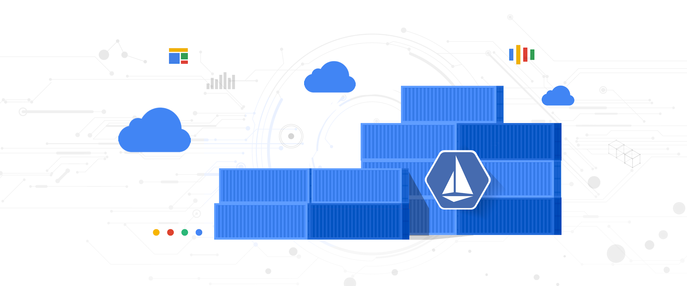
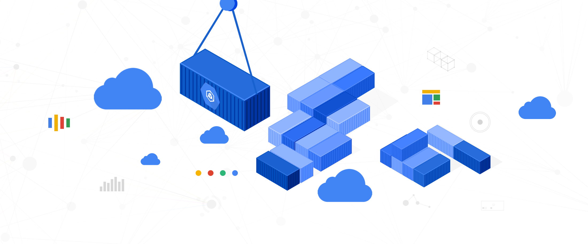

In this final installment of the Anthos series, we will talk about what we
learned on the way to building hybrid infrastructure at [Kartverket](https://kartverket.no/en). 

It's been a long journey, and there's plenty of things we've learned along the
way in building a hybrid Kubernetes platform. We'll try to share some of those
hard earned lessons in this post.

<!--truncate-->

This newsletter is the final entry of a three part series about Anthos in
Kartverket.

1. [Why we chose Anthos](/blog/hybrid-kubernetes-in-production-part-1)
2. [How we run Anthos](/blog/hybrid-kubernetes-in-production-part-2)
3. Benefits and what we would have done differently (You are here!)

## Do you really need hybrid?

When we started out, there was an assumption that it was simply impossible to
use the cloud. This came from all sides of the organization, so this was 
taken as a given. SKIP was therefore started as a project to build an on-premise
Kubernetes platform to service our needs as a transition to cloud native
development principles.

As we moved along, a lot of these assumptions got challenged. We found that
most of these assumptions were based on misunderstandings or a lack of a deeper
understanding of cloud technologies and the surrounding legal aspects. This led
to a fear of the unknown, and subsequent inaction. In the end it turned out
that quite a lot of our workloads could indeed run in the public cloud, given some
minor adjustments.

Had we started out with the knowledge we have now, we would probably have
started with a public cloud provider, and then moved to hybrid when and if
we saw a need for it. Using a cloud provider's managed Kubernetes offering
is significantly easier than running your own, and you can get started much
faster, with less risk.

Given our organization, we would probably have ended up with hybrid anyway, but
that complexity could potentially have been moved down the timeline to a point
where the platform was more mature.

Starting with hybrid is a massive undertaking, and you should have a good reason
for doing so. Do you need hybrid, or do you just need to mature your
organization? If you do, reduce the scope of the initial work to get to a
workable platform, and preferably start in the cloud, adding hybrid features
later. If you're not sure, you probably don't need hybrid.

## Hybrid gives your organization flexibility

Now that we've built a platform that seamlessly runs workloads in both public
cloud and on-premise, we have a lot of flexibility in where we run our workloads
and how we manage them. Our experience is that this makes it easier for the
organization to mature legacy workloads.

All our greenfield projects are written with cloud native principles in mind,
which makes it trivial to run them in the cloud. Legacy workloads, however, are
not so lucky. They are often written with a lot of assumptions about the
underlying infrastructure and are not cognizant of the resources they use. This
means they are a poor fit to lift and shift to the cloud, as they will often be
expensive and inefficient.

With a hybrid platform, we can use our on-premise offering as a spring board for
modernization. Product teams will start by shifting their app to our on-premise
Kubernetes platform, and then gradually modernize it to be cloud native. 
This method gives a few immediate benefits from the lift and shift like better
observability, developer experience and security features but also gives fewer of the
drawbacks, as the on-premise cloud is closer to the existing dependencies than a
public cloud. Once this is done, smaller chunks kan be rewritten as
microservices and moved to the cloud, communicating with the monolith seamlessly
over the hybrid network. This is sometimes referred to as the [strangler
application](https://microservices.io/patterns/refactoring/strangler-application.html).

This method significantly reduces the scope of refactoring, as one can focus on
gradually rewriting smaller modules instead of rewriting the entire application.

## Service mesh is hard, but maybe a necessary evil to make hybrid less painful

Oh my word how we have struggled with service mesh.

Starting from nothing with a goal of providing a secure-by-default zero-trust
network layer with observability and traffic control is quite an undertaking,
especially when you pair that with setting up a new kubernetes-based
infrastructure from scratch. Istio is famously complex, and we've had our fair
share of that.

So how do we feel about Istio? There are various opinions in the team, but if we
average them all out, we're content. It's quite complex and can be hard to
debug, but it does the job. As we've matured and gotten more experience with
Istio, we've also started to see more benefits, like extensions for [handling
OAuth2](https://www.envoyproxy.io/docs/envoy/latest/configuration/http/http_filters/oauth2_filter)
and the traffic control features for gradual rollouts which we used for
canary-testing the migration of some of our larger applications to SKIP. Not all
of these features, like EnvoyFilters, are supported by Anthos Service Mesh (ASM),
which is why we're exploring using upstream Istio instead of ASM.

One thing we quickly learned is to not let the product teams configure the
service mesh directly using service mesh resources. This is a recipe for
disaster. We tried this in the beginning, and first of all it's a huge
complexity burden for the product teams. We also started getting a lot of
weird issues when product teams would configure the mesh in ways that broke
their encapsulation. Since the service mesh is a cluster-wide feature, if one
team makes an invalid configuration, it can break other teams' workloads.
Kubernetes namespaces be damned. We've therefore moved to a model where the
platform team provides an abstraction through
[Skiperator](https://github.dev/kartverket/skiperator) which configures the
service mesh on their behalf.

Finally, I think it's prudent to ask yourself wether or not you actually need a
service mesh. If you're running a small cluster with a few services, you'll
probably be fine with using the built-in Kubernetes features like Ingress and
Network Policies. The observability features are nice, but you can get most of
them with a combination of [instrumentation and
Grafana](https://grafana.com/docs/tempo/latest/metrics-generator/service_graphs/).

If you need service mesh then limit the scope until you get comfortable with the
mesh, for example start with just mTLS and observability, and then add zero
trust networking features later.

Also keep in mind there is a lot of competition in the service mesh space, and
there are some interesting alternatives to Istio, like
[Linkerd](https://linkerd.io/) and the up-and-coming [Cilium Service
Mesh](https://cilium.io/use-cases/cluster-mesh/).

## Anthos helps you as a platform team getting started with best practices.. Even if you plan to move to open source components later

When our platform team started out a few years ago, we picked some of the
brightest cloud engineers from within the organization and combined them with
some consultants to work on the platform. Most of these engineers had some
experience working with Kubernetes and cloud, but not building something of this
scale from scratch. The first months would therefore be a learning experience for
most of the team.

I think a lot of teams will be in a similar situation, and this is where a
managed service like Anthos can be a huge help. Anthos is built with best
practices in mind, so a lot of the architecture decisions were built-in to the
installer. Choosing a managed offering, even when running on-prem has therefore
helped us deliver value to the product teams much quicker than if we had to
build everything from scratch. 

What's important to point out is that choosing something that is managed does
not rule out using open source components later. We started out using all the
parts that Anthos gave us, including service mesh, logging, monitoring and
configuration management. Managed services do come with some tradeoffs, however,
as you lose some of the finer control of the platform. As the team has matured
and gained experience, we've started to replace some of these components with
open source alternatives, which has helped us save money and gain more control
over our platform. This has the downside of having to maintain these
components ourselves, but with more experience in the team, this is a tradeoff
we feel is worth it.

Even though we're increasingly using more open source components, we don't
regret using a paid managed offering in the beginning. It helped us get started
and make the right decisions early on, and we're now in a position where we can
capitalize on that great start.

## Keep in mind autoscaling when choosing licensing models

This may be an obvious point to some of the more experienced platform engineers
out there, but it was still something that we had to learn. When we started out,
we appreciated the simplicity of SaaS products that billed per node, as it made
it easy to predict costs. We could simply look at the number of nodes we had
running and multiply that with the price per node to get a relatively accurate
estimate of what this offering would cost. This would turn out to be a double
edged sword, however.

It is safe to assume that one of the reasons people choose Kubernetes is the ability
to scale workloads easily. This could be scaling up to handle more traffic, or
scaling down to save money. This is a great feature, but as the number of workloads
grow, the provisioned nodes will start to become insufficient and new nodes will
be provisioned. With Kubernetes and Anthos on VMware this can be done
automatically, which is a fantastic feature. 

The problem arises when you scale out more nodes and have a static license that
bills per node. We've made the mistake of getting contracts with two (now just
one) SaaS providers where we order a set of nodes, let's say 10, and when
workloads scale up, we end up with more than 10 nodes. This means we're not
running that SaaS-service's agents on the new nodes, which can be anything from
inconvenient to critical, depending on the service. In the end we've had to
restrict our node scaling to avoid this issue, which goes against the whole
ethos of Kubernetes. We're also provisioning bigger nodes than we need to avoid
scaling out, which can be suboptimal.

We're now working with the vendors to get a more flexible license that bills per
node on demand, but this is something to keep in mind when choosing a SaaS
offering. Try to factor in the future scaling needs of your platform when
purchasing SaaS services.

## Summary

To summarize: We've learned a lot on our journey to building a hybrid Kubernetes
platform. Over the last few years we've iterated on our platform and learned
lots of great lessons. It's been a huge help and privilege to have the support
of our organization, especially in terms of us being allowed to fail and learn
from our mistakes. The Norwegian saying "it's never too late to turn around"
comes to mind, as we've changed course several times on our journey, sometimes
to the annoyance of our product teams who depend on a stable platform - but in
the end we've ended up with a better product - a platform we can be proud of and
that our product teams love using.

Thanks for reading this series on Anthos and hybrid Kubernetes. We hope you've
learned something from our experiences, and that our hard earned lessons can
help you on your journey to building a hybrid Kubernetes platform.

_Disclaimer - Google, GKE and Anthos are trademarks of Google LLC and this website is not
endorsed by or affiliated with Google in any way._
