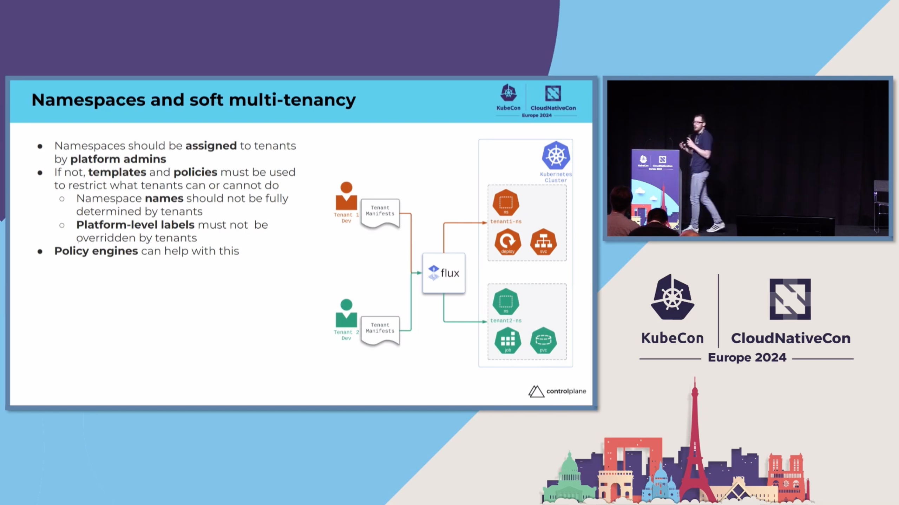

Argo CD is an awesome tool. It helps teams de-mystify the deployment process on
Kubernetes by providing a visual representation of the deployments in the
cluster, and GitOps methodologies gives a consistent and understandable
structure to your configuration files.

But what's the best way to scale when adding more teams? How can we make sure
that we're building our GitOps in a way that facilitates for self service and
security? That's what we'll discuss in this blog post.

Kartverket has been using Argo CD and GitOps for several years, and we've built
an architecture that solves our needs for scale and self-service. Here we'll
share our learnings and discuss why our teams are so happy with our Argo setup.

<!--truncate-->

## Multi-tenancy in Argo CD

So you've deployed Argo CD on your multi-tenant cluster and given your teams
access to the user interface. Let's imagine we now have tens of teams and
hundreds of applications in the Argo UI. When we start scaling out to more than
a handful of users we get into some issues with scale. Examples of these issues
can be:

- How do you organize your apps and projects?
- How do you make sure no two teams accidentally (or maliciously) use the same
  namespace?
- How can we make sure teams clean up unused deployment resources?
- How do you seamlessly deploy to multiple clusters?

As a platform team we often find ourselves thinking that everyone loves 
infrastructure and Kubernetes as much as we do. This is not the case! Most
people have not had the joy of having their childhood ruined by installing
Linux on their school laptops and configuring WLAN drivers using ndiswrapper.
Believe it or not, most people just want tools to get out of their way and let
them do their job, be that programming, testing or anything else. Not every team
is going to be experts in Kubernetes and Argo. So should we expect all teams to
know what a deletion finalizer is? What about the intricacies of serverside
apply vs. clientside apply?

It's our responsibility as a platform team to make the user experience of
deploying to Kubernetes as user friendly as possible. After implementing an
architecture built with UX in mind we've had the joy of seeing people who are
extremely skeptical of Kubernetes and the cloud be won over by how easy it is
to get your workloads running on Kubernetes. This is thanks to the consistent
user experience and built-in best practices of the apps-repo architecture.
But we're getting ahead of ourselves, first we need to talk about a few
abstractions that make this possible.

## What are ApplicationSets?

In Argo CD there's an advanced feature that allows for automating 
creation of Argo CD Applications called
[ApplicationSets](https://argo-cd.readthedocs.io/en/stable/user-guide/application-set/).
Using an ApplicationSet we can essentially make a template that generates
Argo CD applications based on files or folders in a Git repository, sort of like
a `ReplicaSet` for `Pods`. Using ApplicationSets we can build in features and
assumptions and provide the teams with a user experience that essentially boils
down to "add a file to a repo and it gets deployed to the cluster". The purest
form of GitOps. No messing around with Argo CD applications and projects.

A core Argo CD component called the ApplicationSet controller will detect any
`ApplicationSet` resources deployed to the cluster and read them. After this, it
will periodically scan the a repo configured in the `ApplicationSet` resource
and generate `Application` resources, which in turn scan a repo for manifest
files and sync them to the cluster. So in other words: `ApplicationSet` ->
`Application` -> `Deployments`

For this to work you need a Git repo containing manifest files. You could have
the teams put these manifest files into their source code repositories, but this
is [not considered best
practice](https://argo-cd.readthedocs.io/en/stable/user-guide/best_practices/#separating-config-vs-source-code-repositories).
Usually you would put your manifests into a separate repo so that changes to the
manifests don't conflict with changes in the source code. At Kartverket we call
this manifest repo an apps repo.

## Introducing apps repositories


The apps repo is where the product teams put their manifests. It has a consistent
structure and is designed to be read by an Argo CD ApplicationSet. It also has a
lot of nifty features that enable self-service which we'll get back to.

First, let's have a look at the structure of an apps repo.

```
teamname-apps/
  env/
    clustername/
      namespace/
        example.yaml
```

In the simplest of terms, this tree describes where to deploy a given manifest. By
using a directory tree it makes setting up an ApplicationSet for this repo trivial.

Consider this example ApplicationSet:

```yaml
apiVersion: argoproj.io/v1alpha1
kind: ApplicationSet
metadata:
  name: exampleteam-apps
  namespace: argocd
spec:
  generators:
    - git:
        directories:
          - path: env/*/*
        repoURL: 'https://github.com/kartverket/exampleteam-apps.git'
        revision: HEAD
  goTemplate: true
  goTemplateOptions:
    - missingkey=error
  template:
    metadata:
      name: '{{.path.basename}}'
    spec:
      destination:
        namespace: '{{ index .path.segments 2 }}'
        server: '{{ index .path.segments 1 }}'
      project: exampleteam
      source:
        path: '{{.path.path}}'
        repoURL: 'https://github.com/kartverket/exampleteam-apps.git'
        targetRevision: HEAD
      syncPolicy:
        syncOptions:
          - CreateNamespace=true
        automated:
          prune: true
          allowEmpty: true
          selfHeal: true
```

With this ApplicationSet any directory within `env/*/*` will be picked up by
the ApplicationSet controller and a new Argo CD Application will be created
based on the template in the `template` object. This enables a product team
to create any number of applications for their products.


An example use for this is a product team wanting a namespace for each of
their products. Instead of having to order a new namespace from the platform
team when they create a new product, they can simply create it themselves by
adding a new directory with the same name as the namespace they want. A new
Kubernetes namespace will be automatically created thanks to the
`CreateNamespace=true` sync option.

Ephemeral namespaces, aka. preview namespaces, is another usecase. Say a team
wants to review a change before merging it to `main`. They could review the
change in the Pull Request, but this removes us from the end user's perspective
and is not suitable for non-technical people. With a preview environment the
team will automatically create a new directory in the apps repo when a PR is
created, and thus get a complete deployment with the change in question. This
enables end-to-end testing in a browser, and also allows non-technical people
to do QA before a change is merged. When it is merged another workflow can
automatically delete the directory, which cleans up and deletes the preview
environment.

Our convention is that namespaces are formatted with `productname-branch`. This
allows teams to have multiple deploys per product, and also multiple products 
per team. So when a new PR is created all a team needs to do to automate the
creation of a new directory using CI tools like GitHub actions to create a new 
commit in the apps-repo. This also enables the flexibility to create it as a PR
in the apps-repo, but for ephemeral namespaces, this is usually not necessary.

For example:

```
footeam-apps/
  env/
    foo-cluster/
      foo-main/
        app.yaml
      foo-feature-123/
        app.yaml
```

## Automating and avoiding duplication

Depending on the complexity of the apps repo, the amount of products and branches
and a subjective "ickyness" with duplicating files (can you spell DRY?), you have
several options on how to automate creating new namespaces.

Simple repos will probably be fine with directories containing simple yaml-files
that are synced to the cluster. Newer product teams especially appreciate the
simplicity of this approach. To optimize for this you may consider using a 
`template` directory at the base containing some example files that are copied
into the sub-directories. A psuedo-coded GitHub action that uses a
`frontend.yaml` template from the templates directory could look like the
following:

```yaml
jobs:
  build:
    # Build a container image and push it

  deploy:
    strategy:
      matrix:
        env: ['dev', 'test', 'prod']
    steps:
      # .. Checkout repo & other setup ..

      - name: Deploy to ${{ matrix.version }}
        run: |
          namespace="myapp-${{ github.ref_name }}"
          path="./env/atkv3-${{ matrix.env }}/$namespace"
          mkdir -p $path
          cp -r templates/frontend.yaml $path/frontend.yaml
          kubectl patch --local \
            -f $path/frontend.yaml \
            -p '{"spec":{"image":"${{needs.build.outputs.container_image_tag}}"}}' \
            -o yaml
          git config --global user.email "github-actions@github.com"
          git config --global user.name "GitHub Actions"
          git commit -am "Deploy ${{ matrix.env }} version ${{ github.ref_name }}"
          git push
```

This works for most simple apps. Our experience, however, is that as a team
matures and gets more experienced with Kubernetes and Argo CD, they add more
complexity and want more control. At this point most teams will migrate to using
[jsonnet](https://jsonnet.org) to enable referencing and extending a reusable
library shared between multiple components. SKIP also provides some common
manifests via [ArgoKit](https://github.com/kartverket/argokit), a jsonnet
library.

[Kustomize](https://kustomize.io) is also a common choice, widely used by SKIP
for our own infrastructure, but not really widespread with other teams.

Despite Argo supporting [Helm](https://helm.sh/) we mostly avoid using it to
create reusable templates due to the complexity of templating YAML. Jsonnet is
superior in this regard.

<blockquote className="twitter-tweet"><p lang="en" dir="ltr">Fixing indentation errors in YAML templates in a Helm chart <a href="https://t.co/Dv2JUkCdiM">pic.twitter.com/Dv2JUkCdiM</a></p>&mdash; memenetes (@memenetes) <a href="https://twitter.com/memenetes/status/1600898397279502336?ref_src=twsrc%5Etfw">December 8, 2022</a></blockquote>

## Security considerations

You may be wondering: "This seems great and all, but what about the security
implications of allowing teams to create and edit namespaces in a multi-tenant
cluster? That seems really dangerous!". 

First of all, I love you for thinking about security. We need more people like
you. Second, Argo CD has some great features we can leverage to make this work
without removing the self-service nature of the apps repo architecture.

### Prefixes

In order to make this work we need to give each team a set of prefixes. A
prefix will usually be the name of a product that a product team has
responsibility for maintaining. The only important part is that it is unique
and that no other teams have been allocated the same prefix. At Kartverket
this is done by the platform team as part of the team onboarding process.

The prefix is used as part of all namespaces that are created by the teams. In
the example namespace `product-feature-123`, `product` is the prefix. By giving
each team a set of prefixes it helps them separate products into easily
identifiable namespaces and it ensures that a product team does not accidentally
use another team's namespace.

Since each product team has an apps repo with the ability to name their
directories as they wish, how can we enforce this? This is where Argo CD's
Projects come into play.

[Argo CD Projects](https://argo-cd.readthedocs.io/en/stable/user-guide/projects/)
provide a logical grouping of applications, which is useful when Argo CD is used
by multiple teams. It also contains a field that allows allowlisting which
clusters and namespaces are usable by a project.

Add the following to a Project to only allow this project to create and sync to
namespaces prefixed with `myprefix-`.

```
metadata:
  name: exampleteam
spec:
  destinations:
  - namespace: 'myprefix-*'
    server: '*'
```

If you scroll back up to the ApplicationSet example above, you will see that it
only creates applications with the project `exampleteam`. This will automatically
wire any applications created to the destination rules we've defined in this
project and therefore deny any attempts by a team to use prefixes that they have
not been allocated.

The crucial part here is that ApplicationSets and Projects are provisioned by the
platform team, and therefore build in these security features. These resources
must not be accessible to the teams, or an attacker can simply add exclusions.

### Namespace resources

Another way this could be abused is if a team is able to create Namespace
resources in their apps repository. This should be denied using Argo and/or
cluster policies.

If a team is able to create namespace resources (or other cluster scoped
resources) in their namespace an attacked can use this to break their namespace
"encapsulation". Imagine for example if one could use their apps repo to sync
a namespace resource named `kube-system` into their `env/foo-cluster/foo-main`
directory. Argo CD would allow this, as the manifests are read into an Argo CD
application. Then the attacker could delete the namespace and take down the
cluster.

[](https://www.youtube.com/watch?v=8Zwftqf8g8w)

It's useful in this multi-tenancy scenario to think of namespaces as resources
owned by the platform team and namespace-scoped resources as owned by the
product teams. This is considered a best practice, and was reiterated at [KubeCon
Europe 2024 by Marco De Benedictis](https://www.youtube.com/watch?v=8Zwftqf8g8w). 
Allowing product teams to edit namespaces can open up a ton of attack vectors,
like disabling [Pod Security
Admission](https://kubernetes.io/docs/concepts/security/pod-security-admission)
controllers, allowing an attacker to create privileged containers which can
compromise the host node. 

Friends don't let friends edit namespaces!

## Self service customization

So we set up an ApplicationSet that configures best practices and secure
defaults for product teams! Great! But now that team with experienced cloud
engineers really wants to customize their Argo configuration. Maybe they want to
configure that one app has [auto
sync](https://argo-cd.readthedocs.io/en/stable/user-guide/auto_sync/) on, but
another app has it turned off. Maybe they want to disable self-healing for a
short period to manually edit in the cluster. In any case, how can we let teams
change this configuration self-service when applications are provisioned by the
`ApplicationSet` resource?

We could let the teams edit the ApplicationSet. In our case this would mean
the teams need to learn about the ApplicationSet abstraction, gotemplate and
SKIP's internal GitOps repo structure. This is overkill when a team usually just
wants to flip a flag between true or false for a directory. There could also be
security implications with allowing teams to edit `ApplicationSet` resources
that could break encapsulation, which we want to avoid.

Another option would be to contact the platform team and tell us to change some
config for them. This is not in line with our thinking, as we want the teams to
be able to work autonomously for most operations like this. It would also mean
we were given a lot of menial tasks which would mean we have less time to do
other more meaningful things or become a bottleneck for the teams.

A third option is setting the `ApplicationSet` sync policy to `create-only`.
This would confifure the ApplicationSet controller to create Application
resources, but prevent any further modification, such as deletion, or
modification of Application fields. This would allow a team to edit the
application in the UI after creation, for example disabling auto sync. This last
option is user friendly, but in violation of GitOps principles where config
lives in git and not in a database. If you run Argo stateless like we do this
would also mean the changes disappear when the pod restarts.

Because none of these options seemed to be the best, we created a better
solution. By using a combination of generators and the new [template patch](https://argo-cd.readthedocs.io/en/stable/operator-manual/applicationset/Template/#template-patch)
feature in Argo CD 2.8 we can look through every directory in the apps repo
for a configuration file called `config.json`.

Let's look at an example `config.json` file. This example file is commited in
the apps repo to the `env/foo-cluster/foo-main` directory.

```json
{
  "tool": "kustomize",
  "autoSync": false
}
```

This file is not required, but if this file is found the values configured there
overrides a set of default values in the `ApplicationSet` template. These flags
are then used to determine how the resulting `Application` will behave. This 
means the team is able to change the values they care about per directory of
their apps repo

```
footeam-apps/
  env/
    foo-cluster/
      foo-main/
        config.json
        app.yaml
      foo-feature-123/
        config.json
        app.yaml
      foo-feature-with-default-config/
        app.yaml
```

Additionaly, since the platform team is in control of the template we can
eliminate the ability to maliciously change the template by parsing the inputs
in a secure way.

### Example ApplicationSet

Let's look at how we can write an `ApplicationSet` that allows us to use
`config.json` files.

First, we need to configure the `ApplicationSet` to look through all directories,
and at the same time use a `config.json` file if it is found. This is perhaps
the least intuitive part of this new `ApplicationSet`, so let's walk through it
step by step.

First we create a merge generator, which will merge two generators. The key
thing here is that it only merges if the `key` matches in both generators, so
this allows us to first find all directories (the default), then directories
that contain `config.json` files (the override).

```yaml
 generators:
  - merge:
      generators:
      - # default
      - # override
      mergeKeys:
      - key
```

Now we're going to add the generator from before into the default. The only
difference is we're doing this using a matrix generator. Doing this combines the
parameters generated by the two child generators, which gives us the values from
the git generator like before, but also a set of default values we can use in
our template later if the `config.json` file is not provided.

We're also using a value from the git generator to assign a `key` that will
uniquely identify this directory for the merge generator later.

```yaml
 generators:
  - merge:
      generators:
      - matrix:
          generators:
          - git:
              directories:
                - path: env/*/*
              repoURL: 'https://github.com/kartverket/exampleteam-apps.git'
              revision: HEAD
          - list:
              elements:
              - allowEmpty: false
                autoSync: true
                key: '{{ .path.basenameNormalized}}'
                prune: true
                selfHeal: true
                tool: directory
      - # override
      mergeKeys:
      - key
```

Now we use a variant of the git generator to find all `config.json` files in
the same repo and extract the values from it. Again we're using the key field
to uniquely identify this directory so that it will be merged with the correct
directory in the merge generator.

We're repeating the default values here as well, since not all fields are
required and we don't want them to be overwritten as null in the resulting
merge.

```yaml
 generators:
  - merge:
      generators:
      - matrix:
          generators:
          - git:
              directories:
                - path: env/*/*
              repoURL: 'https://github.com/kartverket/exampleteam-apps.git'
              revision: HEAD
          - list:
              elements:
              - allowEmpty: false
                autoSync: true
                key: '{{ .path.basenameNormalized}}'
                prune: true
                selfHeal: true
                tool: directory
      - matrix:
          generators:
          - git:
              directories:
              - path: env/*/*/config.json
              repoURL: 'https://github.com/kartverket/exampleteam-apps.git'
              revision: HEAD
          - list:
              elements:
              - allowEmpty: false
                autoSync: true
                key: '{{ .path.basenameNormalized}}'
                prune: true
                selfHeal: true
                tool: directory
      mergeKeys:
      - key
```

That's it for the generator! Now we can use these variables in the 
`templatePatch` field (and other fields). In this case we want to set syncPolicy
options, so we need to use the `templatePatch`, as gotemplates don't work for
objects.

We're also adding a special case where for `directory` sources (the default) we
exclude `config.json` files, as we don't want to sync the config file with Argo.
This allows us to extend it later to add options for other tools like Kustomize
or Helm.

Keep in mind that we don't want users to inject maliciously formed patches, so
we cast booleans to booleans. 

```yaml
  templatePatch: |
    spec:
      source:
        directory:
      {{- if eq .tool "directory" }}
          exclude: config.json
      {{- end }}
    {{- if .autoSync }}
      syncPolicy:
        automated:
          allowEmpty: {{ .allowEmpty | toJson }}
          prune: {{ .prune | toJson }}
          selfHeal: {{ .selfHeal | toJson }}
    {{- end }}
```

## Complete ApplicationSet

Here is a complete `ApplicationSet` containing all the features we've discussed
so far.

```yaml
apiVersion: argoproj.io/v1alpha1
kind: ApplicationSet
metadata:
  name: exampleteam-apps
  namespace: argocd
spec:
  generators:
  - merge:
      generators:
      - matrix:
          generators:
          - git:
              directories:
                - path: env/*/*
              repoURL: 'https://github.com/kartverket/exampleteam-apps.git'
              revision: HEAD
          - list:
              elements:
              - allowEmpty: false
                autoSync: true
                key: '{{ .path.basenameNormalized}}'
                prune: true
                selfHeal: true
                tool: directory
      - matrix:
          generators:
          - git:
              directories:
              - path: env/*/*/config.json
              repoURL: https://github.com/kartverket/exampleteam-apps.git
              revision: HEAD
          - list:
              elements:
              - allowEmpty: false
                autoSync: true
                key: '{{ .path.basenameNormalized}}'
                prune: true
                selfHeal: true
                tool: directory
      mergeKeys:
      - key
  goTemplate: true
  goTemplateOptions:
  - missingkey=error
  template:
    metadata:
      name: '{{.path.basenameNormalized}}'
    spec:
      destination:
        namespace: '{{ index .path.segments 2 }}'
        server: '{{ index .path.segments 1 }}'
      project: exampleteam
      source:
        path: '{{.path.path}}'
        repoURL: 'https://github.com/kartverket/exampleteam-apps.git'
        targetRevision: HEAD
      syncPolicy:
        managedNamespaceMetadata:
          labels:
            app.kubernetes.io/managed-by: argocd
            pod-security.kubernetes.io/audit: restricted
            team: exampleteam
        syncOptions:
        - CreateNamespace=true
        - ServerSideApply=true
        - PrunePropagationPolicy=background
  templatePatch: |
    spec:
      source:
        directory:
      {{- if eq .tool "directory" }}
          exclude: config.json
      {{- end }}
    {{- if .autoSync }}
      syncPolicy:
        automated:
          allowEmpty: {{ .allowEmpty | toJson }}
          prune: {{ .prune | toJson }}
          selfHeal: {{ .selfHeal | toJson }}
    {{- end }}
```


## Results

With Argo CD and the apps repo architecture, we've seen some real improvements
in our deploy system. Teams find it to be incredibly intuitive to just update a
file in Git and have it be instantly reflected in Argo CD and Kubernetes,
especially when combined with Argo CD auto-sync.

Onboarding new teams is quick and easy, since just putting files into a Git repo
is something most developers are already familiar with. We just show them the
structure of the apps repo and they're good to go. A team can go from not having
any experience with Kubernetes to deploying their first application in a matter
of minutes.

Migrating from one cluster to another is also a breeze. Just move manifests from
one directory under `env` to another, and the ApplicationSet will take care of
the rest. This is especially useful for teams that want to start developing with
new cloud native principles on-premises, modernizing the application and
eventually moving to the cloud.

I feel the key part of this architecture is the `config.json` file. It allows
a degree of customization that is not possible with the default `ApplicationSet`
template and was to us the last missing piece. It allows teams to change
configuration without needing to know about the `ApplicationSet` abstraction,
and it allows the platform team to enforce security and best practices.

### Tradeoffs

But of course, there are some drawbacks. Like always, it's tradeoffs all the
way down. 

Since a product team uses an apps repo to organize their apps, moving apps
from one team to another will require migrating files from one repo to another.
This will require some manual work to prevent Argo deleting the entire namespace
when the directory is removed from the old repo. Usually this is not a big
issue, and moving projects between teams happens very rarely, but it's something
to keep in mind.

There is also a risk that a team could accidentally delete a namespace by
removing a directory in the apps repo. We have mitigated this by disabling
auto-sync for most mission critical applications in production.

And finally, projects that don't have clear ownership or shared ownership can
be tricky to place into a repo. You could make an apps repo for a "psuedo-team"
consisting of the teams that need access, but generally we find that it's better
that all products have a clear singular main owner. This also prevents 
[diffusion of responsibility](https://en.wikipedia.org/wiki/Diffusion_of_responsibility).

## Thank you for reading!

We hope you found this article helpful and informative. Getting into
`ApplicationSets` can be a bit tricky, so we hope we managed to convey the most
important parts in a clear and understandable way. Thanks for reading!

We recently created a Mastodon account [@kv_plattform](https://mastodon.social/@kv_plattform)!
If you want to contact us or discuss this article, feel free to reach out to us
there.
