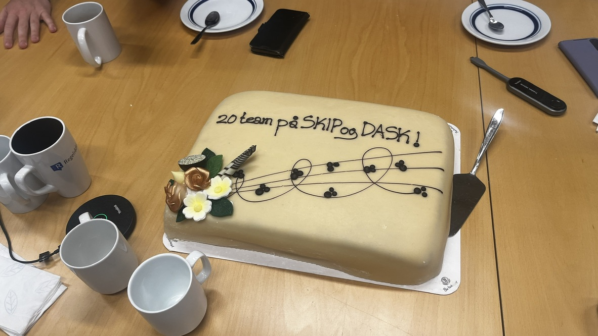
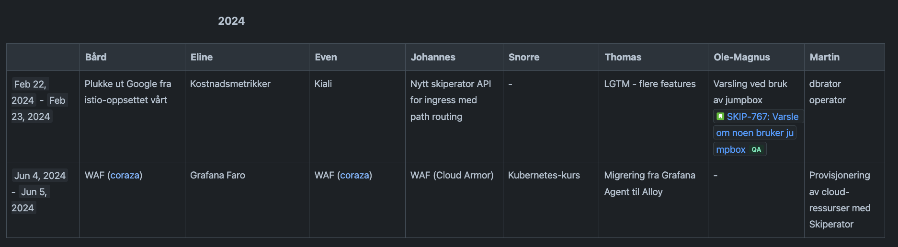
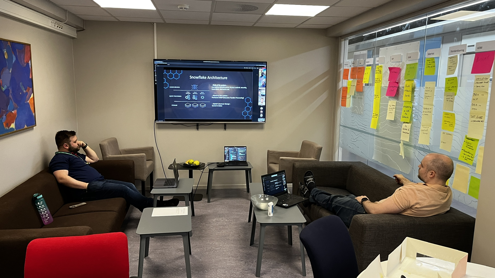
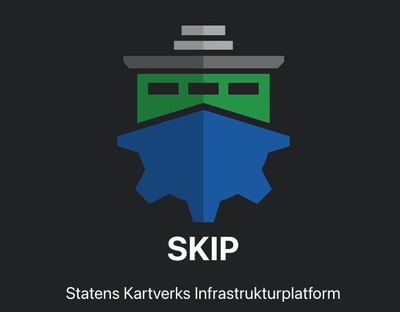

We recently passed an important milestone, onboarding our 20th team on
Kartverket's platform. Since we started a few years ago we've been working hard
to build a platform that drives positive change in Kartverket, and we're proud
of the results we've got. Our research shows that users are happy with the
technology and support they get, and that they're able to deliver faster and
more securely than before.

Building a platform is not easy, and it requires re-thinking a lot of assumptions
held in your organization. It's therefore easy to lose your way and to end up
with something that doesn't deliver on the high standards you've set for
your organization. Like everyone that starts with something new we've made
mistakes along the way, we've had to change course multiple times and most
importantly we've learned a lot in our journey.

On the occasion of this achievement we're going to look back at the decisions we
made that led us to building a successful platform. In this tech blog we are
showcasing the the secrets to our success - the decisions that have had the
biggest impact.

<!--truncate-->

## Principles matter

When you set out to create something new, you have the privilege of setting
some standards that encourage best practices. While this is possible to do for
an existing system, in practice it will mean a lot of work to get to the
point where you're able to enforce these standards. It's much easier to start
with a clean slate.

For our platform, we decided on a set of principles that we wanted to follow.
Some of these are:

- **Stateless**: Our clusters are stateless, which means that we can easily
  replace them if something goes wrong. All configuration is held in a GitOps
  repository and all state is held in external systems like managed databases,
  object storage, etc. This significantly reduces operational complexity, as
  means that when a cluster goes down we can easily replace or revert it by
  applying the configuration from the GitOps repository without worrying about
  losing state.
- **Ownership**: For each application, there is a clear owner. This owner is
  responsible for the application and maintains and supports it.  This way we're
  able to avoid the "tragedy of the commons", where no one is responsible for
  an application. If an app has unclear or short-term ownership, you simply
  don't get to use the platform. We're not an orphanage.
- **Financing**: You use the platform? You also pay for its continued support
  and development. While we currently we don't have a full chargeback model we
  have a "fair" model where your department is expected to pitch in a certain
  amount of money to the platform. This is a way to ensure that the platform is
  sustainable.
- **Secure by default**: We enforce security best practices by default. Examples
  of this are zero trust networking with Network Policies, where no app can talk
  to another without explicitly allowing this. Some applications will need to opt
  out of some of these defaults, and they can do so by altering their
  configuration. But the defaults are secure, which is especially useful for
  teams that are new to Kubernetes.
  
All teams that are onboarded on SKIP are given an introduction to these
principles and are expected to follow them. This means that being able to use
the modern platform is contingent on the teams being able to prioritize
modernizing their applications and working in sustainable ways, which helps push
for positive change.

## Encourage collaboration

It's easy for a product team to ask the platform team for help when they're
stuck. We're always happy to help, but we also have a heavy workload of exciting
things we're working on. Therefore it's much better when platform users can help
each other, as this facilitates collaboration and learning. This is why we
highly encourage teams to help each other out - to build a community around the
platform.

In practice this is done through a single Slack channel where all teams that are
using the platform are invited. This is a great place to ask questions, share
experiences, and learn from each other - and it's a place where all new features
and changes are announced. We used to have many different channels for different
teams, but we found that this was not as effective for building a community as
a channel where everyone can help each other out.

And a final tip: As a platform developer, sometimes it's better to wait a little
while before responding to questions in these channels to allow the community to
help each other out before you jump in and help.

## Make time for innovation

It's easy to get bogged down in the day-to-day work of keeping the platform
running. This is why it's important to set aside time for innovation, this
is something we take very seriously. 

On SKIP we have dedicated innovation days where we work on new features,
improvements, and other things that we think will make the platform better. This
is an extraordinarily successful initiative, and we've seen many great features
come out of these days. It's also a great way to build team morale and to build
a culture of learning and innovation.

In practice we have two days in a row of dedicated innovation work every other
month. We used to have one day every month, but we found that this was not
enough time to really get into the flow of things so we started running double
days every 2 months, which worked better. We also have a rule that you can't
work on anything that's on the roadmap, as this is work that we're already going
to do. This is a great way to get new ideas and to work on things that might not
otherwise get done.



There's a little bit of structure around these days, but not too much. 

First, it is understood by everyone that these days are for things that are
"useful for Kartverket". This means that you can't work on your own pet project,
but it's vague enough that you can work on pretty much anything that you think
will be useful for the organization. 

Then, a week before the innovation day we will have a "pitching session", where
everyone who has an idea can pitch it to the rest of the team. This is a great
way to get feedback on your idea and to get others to join you in working on it.

Finally, we have a "show and tell" session at the end of the last day where
everyone shows what they've been working on. This way we can share our
experiences and discuss if this work can be improved and put into production.
We encourage everyone to show something, even if it's not finished or you did
video lessons, as this creates discussion and further ideas.



There's plenty of examples of features that are results of work done on these
days. On-premise Web Application Firewall with Wasm, Grafana features, open
source tools like [Skiperator](https://github.com/kartverket/skiperator) and
[Skyline](https://github.com/kartverket/skyline) as well as this very website!

No one has time to prioritize innovation, and we're no different. But we
prioritize it anyway, because we know that it's important to keep improving and
to keep learning.

## Communication is key


Unfortunately a lot of infrastructure teams don't prioritize communication very
well. This is a mistake. Communication is key to building a successful platform.

Your users exist in the context of all the platform features that you have
shipped and the changes you will ship in the future. Not informing them and
keeping them up to date with what's going on is a surefire way to lose their
trust and to make them unhappy.

It starts with simply informing users of the new things that ship. This can be
done through a Slack channel, a newsletter, a blog or a town hall meeting. We
use a combination of all of these, but the most important thing is that you
inform your users of what's coming. An added benefit of this is helps push
adoption of new features and excitement around the platform by showcasing
innovation.

The next step is informing users on what will ship when. This will help users
plan their work and to know what to expect, but it also helps users feel
involved when they see their requests being planned. This can be done through a
roadmap, a technical forum, or a blog. We use a combination of all of these, but
the easiest way to do this is to have a roadmap that you keep up to date on a
regular basis.

Now for the hard part: When things go wrong, you need to communicate this as
well. Product teams will want to know when their applications are affected by
outages or other issues, and they will want to know what you're doing to fix it.
This can be done through a status page, a Slack channel, or postmortems. Again,
we use a blend of these so that we can reach as many users as possible at the
right time.

Do these things and you will have happy users that feel informed.

## Branding is important



Do you think Spotify would be as successful if it was called "Music Player"? 
Do you think Apple would be as successful if it was called "Computer Company"?
Of course not. Branding is important. It builds a sense of identity and
community around your platform.

This is especially important for a platform team, as you're not just building a
product, you're building a community. You want your users to feel like they're
part of something bigger, and you want them to feel excited to use the platform.

When you're starting out, you want to drive adoption. Here a brand really helps
as it's easier to talk about a good brand in a positive way. It's also easier to
get leadership buy-in when you have a strong brand.

This holds true when you're more established as well. When you grow larger than
your ability to talk to everyone, a brand helps you communicate your values and
intent to your users, which will drive organic growth from teams that want to
work with you.

A minimum viable brand is a logo, a name, and a color scheme. This is something
you should think deeply about, as it's something that will stick with you for a
long time. After this you can think about a website, merchandise like stickers
and t-shirts, and a mascot. These things are not necessary, but they can help
build a sense of identity and community around your platform.

## Using the cloud is a long journey

As a platform team, it's our responsibility to push for modern, user-friendly
and secure solutions. This generally means using public cloud solutions like
Google Cloud Platform. But for most organizations, pushing this narrative incurs
significant friction and to some extent fear due to legal and cost concerns.
This is understandable, as the known is always more comfortable than the
unknown, and it's a view that's hard to change.

This is why it's important to take a long-term view on this. You're not going to
move everything to the cloud overnight, and you're not going to convince
everyone to get on board with this idea overnight. It's a long journey, and you
need to be patient and persistent. 

We've spent years pushing for the cloud, and we're still not there. You're going
to sit in meetings until you're blue in the face, and you're going to have to
fight for every little thing over and over again. But it's necessary. Once 
everyone has a clear understanding of the risks and how to mitigate them, you
will be able to formulate a document guiding the organization's teams on how to
get to the cloud from a compliance point of view.

If I have any recommendations on how to get to the cloud as easily as possible,
it would be to first get leadership buy-in. This is the most important thing, as
it will make the next steps easier. After you've done this and got a competent
platform team in place, you can start pushing for the cloud. Here you need to
talk directly with the legal team, not via other people. Have representatives of
the platform team sit down with the lawyers and talk through the risks and how
to mitigate them.  This is the only way you can combine the technical and legal
aspects of this work. Working in silos and not talking to each other is a
surefire way to fail.

## Autonomy and platform as a product

Your platform is a product, and so you need to work as a product team. This
means continuously improving your product, listening to your users, and building
the features that they need.

Research-based literature like "Team Topologies" establishes the importance of
autonomous teams in modern organizations. Traditional top-down organizations are
just not going to be able to have as close of a relationship with their
stakeholders as a team that is able to proactively understand the needs of their
users and make their own decisions that push continuous improvement of their
products. This is why it's important, even for infrastructure teams, to be able
to own their roadmap and make decisions on what to build when.

Stakeholder management is key here. You need to be able to understand the needs
of your stakeholders and to be able to prioritize these needs. Ensure you are
empowered to be able to say "no" to requests. As an autonomous team, you should
have done the research to know the needs of your users better than anyone, and
sometimes requests don't align well with that. Just because someone asks loudly
for something, doesn't mean it's the right fit for your platform. Dare to
challenge assumptions and ask why.

## Abstractions save time

It should go without saying that a platform team's job is to make tools that
make product teams' jobs easier. But it really can't be said enough. The more
good tooling you create, the less you have to do support. This is a win-win for
everyone.

When building tools, think about how you can abstract away complexity. This can
be done in many ways, but we've had great success building an operator that
abstracts away the complexity of managing applications on Kubernetes. The
operator is called [Skiperator](https://github.com/kartverket/skiperator) and
makes deploying applications on Kubernetes as easy as writing a configuration
manifest.

```yaml
apiVersion: skiperator.kartverket.no/v1alpha1
kind: Application
metadata:
  namespace: sample
  name: sample-two
spec:
  image: nginxinc/nginx-unprivileged
  port: 80
  replicas: 2
  ingresses:
    - foo.com
    - bar.com
```

The key takeaway here is that abstractions like Skiperator are designed to speak
the language of the user. There is no mention of NetworkPolicies or Istio
VirtualServices in the configuration, as these are things that the user
generally doesn't have any knowledge of. Instead, the user can specify things
like "I want to expose this service to the internet" or "I want to run this job
every day at midnight". This simplifies the user experience of Kubernetes, which
is a complex system, and makes it easier for users to get started.

Work smarter not harder.

## Build forward- and backwards compatibility

We've had multiple experiences where we've weighed our options and decided to
make a breaking change. Just recently we asked our users to migrate their apps
from one cluster to another in order to improve the architecture of the
platform. Multiple options were considered, but in the end the scale of the
changes meant that upgrading the clusters in-place would not be practical, so
we commissioned new clusters with the new architecture and asked users to
migrate their apps.

In our case, we had a simple way to migrate, only requiring moving a config file
from one directory to another to make the change. But even so, this was a time
consuming process for our users, and a laborious process for us to support.
This is because even though the change was simple, it was still a change that
required testing and validation, and it was a change that was not necessarily
the highest priority for the teams that were asked to make it. So even though
the change was simple, it took months.

If you ask your users to make changes to their applications, you're asking a
team that is already busy to do more work. Any changes you ask them to make
will take time, as it would not necessarily be the highest priority for them.
Therefore avoiding breaking changes should be a primary goal, so wherever
possible building in forward and backwards compatibility by inferring as much as
possible from the existing configuration is a good thing.

When building operators, don't change or remove fields that are in use. Use 
default values for new fields, and use lists of objects instead of raw values
like lists of strings as they are easier to extend.

## Documentation is key

One thing we keep hearing from our users is the need for more and better
documentation. This is understandable. When you're using a platform, you don't
want to have to ask for help all the time - you want to be able to discover
platform features and implement them yourself with the support of good
documentation.

The point here is that as a platform team you need to prioritize documentation.
A task is not done until it has been documented. This way announcing new
features will always include a link to the documentation where users can dive
deeper into the feature and how to use it, like the example below.


The bigger challenge here is preventing documentation from going stale. It's
too easy to forget about updating documentation to reflect changes in the
code. Here we can share a few tips from our experience:

First, the obvious way to keep docs up to date is to allocate time to update
them. One way we do this is that a few times a year we will do a documentation
grooming session where we huddle together and review documentation, rewriting it
when we find out of date information.

A more interesting way to keep docs up to date is changing how you respond to a
questions. Instead of answering questions immediately, we should be asking
ourselves: "How can we make sure that this question never gets asked again?". In
our case we spend some time to write documentation or improve existing
documentation and reply with a link to the documentation page. This is a triple
win, as you will now have more updated documentation, save time in the future by
being able to refer to the improved docs instead of writing a lengthy response
and the user will now know where to look for answers.

## Learn from others

When building a platform you'll quickly learn that you don't have all the
answers. You might discuss how to implement a feature with your team, but you
might not have the experience to know what works well in this context. When you
get into this situation, an outside perspective can be crucial to avoid making
costly mistakes.

One great advantage of working in the public sector is that we can ask other
public sector platform teams for advice and learn from their experiences. We can
also share our experiences with others, which is usually interesting. Invest
some time in building these relationships of mutual benefit.


I also want to give special credit to Hans Kristian Flaatten and the [Public
PaaS](https://offentlig-paas.no/) network here. Having a shared forum to discuss
platform issues is a strong asset and helps the Norwegian public sector get
ahead and stay competitive.

Even if you work in the private sector, you can still learn from other
organizations. Honestly, if you want to learn from someone's experiences it
never hurts to ask. Teams generally want to help each other out, and it's
usually possible to make a trade of some sort. I suggest to offer to give a talk
on your experiences and ask if they can do the same. It's a win-win for both
parties.

## Conclusion

You may think building a platform is mostly technology, and we've written a lot
about technology in [previous blog
posts](/blog/hybrid-kubernetes-in-production-part-1). But it's important to
remember that building a platform is also about building a community, and
communities have expectations and needs that go beyond technology. This is a
strength, and not a weakness, as if you're able to inspire and motivate your
users you will be able to build a platform that is sustainable and that drives
positive change in your organization.

Best of luck in your endeavors!
