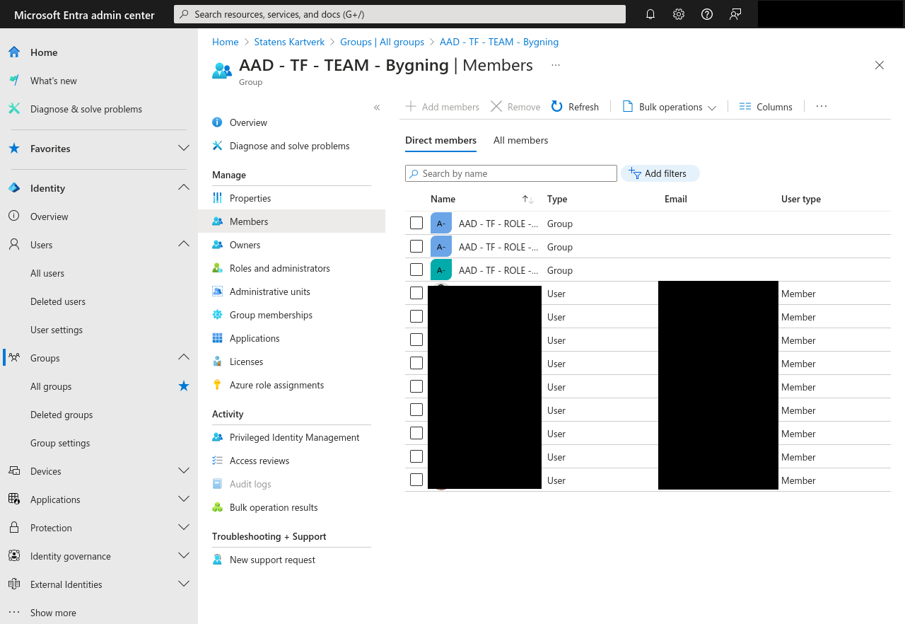

# Konfigurering av Entra ID grupper

## Legge til eller fjerne personer fra et team

Det vil ofte forekomme tilfeller hvor personer går inn eller ut av et produktteam. Dette kan for eksempel være om man har fått en nyansatt som skal inn eller en konsulent som har
skiftet over til et annet team. I disse tilfellene har man tradisjonelt vært avhengig av at dette håndteres som en bestilling og derfor er en tidkrevende prosess å gi nye
teammedlemmer tilganger, noe som fører til treghet i onboarding.

På SKIP har vi delegert tilganger til team lead på hvert team slik at disse personene kan administrere sine grupper i Entra ID. Disse gruppene er de som brukes for å gi tilgang til
tjenester på SKIP slik at et medlem av disse gruppene automatisk får tilgang til SKIP-tjenester som Google Cloud og Kubernetes. Med andre ord er det produktteamene sitt ansvar å
holde sine team oppdatert, og av sikkerhetsmessige hensyn forventes det at dette gjøres. Det kan bli utført kontroll av dette i ettertid, så det forventes at team på SKIP har
rutiner og sjekklister for offboarding av teammedlemmer.

For å legge til eller fjerne et teammedlem må team leaden på teamet (eller personen som har fått team lead ansvar) gå til
[Entra ID](https://entra.microsoft.com/#view/Microsoft_AAD_IAM/GroupsManagementMenuBlade/~/AllGroups/menuId/AllGroups) . Her finner man sin gruppe ved å søke etter
`TF - AAD - TEAM - mitt_teamnavn` (bytt ut mitt_teamnavn med ditt teamnavn). Klikk deg inn på dette og du vil finne **Members** i sidemenyen til venstre. Etter du har klikket deg
inn der bør du se et skjermbilde som ligner på det over. Her ser du alle som ligger i team-gruppen deres og i kraft av det har fått tilganger til det en person på deres team skal ha.

Du vil også se at det ligger tre grupper øverst i denne listen. Dette er grupper for personer med henholdsvis produkteier-, team lead- og tech lead-ansvar. Disse skal ligge der og
det forventes også at dere fyller ut disse med de enkeltpersonene som skal ha disse ansvarsområdene.

Dersom du er logget inn som team lead vil **Add members**-knappen øverst være mulig å klikke på. Dersom du vil legge til et nytt teammedlem klikker du på denne og søker opp den
personen du ønsker å legge til. Etter dette bekreftes vil denne personen legges i gruppen og etter litt tid få de tilgangene som forventes. Team lead må også legge til seg selv som
 medlem for å tilgang til SKIPs tjenester.

For å fjerne (offboarde) et teammedlem krysser du av i firkanten ved siden av bildet på brukeren og klikker **Remove**. Dette er også noe som kun team lead kan gjøre.

## Endre team lead
Endring av team lead kan kun gjøres i [entra-id-config repoet](github.com/kartverket/entra-id-config), dersom du prøver å endre på team lead eller owners i Entra ID portalen, så vil dette bli overskrevet.   
For å endre team lead så må du finne teamet ditt i [org.yaml](https://github.com/kartverket/entra-id-config/blob/main/org.yaml), endre på `team_lead` variabelen, og lage en pull request.
