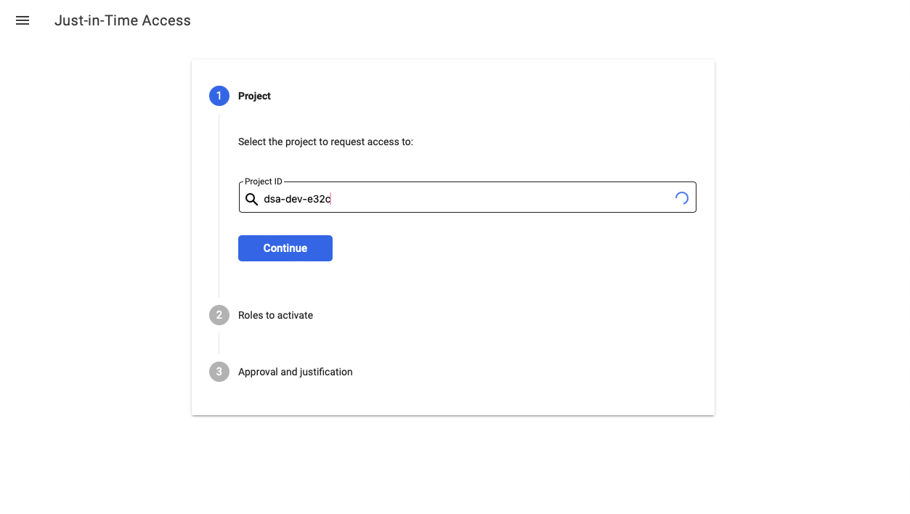
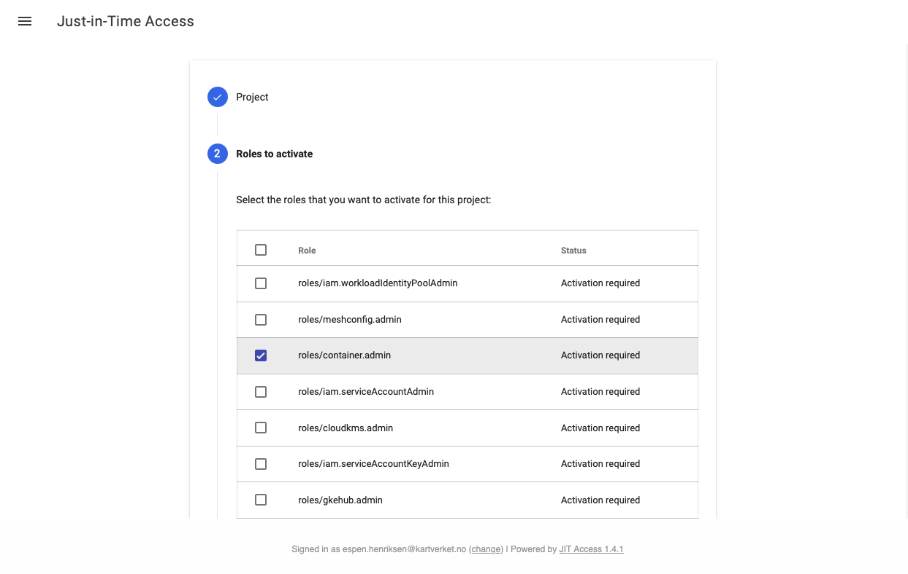
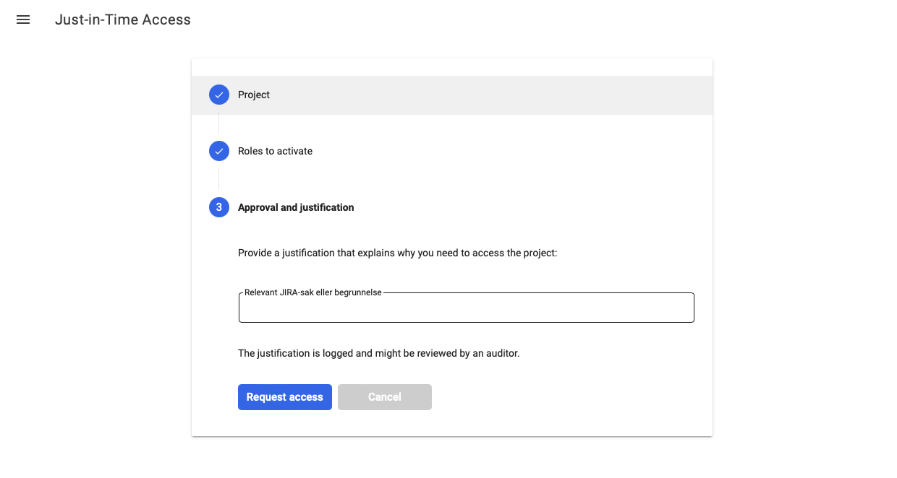
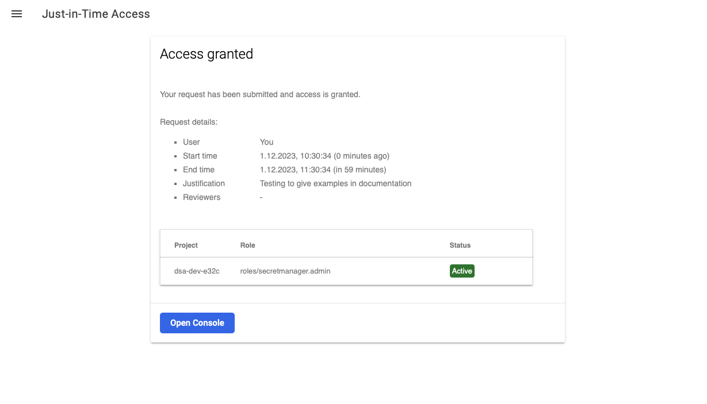

# Dynamisk tilgangskontroll (JIT)
:::note
Privileged Access Manager (PAM) er vår nyeste og anbefalte metode for midlertidig rettighetseskalering (privilege elevation).
Se [PAM guide](./09-pam-google-cloud.md).
:::
De fleste utviklere vil på et tidspunkt oppleve å ikke ha de riktige tilgangene for å bruke Google Cloud-ressurser. Dette er tilsiktet og er en del av [principle of least privilege](https://owasp.org/www-community/controls/Least_Privilege_Principle).

For å kunne bruke ressursene du ønsker tilgang til, må du eskalere privilegiene dine. Det finnes et system for å gjøre denne operasjonen som selvbetjening, og det kalles Just-In-Time access. Det er tilgjengelig på [https://jit.skip.kartverket.no](https://jit.skip.kartverket.no/).

Etter at du har logget inn med din Google-konto i Kartverket, vil du komme til skjermbildet under.

Første steg er å fylle inn ID-en til prosjektet du ønsker tilgang til. Denne kan finnes ved å søke i boksen eller ved å finne ID-en fra [console.cloud.google.com](http://console.cloud.google.com/).

Andre steg er å velge rollene du ønsker. Det er ofte mulig å se hvilken rolle du trenger fra feilmeldingen du fikk da du prøvde å utføre en operasjon og ble nektet tilgang.

En vanlig rolle som brukes for å administrere secrets i Google Secret Manager er `secretmanager.admin`.

Velg en passende varighet ved å bruke glidebryteren og klikk fortsett. Merk at enkelte sensitive roller ikke er kompatible med lengre varighet.

Til slutt, skriv inn en begrunnelse for tilgangsforespørselen. Dette er hovedsakelig for revisjon (auditing), da forespørsler generelt sett innvilges automatisk. Begrunnelsen som legges inn vil være mulig å se i logs dersom vi må undersøke et sikkerhetsbrudd (security breach).

I sjeldnere tilfeller, for eksempel når begrensede roller skal tildeles, kreves en manuell godkjenning. I slike tilfeller vil begrunnelsen være synlig for personen som godkjenner forespørselen.

Når du klikker på "Request Access", vil du bli tatt til et oppsummeringsskjermbilde som gir deg resultatet av forespørselen din. I eksempelet over ble forespørselen min automatisk godkjent.

Du har nå tilgang, og det "Just-In-Time"!
