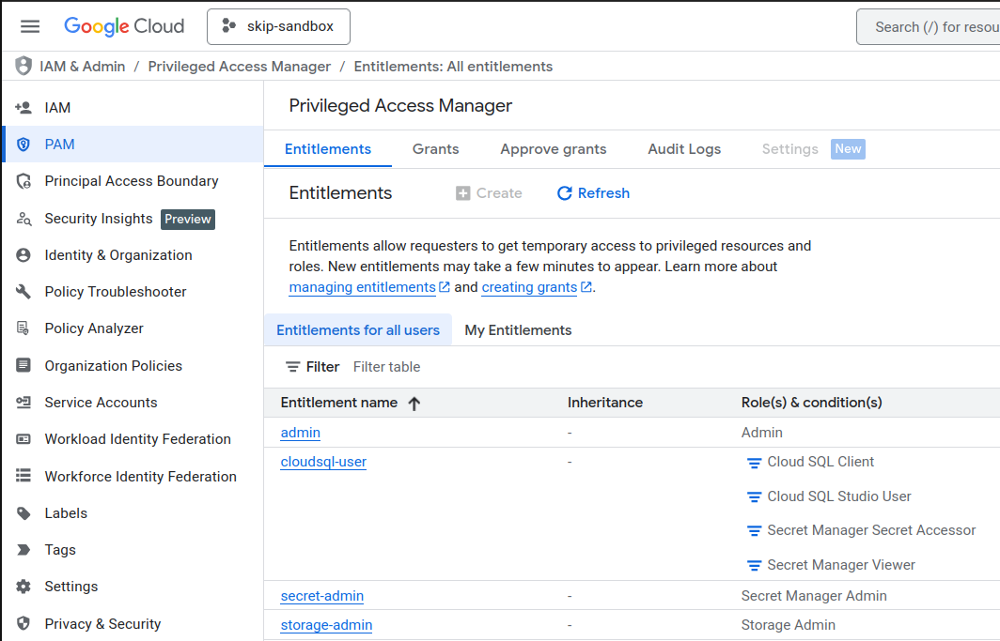
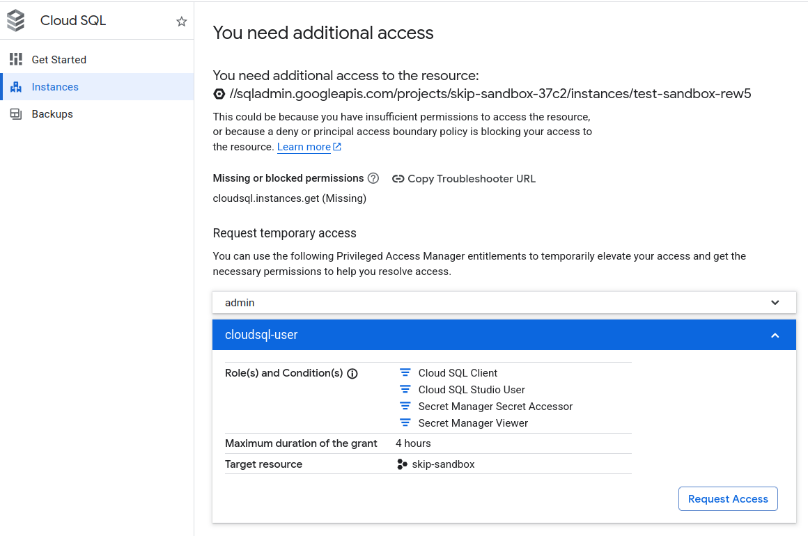
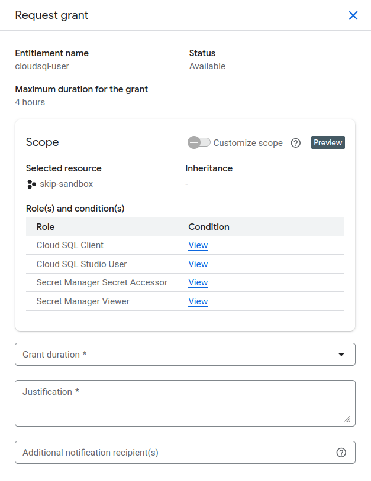

# Privileged Access Manager (PAM)

## Hva er PAM?

Google Cloud Privileged Access Manager (PAM) er et sett med definerte tilgangsrettigheter som brukes for å gi tidsbegrenset og kontrollert tilgang til prosjekt og ressurser. I tråd med Principle of Least Privilege er formålet å gi tilganger først når behov oppstår, dette skal hindre risiko knyttet til feilbruk av overpriviligerte roller. 

**Kort fortalt:**

- Tilgang gis ved behov, i en begrenset periode.
- Brukere får tilgang i 30 min - 4 timer.
- Alle forespørsler blir logget.

## Når skal teamet bruke PAM?

Bruk PAM når det er behov for midlertidig forhøyede rettigheter for å utføre arbeid i Google Cloud, dette kan eksempelvis være å administrere en database eller oppdatere secrets.

## Hvordan fungerer PAM hos oss?

Vi bruker definerte sett med rettigheter (entitlements) for å gi tilganger i Google Cloud. Det er 4 entitlements å velge fra, der alle bortsett fra storage-admin trenger approval for å få tilgangen innvilget. Det vil gis varsel på epost for tilgangsforespørsler, godkjent forespørsel og ved når tilgangen løper ut. 
Det er mulig å be om tilganger på to forskjellige måter:

**Under GCP prosjekt --> IAM & Admin --> PAM:**

**Direkte under ressurs:**

## Inntil videre er det 4 entitlements:

| Entitlement | Autoapprove | Beskrivelse |
| :--- | :--- | :--- |
| cloudsql-user | Ikke i prod | Rettigheter for lese secrets og koble til cloudsql instanser med tag component: cloudsql  |
| storage-admin | Ja | Storage admin (uten conditions, men deny policy hindrer fortsatt lesing av terraform state) |
| secret-admin | Ikke i prod | Secret Manager admin |
| admin | Nei | Secret Manager admin - Slags break-glass mulighet hvis nødvendig |

## Hvordan bruke PAM?

### 1. Finn frem til ditt prosjekt 

### 2. Velg entitlement/ressurs og trykk "Request Grant"

Velg varighet ved å trykke på "Grant duration", og gi en begrunnelse for tilgangen i tekstboksen under, f.eks "Midlertidig tilgang for å lese secret".

### 3. Utfør oppgaven og avslutt

- Verifiser at tilgang er aktiv
- Gjennomfør kun nødvendig arbeid
- Du vil bli varslet på epost når tilgangen har løpt ut

## Godkjenning og ansvar

- Teamene har selv ansvar for godkjenning og oppfølging av PAM-forespørsler, det kreves at et teammedlem godkjenner forespørselen.

## Relatert dokumentasjon

- [Dynamisk tilgangskontroll (JIT)](./08-jit.md)
- [Få tilgang til GCP](./06-access-gcp.md)
- [Google Cloud Privileged Access Manager](https://cloud.google.com/iam/docs/pam-overview)
