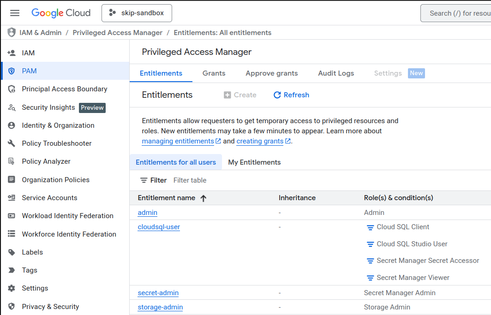
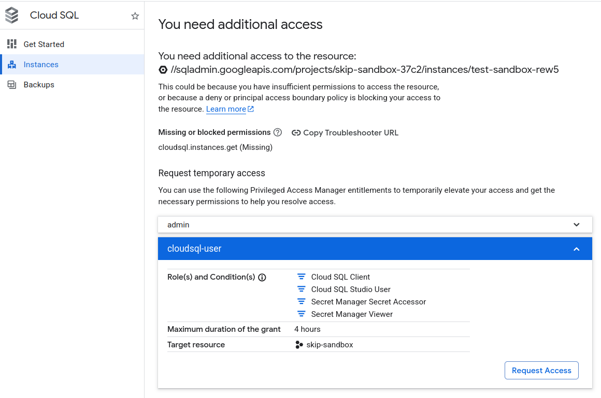
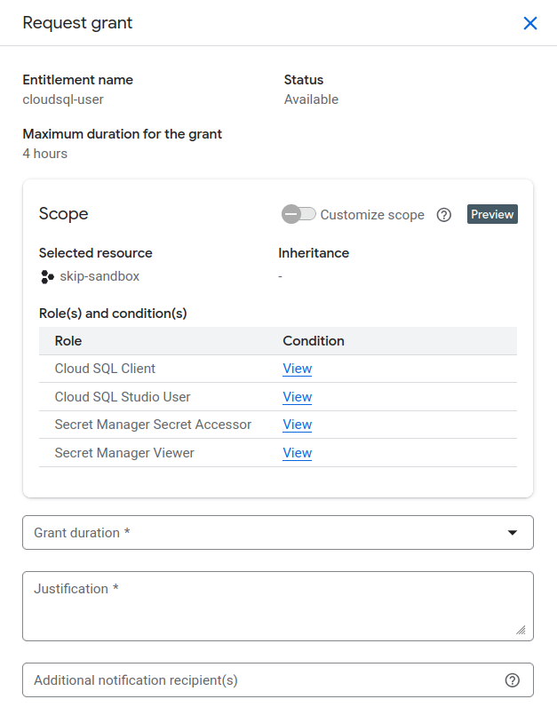

# Privileged Access Manager (PAM)

## Hva er PAM?

Google Cloud Privileged Access Manager (PAM) er et sett med definerte tilgangsrettigheter som brukes for å gi tidsbegrenset og kontrollert tilgang til prosjekt og ressurser. I tråd med Principle of Least Privilege er formålet å gi tilganger først når behov oppstår. Dette skal hindre risiko knyttet til feilbruk av overprivilegerte roller.

**Kort fortalt:**

- Tilgang gis ved behov, i en begrenset periode.
- Brukere får tilgang i 30 min - 4 timer.
- Alle forespørsler blir logget.

## Når skal teamet bruke PAM?

Bruk PAM når du trenger midlertidig forhøyede rettigheter i Google Cloud, for eksempel for å administrere en database eller oppdatere secrets.

## Hvordan fungerer PAM hos oss?

Vi bruker definerte sett med rettigheter (entitlements) for å gi tilganger i Google Cloud. Det er 4 entitlements å velge fra, der alle bortsett fra storage-admin trenger approval for å få tilgangen innvilget. Du får varsel på e-post for tilgangsforespørsler, godkjente forespørsler og når tilgangen løper ut.
Det er mulig å be om tilganger på to forskjellige måter:

### Under GCP-prosjekt → IAM & Admin → PAM:

### Direkte under ressurs:

## Tilgjengelige entitlements

| Entitlement | Autoapprove | Beskrivelse |
| :--- | :--- | :--- |
| cloudsql-user | Ikke i prod | Koble til Cloud SQL-instanser med tag component: cloudsql og lese tilhørende secrets |
| deploy-sa-user | Ikke i prod | Impersonate deploy kontoer (krever tagging av kontoene via gcp-service-accounts) |
| storage-admin | Ja | Storage admin (uten conditions, men deny policy hindrer fortsatt lesing av terraform state) |
| secret-admin | Ikke i prod | Secret Manager admin |
| audit-log-viewer | Ikke i prod | Lesetilgang til private audit-logger |
| pubsub-admin | Ikke i prod | Admin-tilgang til Pub/Sub |
| bigquery-admin | Ikke i prod | Admin-tilgang til BigQuery |
| cloud-run-admin | Ikke i prod | Admin-tilgang til Cloud Run |
| operasjonell-ros-read | Nei | Lesetilgang for OpRoS. Kun i prod, inntil 168 timers tilgang |
| operasjonell-ros-write | Nei | Redigeringstilgang for OpRoS. Kun i prod, inntil 168 timers tilgang |
| admin | Nei | Break-glass-mulighet for kritiske situasjoner |

## Hvordan bruke PAM?

### 1. Finn frem til ditt prosjekt

### 2. Velg entitlement/ressurs og trykk «Request Grant»

Velg varighet ved å trykke på «Grant duration», og gi en begrunnelse i tekstboksen under, f.eks. «Midlertidig tilgang for å lese secret».

### 3. Utfør oppgaven og avslutt

- Verifiser at tilgang er aktiv
- Gjennomfør kun nødvendig arbeid
- Du vil bli varslet på epost når tilgangen har løpt ut

## Godkjenning og ansvar

- Teamene har selv ansvar for godkjenning og oppfølging av PAM-forespørsler. Et teammedlem må godkjenne forespørselen.

## Relatert dokumentasjon

- [Få tilgang til GCP](./06-access-gcp.md)
- [Google Cloud Privileged Access Manager](https://cloud.google.com/iam/docs/pam-overview)
