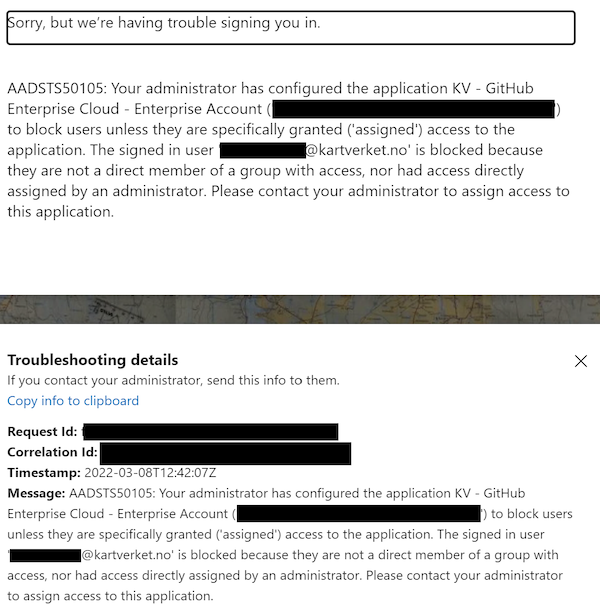

# Tilgang til GitHub

Kartverket lagrer kildekode på [github.com](https://github.com/) , og gjennom organisasjonen vår distribuerer vi tilgang ved å fordele lisensene vi har kjøpt inn. For å få tilgang følg sjekklisten under.

:::info
Ved spørsmål vedrørende tilgang eller behov for støtte, ta kontakt på [#gen-github](https://kartverketgroup.slack.com/archives/C03666VKSTE) på slack
:::

# Sjekkliste

- Opprett en konto på GitHub. Denne vil bli knyttet til din kartverket-bruker senere. Det er også mulig å bruke eksisterende brukere.
- Sørg for at brukeren din har [skrudd på tofaktor-autentisering](https://docs.github.com/en/authentication/securing-your-account-with-two-factor-authentication-2fa/configuring-two-factor-authentication) . Dette er et krav i organisasjonen
- Send inn forespørsel til drift i [PureService](https://kartverket.pureservice.com/) og fortell at du skal ha tilgang til GitHub og Slack (brukes til support)
- Du vil få en invitasjonsmail fra GitHub. Klikk på lenka i invitasjonsmailen og følg instruksjonene. Alternativt dersom du ikke fikk noen mail gå til [https://github.com/kartverket](https://github.com/kartverket) og se etter en banner øverst på skjermen. I begge tilfeller blir du tatt til en login-skjerm for kartverket-brukeren din tilsvarende den man ser på [http://office.com](http://office.com/). Følg instruksjonene.
- Dersom du etter å logge inn med kartverks-brukeren din og får feilen under, så ligger du ikke i github-gruppa i AD eller så er ikke gruppene blitt synket. Det tar 20-30 minutter for denne gruppen å synke til GitHub, så om du er usikker vent 10 minutter og prøv igjen. Dersom feilen vedvarer sjekk at mailen i bildet er riktig og ta kontakt med IT support

- Dersom alt gikk som det skal skal du nå kunne gå til [https://github.com/kartverket](https://github.com/kartverket) og se repoene som ligger under organisasjonen
- Sjekk at du ligger i team-et du forventer å ligge i. Listen over tilgjengelige teams finner du her: [https://github.com/orgs/kartverket/teams](https://github.com/orgs/kartverket/teams) . Teamene bestemmer hvilke tilganger du får til å lese, endre og administrere repoer, så hvis du mangler tilgang til noen repoer fordi du ikke ligger i riktig team så ta kontakt med teamleder (markert som maintainer på teamsiden i GitHub) så får de invitert deg
- [Legg til en SSH-nøkkel på brukeren din](https://docs.github.com/en/enterprise-cloud@latest/authentication/connecting-to-github-with-ssh/generating-a-new-ssh-key-and-adding-it-to-the-ssh-agent) så du kan pushe kode fra maskinen din. Sørg også for at den er [autorisert for bruk med kartverket](https://docs.github.com/en/enterprise-cloud@latest/authentication/authenticating-with-saml-single-sign-on/authorizing-an-ssh-key-for-use-with-saml-single-sign-on) .
- Du har nå tilgang til GitHub!

:::note
Opprettelse og administrasjon av team på Github skjer foreløpig manuelt. Dersom du har behov for et nytt team er dette
noe du selv må opprette [her](https://github.com/orgs/kartverket/new-team)
:::

## Bistand og diskusjon rundt GitHub

- Logg på slack ved å laste ned programmet fra [http://slack.com](http://slack.com/) og bruk [kartverketgroup.slack.com](http://kartverketgroup.slack.com/) som workspace
- Ta kontakt med SKIP på slack i [#gen-github](https://kartverketgroup.slack.com/archives/C03666VKSTE) for å få en invitasjon til GitHub-organisasjonen til Kartverket (send github-brukernavnet ditt). Dersom du vet på forhånd at du jobber som del av et team så fortell oss hvilke team dette er så får vi lagt deg i tilsvarende team i GitHub

