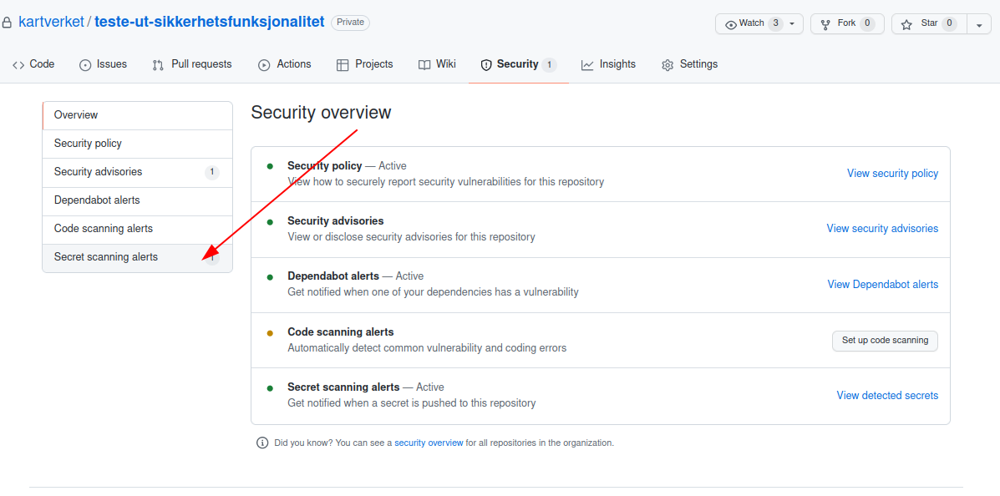
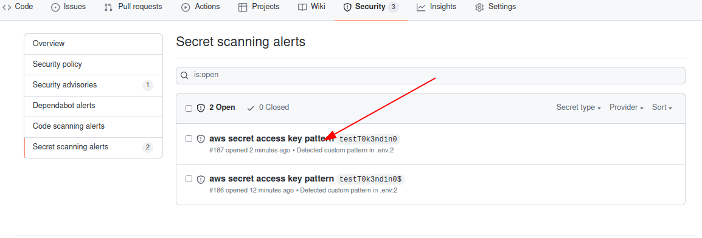
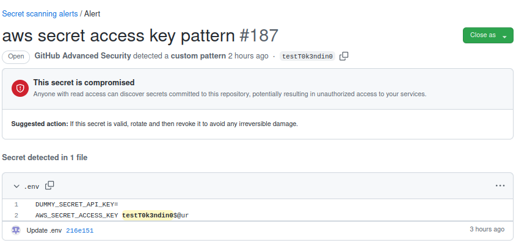

# Håndtering av sensitiv data som er kommet på repositoriet

:::info
Denne siden er under arbeid. Ingen garanti for at informasjonen på siden er riktig
:::

Denne veiledningen beskriver hvordan man går frem fra å oppdage at sensitive data, som for eksempel passord eller tokens, er lagt inn i et repository, til hva man gjør for å fjerne dem på en forsvarlig måte

## 📘 Instruksjoner

- For å se om secret scanning har avdekket sensitive data i repositoriet, gå til repositoriets forside og klikk deg inn på security-fanen. Trykk deretter på sidemeny-valget "Secret scanning alerts"
  
- Trykk deg inn på varselet for de sensitive dataene du skal håndtere
  
- Her får du vite hvilke filer det gjelder og nøyaktig hvilken linje.
  
- Følg deretter denne guiden for selve fjerningen: [Fjerne sensitive data fra repositorier](https://kartverket.atlassian.net/wiki/spaces/SIK/pages/309198978/Fjerne+sensitive+data+fra+repositorier)
- Når fjerningen er gjort, kan du lukke varselet

## 📋 Relaterte artikler

[Fjerne sensitive data fra repositorier](https://kartverket.atlassian.net/wiki/spaces/SIK/pages/309198978/Fjerne+sensitive+data+fra+repositorier)

[Secret Scanning](https://kartverket.atlassian.net/wiki/spaces/SIK/pages/307527933/Secret+Scanning)
