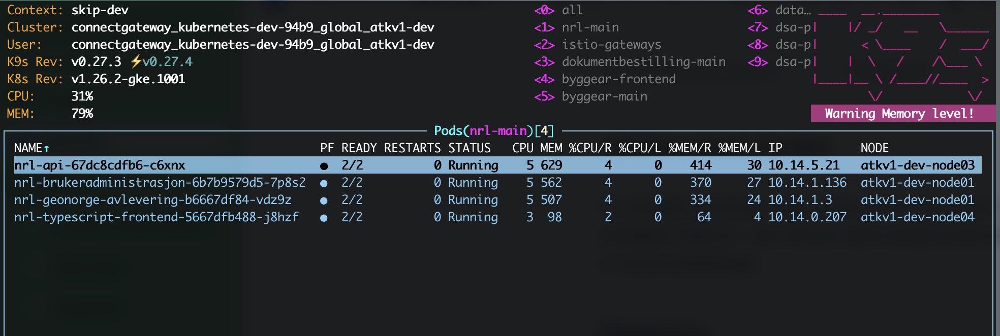

# Jobbe med Kubernetes cluster

For å jobbe med Kubernetes cluster så har man et par valg. Det første du vil skaffe deg er nok CLI verktøyet `kubectl` , men det kan være nyttig å bruke et litt mer visuelt verktøy
for å få bedre oversikt. Her er et par anbefalinger.

## K9s

K9s er terminalbasert men gir deg mer informasjon enn du ellers ville fått ved enkle kubectl kommandoer. Se her en oversikt over alle Podder som kjører i et namespace.

Her får vi for eksempel en stor toast på at alle poddene kjører med mer minne enn de requester. I tillegg har vi en fin oversikt over generell ressursbruk og forhold mellom
request/limit og faktisk bruk.

Man kan enkelt sortere på alle felter, søke på vilkårlige ressurstyper, redigere ressurser, filtere basert på søk og masse mer.

Nedlasting: [K9s - Manage Your Kubernetes Clusters In Style](https://k9scli.io/)

## Freelens

Om man heller foretrekker GUI kan dette være et alternativ. En fersk fork og videreutvikling av Openlens.

[Freelens nettside](https://freelensapp.github.io)

Nedlasting: [Freelens Github](https://github.com/freelensapp/freelens/releases)
