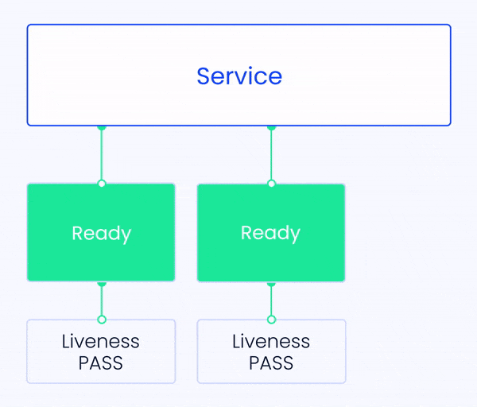
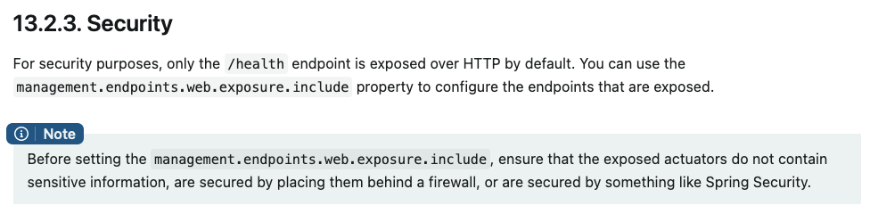

# Helsesjekker i Kubernetes
## Bakgrunn

Helsesjekker i kubernetes er en veldig viktig del av mikrotjeneste-arkitekturen, og det er derfor lurt å sette seg litt inn i hensikten og funksjonen til de ulike helse-endepunktene man kan konfigurere. Det finnes mange måter å konfigurere disse på, alt i fra helt egenlagde endepunkter til ferdige rammeverk som eksponerer dette automatisk.

I hovedsak finnes det tre typer prober som kubernetes opererer med:

- **Liveness probe** - Sjekker om containeren kjører og fungerer, hvis ikke så restarter kubernetes containeren



- **Readiness probe** - Brukes for å bestemme om en pod en klar for å ta i mot trafikk. En pod er klar når alle containere i poden er klare.


- **Startup probe** - Hvis denne er konfigurert så avventer kubernetes med liveness og readiness til dette endepunktet svarer. Dette kan brukes for å gi trege containere noe mer tid til å starte opp.

Det finnes flere måter å sette opp helsesjekker på, som f.eks. kommandoer, HTTP-requests, TCP-requests og gRPC-requests. Den aller vanligste måten er å konfigurere et endepunkt (f.eks /health, /liveness) i applikasjonen som svarer på HTTP-requests, og spesifisere dette som en del av pod-spesifikasjonen.

Litt mer om helsesjekker generelt: [https://kubernetes.io/docs/tasks/configure-pod-container/configure-liveness-readiness-startup-probes/](https://kubernetes.io/docs/tasks/configure-pod-container/configure-liveness-readiness-startup-probes/)

Det er viktig å merke seg at man ikkemåbenytte seg av alle disse helsesjekkene, men man bør ta et bevisst valg om det er hensiktsmessig eller ikke. Sjekk den lenken her for å en oversikt over hva man bør gjøre: [https://kubernetes.io/docs/concepts/workloads/pods/pod-lifecycle/#when-should-you-use-a-liveness-probe](https://kubernetes.io/docs/concepts/workloads/pods/pod-lifecycle/#when-should-you-use-a-liveness-probe)

## Skiperator

De aller fleste som har applikasjoner på SKIP benytter Skiperator for å forenkle oppsettet rundt applikasjonen. I Skiperator-manifestet kan man konfigurere helsesjekker på samme måte man ville gjort for en vanilla-pod i kubernetes. Detaljer rundt dette står i [dokumentasjonen for Skiperator](https://pkg.go.dev/github.com/kartverket/skiperator@v1.0.0/api/v1alpha1#ApplicationSpec) . Se under `ApplicationSpec` og `Liveness` / `Readiness` / `Startup` .

## Sikkerhetshensyn

Det er noen fallgruver å være klar over, så denne siden skal prøve å gi en oversikt over hvordan man typisk bør konfigurere dette på en sikker og god måte.

Hvis man ikke konfigurerer applikasjonen sin riktig kan man i verste fall ende opp med å eksponere de samme endepunktene som kubernetes bruker internt ut på internett. Et enkelt /health endepunkt som svarer med HTTP 200 OK, gjør ikke så stor skade. Et feilkonfigurert management-endepunkt derimot kan eksponere interne miljøvariabler, debug-info og minnedump.

Ta en titt på følgende flytskjema før du går videre, og gå til det punktet som gjelder deg

### Undersøke hva som eksponeres som standard

En veldig vanlig måte å løse helsejsekker på når man bruker Spring Boot er å benytte seg av sub-prosjektet [Spring Boot Actuator](https://docs.spring.io/spring-boot/docs/current/reference/htmlsingle/#actuator) .

For å ta det i bruk trenger man bare å legge til følgende for Maven-prosjekt (pom.xml)

```xml
<dependencies>
    <dependency>
        <groupId>org.springframework.boot</groupId>
        <artifactId>spring-boot-starter-actuator</artifactId>
    </dependency>
</dependencies>
```

Eller dette hvis man bruker Gradle (build.gradle)

```java
dependencies {
    implementation 'org.springframework.boot:spring-boot-starter-actuator'
}
```

Rammeverket setter automatisk opp endepunktet `/actuator/health` som en trygg default (gjelder versjon 2 og høyere av Spring Boot). Når man starter opp en Spring-applikasjon i kubernetes vil Spring Boot Actuator også automatisk tilgjengeliggjøre `/actuator/health/liveness` og `/actuator/health/readiness` som man benytte for helsesjekker. For å teste disse manuelt kan du legge til `management.endpoint.health.probes.enabled=true` i `application.properties` .

Disse endepunktene kan du så bruke i Skiperator-manifestet:

```java
apiVersion: skiperator.kartverket.no/v1alpha1
kind: Application
metadata:
    name: some-backend
    namespace: yournamespace
spec:
    # Øvrig konfigurasjon
    liveness:
        path: /actuator/health/liveness
        port: 8080
        failureThreshold: 3
        timeout: 1
        initialDelay: 3
    readiness:
        path: /actuator/health/readiness
        port: 8080
        failureThreshold: 3
        timeout: 1
        initialDelay: 5
```

Det er viktig å merke seg følgende notat:


:::warning
Konfigurasjon som `management.endpoints.web.exposure.include=*` frarådes ettersom det eksponerer alle endepunkt som er skrudd på. I så fall må man passe på å sette `management.endpoints.enabled-by-default=false` og manuelt skru på de man ønsker å bruke.
:::

Ønsker man å eksponere ytterligere [endepunkt](https://docs.spring.io/spring-boot/docs/current/reference/htmlsingle/#actuator.endpoints) , som f.eks. å eksponere `/info` for å presentere informasjon om bygget eller lignende er det tryggere å eksplisitt man gjøre det på denne måten i `application.properties` :

```java
management.endpoint.info.enabled=true
management.endpoint.health.enabled=true
management.endpoints.web.exposure.include=health,info
```

:::info
Savner du ditt rammeverk? Legg det til da vel 
:::

### Eksponer endepunktene på dedikert port uten service

Her vil det variere litt hvordan man går frem avhengig av om man bruker et rammeverk eller ikke, siden prosessen i containeren må lytte på ekstra port.

Først må man velge seg en port, f.eks. 8081, og så eksponere denne i Dockerfile. I dette eksempelet vil 8080 være applikasjonsporten, og 8081 management/helseporten.

```java
EXPOSE 8080 8081
```

Deretter må man konfigurere management-porten i application.properties på følgende måte:

```java
management.server.port=8081
management.endpoint.info.enabled=true
management.endpoint.health.enabled=true
management.endpoints.web.exposure.include=health,info
```

Skiperator-manifestet vil være helt likt, men man insturerer kubernetes til å gjøre helsesjekkene på en annen port.

```java
apiVersion: skiperator.kartverket.no/v1alpha1
kind: Application
metadata:
    name: some-backend
    namespace: yournamespace
spec:
    port: 8080
    # Øvrig konfigurasjon
    liveness:
        path: /actuator/health/liveness
        port: 8081
        failureThreshold: 3
        timeout: 1
        initialDelay: 3
    readiness:
        path: /actuator/health/readiness
        port: 8081
        failureThreshold: 3
        timeout: 1
        initialDelay: 5
```

### Eksponer endepunktene på dedikert port med service

:::note
For øyeblikket kan man ikke spesifisere hvilken port man skal tillate trafikk til via skiperator sin accessPolicy
:::

Hvis man har behov for at en annen applikasjon skal kunne nå endepunktet på en annen port må man gjøre ytterligere konfigurasjon. Man bør ta en ekstra vurdering på om det er hensiktmessig å eksponere denne typen informasjon via actuator-endepunkter.

Sett opp konfigurasjonen på samme måte som punktet over, men manifestet vil nå inkludere spesifikasjon for ekstra porter og tilgangssstyring.

```java
apiVersion: skiperator.kartverket.no/v1alpha1
kind: Application
metadata:
    name: some-backend
    namespace: yournamespace
spec:
    port: 8080
    additionalPorts:
      - name: actuator
        port: 8081
        protocol: TCP
    # .. øvrig konfigurasjon
    liveness:
        path: /actuator/health/liveness
        port: 8081
        failureThreshold: 3
        timeout: 1
        initialDelay: 3
    readiness:
        path: /actuator/health/readiness
        port: 8081
        failureThreshold: 3
        timeout: 1
        initialDelay: 5
    accessPolicy:
      inbound:
        rules:
          - application: some-frontend
            port: 8081 # Ikke mulig akkurat nå
```
