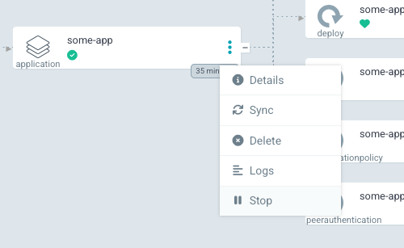

# 🔧 Vedlikehold av applikasjoner

Applikasjoner som flyttes over på SKIP uten tilpassing til et moderne kjøretidsmiljø kan ha spesielle behov som krever litt manuell håndtering ved f.eks. oppgraderinger eller vedlikehold av databaser.

Denne siden prøver å forklare hvordan man kan gjøre en del av disse manuelle handlingene.

## Stoppe kjørende applikasjon i ArgoCD

For å kunne stoppe en kjørende applikasjon som er administrert av ArgoCD må man først være sikker på at autosync/self heal er deaktivert for produktteamet som eier applikasjonen. Hvis ikke vil bare applikasjonen spinne opp igjen automatisk.

Se [denne filen](https://github.com/kartverket/skip-apps/blob/main/lib/argocd/teams.json) for å sjekke hva som er status, eventuelt spør noen på SKIP hvis du er usikker. Hvis ikke annet er satt kan du gå ut i fra at autosync er skrudd på i dev og test, men avslått i prod.

For å stoppe en applikasjon trykker du på menyen til en application-ressurs og velger “Stop”. Dette vil midlertidig sette antall kopier til 0 slik at skiperator skalerer ned applikasjonen. Du vil da kunne se at pods forsvinner fra grensesnittet, og “Sync Status” for applikasjonen vil stå som “OutOfSync”

Når man er ferdig med vedlikeholdet og ønsker å gjennopprette tidligere konfigurasjon trenger man bare å trykke “Sync” for at applikasjonen skal spinne opp igjen.

## Stoppe kjørende applikasjon manuelt

For å stoppe en applikasjon som kjører på SKIP må man i praksis skalere ned antallet kjørende kopier til 0.

Det er produktteamets ansvar å sette korrekt antall replicas til en hver tid. Hvis ingen er definert vil man få minimum 2 med autoskalering til maks 5 replicas. Autoskalering trigger på 80% CPU-bruk.

Se følgende eksempel på manifest som skalerer til 0

```yaml
apiVersion: skiperator.kartverket.no/v1alpha1
kind: Application
metadata:
  name: some-app
spec:
  replicas: 0
```
