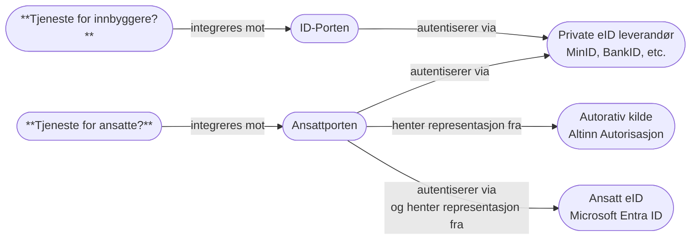

# Ansattporten

Ansattporten er en relativt ny fellesløsning utviklet av Digdir for innlogging for ansatte i offentlige og tilknyttede virksomheter. 
Der ID‑porten er for innbyggere, brukes Ansattporten når sluttbrukeren er en ansatt som skal få tilgang til en tjeneste på vegne av sin arbeidsgiver, såkalt **representasjon**. 
Representasjon for virksomheter styres i [Altinn](https://info.altinn.no/), og Ansattporten knytter sammen deg som person med representasjon tildelt til ulike virksomheter i Altinn. 
Du kan lese mer om Ansattporten på [Digdir sine sider](https://docs.digdir.no/docs/ansattporten/ansattporten_om.html).

Klientregistrering for Ansattporten støttes ikke per nå gjennom Digdirator, og det må dermed gjøres i Digdir sin 
[selvbetjeningsløsning](https://sjolvbetjening.samarbeid.digdir.no/login).

## 🧪 Testmiljø for Ansattporten

Digdir tilbyr Ansattporten i et testmiljø, der du kan teste applikasjonen din med syntetiske brukere fra Test-Folkeregisteret og syntetiske organisasjoner. 
For å registrere en klient mot Ansattporten sitt testmiljø så kan du benytte deg av Digdir sin [selvbetjeningsløsning i test](https://sjolvbetjening.test.samarbeid.digdir.no/login) 
Du kan også teste ut å gi ulike representasjoner til syntetiske organisasjoner for test-brukere i [Altinn sitt test-miljø](https://info.tt02.altinn.no/).

## 🔹 Federering til Microsoft Entra ID

Digdir annerkjenner at Microsoft Entra ID brukes som intern identitetstilbyder for brorparten av offentlige virksomheter i Norge. 
Som et resultat av dette har de derfor implementert støtte for såkalt "federering" mellom Ansattporten og Microsoft Entra ID.
Dette betyr at når en sluttbruker skal logge inn via Ansattporten, og vedkommende sin arbeidsgiver bruker Microsoft Entra ID, 
så vil brukeren bli omdirigert til sin egen virksomhets Microsoft Entra ID for autentisering før de returneres til Ansattporten for autorisering og tildeling av riktige representasjoner. 
Dette gjør det enklere for en virksomhet å enkelt vedlike hvem som skal ha hvilke rettigheter til andre virksomheter sine tjenester, samtidig som sluttbrukeren får en sømløs innloggingsopplevelse ved å bruke sin vante påloggingsmetode.

_Skisse over Ansattporten og ID-Porten._

