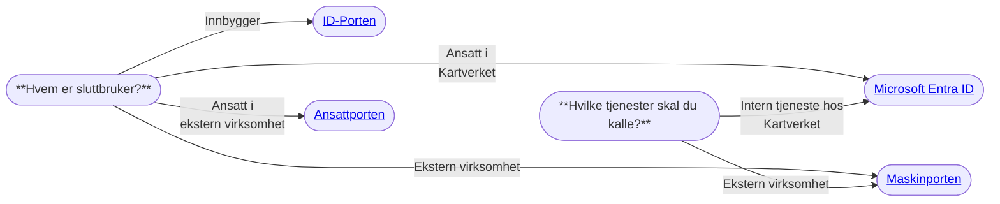

# Klientregistrering

Før du går i gang med å sikre din applikasjon med Ztoperator, så trenger du en klientregistrering hos en identitetstilbyder.
Når du registrerer en klient, får applikasjonen sin egen identitet og kan autentisere seg mot den valgte identitetstilbyderen.

## ⚖️ Valg av identitetstilbyder

Når du skal opprette en klientregistrering bør du vurdere hvilke(n) identitetstilbyder(e) som passer best til behovene i din applikasjon. 
Microsoft Entra ID og Digitaliseringsdirektoratets (Digdir) fellesløsninger; ID-Porten, Maskinporten og Ansattporten er identitetstilbyderne vi mener dekker bredden av konsumentene av Kartverkets digitale tjenester. 
Hvis du har behov for en annen identitetstilbyder enn de som er listet opp under, ta kontakt med Team Tilgangsstyring på [#gen-tilgangsstyring](https://kartverketgroup.slack.com/archives/C08CJLBLY2X).
Valg av identitetstilbyder(e) kan forenkles å stille seg spørsmålene: "*Hvem er sluttbruker?*" og "*Hvilke tjenester skal du kalle?*".

_Valg av identitetstilbyder ved klientregistrering._