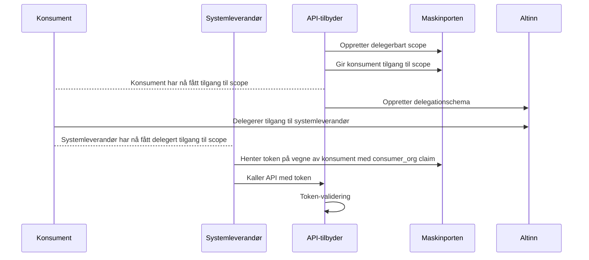

# Altinn-delegering i Maskinporten
Altinn-delegering egner seg dersom du:
1. Ønsker å bruke Maskinporten for å sikre ditt API, og
2. Ønsker å tilgangsstyre tilgang til API-et ved å gi konsumenter eksplisitt tilgang via Maskinporten, og
3. Tillater at konsumenten delegerer tilgangen videre til en tredjepart, som da vil kunne hente tokens på vegne av
konsumenten.

Dersom du heller ønsker å gi _systemleverandør_ eksplisitt tilgang bør du vurdere
[bruk av systembrukere](./02-systembruker.mdx) istedenfor.



## Som API-tilbyder
Dette gjelder dersom du ønsker å leverere et API sikret med Maskinporten, der konsumentene skal kunne delegere tilgangen
videre til en tredjepart (f.eks en systemleverandør). I dette tilfellet er Kartverket API-tilbyder.

### 1. Opprett delegerbart Maskinporten-scope, og gi konsumenter tilgang til dette
Vi anbefaler opprettelse av scopes med Digdirator. Alternativt kan selvbetjeningsportalen til Digdir benyttes direkte.

Eksempel på `MaskinportenClient`-ressurs for opprettelse av scope og tildeling av tilgang til konsument:
```yaml
apiVersion: nais.io/v1
kind: MaskinportenClient
metadata:
  name: skip-tilgangsstyring-demo
spec:
  clientName: SKIP Tilgangsstyring Demo
  secretName: maskinporten-secret
  scopes:
    exposes:
      - enabled: true
        name: demo.read
        product: tilgangsstyring
        delegationSource: altinn
        separator: "/"
        consumers:
          - orgno: "213302922"
            name: "MEMORERENDE ORANSJE TIGER AS"
```
Her gir vi konsument med organisasjonsnummer `213302922` tilgang til scopet `kartverk:tilgangsstyring/demo.read`.
Prefiks `kartverk` i denne sammenhengen er forhåndsbestemt av klienten Digdirator bruker underliggende. Listen med
konsumenter kan endres etterhvert som konsumenter skal få eller miste tilgang.

### 2. Opprett delegeringsoppsett i Altinn for det aktuelle scopet

:::info Forenklet oppsett av Altinn-delegering
Team Tilgangsstyring ønsker å gjøre det enklere for teamene å sette opp delegeringsoppsett i Altinn. Ta kontakt med oss
dersom du har innspill, behov eller spørsmål knyttet til dette.
:::

Gjøres i Altinn Studio eller via Altinn sine API-er. Merk at Altinn sin dokumentasjon kan være både omfattende og
komplisert. Ta gjerne kontakt med Team Tilgangsstyring for hjelp med oppsett av delegering i Altinn.

#### Med API
Opprettelse og administrasjon av delegerbare ressurser krever et Maskinporten-token med følgende scopes:
- `altinn:resourceregistry/resource.write`
- `altinn:resourceregistry/resource.read`
- `altinn:maskinporten/delegationschemes.write`

[Du finner Altinn sin dokumentasjon av dette API-et her](https://docs.altinn.studio/nb/authorization/guides/resource-owner/api-scheme/create-apischeme-api/).
Merk at `resourceType` alltid skal settes til `MaskinportenSchema`.

#### I Altinn Studio
For å få tilgang til Altinn Studio må du søke om rettigheter via [PureService](https://kartverket.pureservice.com/).
Stegene som må gjennomføres er:
1. Opprett Altinn Studio-bruker tilknyttet din Github-bruker
2. Opprett forespørsel i PureService. Oppgi at du trenger tilgang til Altinn Studio, samt ditt Github-brukernavn.
   I testmiljøet er de nødvendige gruppene `Resources-Publish-TT02` og `AccessLists-TT02`.
3. Videre må du få tilgang til noen repoer i Altinn Gitea. Det er TBD hvem som er riktig kontaktperson for dette, spør
   i egnet Slack-kanal (f.eks [#gen-tilgangsstyring](https://kartverketgroup.slack.com/archives/C08CJLBLY2X) eller
   [#gen-sikkerhet](https://kartverketgroup.slack.com/archives/C04FFERQWNQ)).

Videre må du opprette en ressurs i Altinn med ressurstype "Maskinporten-skjema" og ressursreferanse tilsvarende det
delegerbare Maskinporten-scopet du opprettet tidligere. [Du finner Altinn sin dokumentasjon for opprettelse av maskinporten-ressurser i Altinn Studio her](https://docs.altinn.studio/nb/authorization/guides/resource-owner/api-scheme/create-apischeme-resource-admin/).
Under "Tilgangsregler" må du definere hvem i konsumentens virksomhet som har lov til å delegere tilgang, for eksempel
daglig leder. Under "Hvilke rettigheter skal gis?" kan du velge `scopeaccess`. Du kan også velge å begrense tilgang til
ressursen basert på tilgangslister.

### 3. Be konsumenter delegere tilgang i Altinn til sin(e) systemleverandør(er)
Konsumenter må delegere tilgangen videre i Altinn. Din Altinn-ressurs vil dukke opp som et valg for
delegering. [Du finner Altinn sin dokumentasjon for delegering av tilgang her](https://altinn.github.io/docs/utviklingsguider/api-delegering/tilgangsstyrer/).
Merk at dokumentasjonen gjelder for Altinn 2 og sannsnyligvis vil erstattes med ny dokumentasjon for Altinn 3 når dette
er klart, tentativt ila. sommeren 2026.

### 4. Gjør eventuell delegeringsrelevant validering i ditt API
Maskinporten-tokens der delegering er i bruk har to ekstra claims, `delegation_source` og `supplier`:
```json
{
  "consumer" : {
    "authority" : "iso6523-actorid-upis",
    "ID" : "0192:<orgnr_for_konsument>"
  }
  ..
  "delegation_source" : "https://tt02.altinn.no/",
  "supplier" : {
    "authority" : "iso6523-actorid-upis",
    "ID" : "0192:<orgnr_for_systemleverandør>"
  },
}
```

_Dersom_ du har begrensninger knyttet til delegering i ditt API, f.eks at kun et begrenset utvalg leverandører har lov
til å handle på vegne av dine konsumenter, bør du validere at:
1. `delegation_source` er satt (`https://altinn.no/` i produksjon)
2. `supplier`-claimen inneholder et organisasjonsnummer som lar lov til å opptre på vegne av konsumenten
