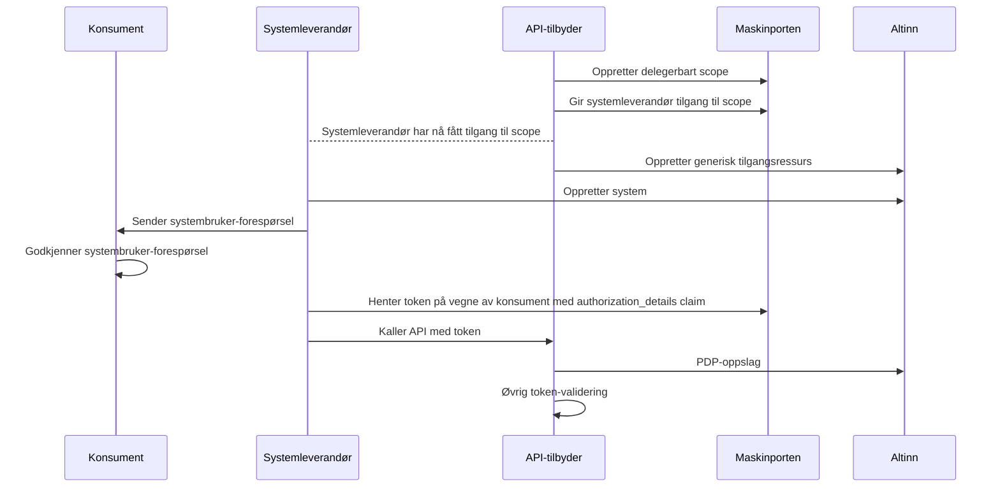

# Systembruker, system og ressurs i Altinn
Systembrukere i Altinn egner seg dersom du:
1. Ønsker å bruke Maskinporten for å sikre ditt API, og
2. Ønsker å tilgangsstyre tilgang til API-et ved å gi systemleverandører eksplisitt tilgang via Maskinporten, og
3. Ønsker å tilgangsstyre tilgang til API-et ved å definere en tilgangspakke eller rolle i Altinn, som så kan opprette
systembrukere tilknyttet systemleverandørens fagsystem

Dersom du heller ønsker å gi _konsumentene_ eksplisitt tilgang bør du vurdere
[bruk av Altinn-delegering](./01-delegering.mdx) istedenfor



## Som API-tilbyder
### 1. Opprett delegerbart Maskinporten-scope, og gi systemleverandører tilgang til dette
Vi anbefaler opprettelse av scopes med Digdirator. Alternativt kan selvbetjeningsportalen til Digdir benyttes direkte.

Eksempel på `MaskinportenClient`-ressurs for opprettelse av scope og tildeling av tilgang til konsument:
```yaml
apiVersion: nais.io/v1
kind: MaskinportenClient
metadata:
  name: skip-tilgangsstyring-demo
spec:
  clientName: SKIP Tilgangsstyring Demo
  secretName: maskinporten-secret
  scopes:
    exposes:
      - enabled: true
        name: demo.read
        product: tilgangsstyring
        delegationSource: altinn
        separator: "/"
        consumers:
          - orgno: "213302922"
            name: "MEMORERENDE ORANSJE TIGER AS"
```
Her gir vi systemleverandøren med organisasjonsnummer `213302922` tilgang til scopet `kartverk:tilgangsstyring/demo.read`.
Prefiks `kartverk` i denne sammenhengen er forhåndsbestemt av klienten Digdirator bruker underliggende. Listen med
konsumenter kan endres etterhvert som konsumenter skal få eller miste tilgang.

### 2. Opprett en generisk tilgangsressurs i Altinn
:::info Forenklet oppsett av Altinn-ressurser
Team Tilgangsstyring ønsker å gjøre det enklere for teamene å sette opp ressurser i Altinn. Ta kontakt med oss
dersom du har innspill, behov eller spørsmål knyttet til dette.
:::

Gjøres i Altinn Studio eller via Altinn sine API-er. Merk at Altinn sin dokumentasjon kan være både omfattende og
komplisert. Ta gjerne kontakt med Team Tilgangsstyring for hjelp med oppsett av ressurser i Altinn.

#### Med API
Opprettelse og administrasjon av generiske tilgangsressurser krever et Maskinporten-token med følgende scopes:
- `altinn:resourceregistry/resource.write`
- `altinn:resourceregistry/resource.read`

Altinn har ikke noe egen API-dokumentasjon for dette, men samme dokumentasjon som for opprettelse av delegeringsoppsett
ifbm. Maskinporten-delegering kan brukes. [Du finner Altinn sin dokumentasjon av dette API-et her](https://docs.altinn.studio/nb/authorization/guides/resource-owner/api-scheme/create-apischeme-api/).
For opprettelse av generiske tilgangsressurser må  `resourceType` settes til `GenericAccessResource`.

#### I Altinn Studio
For å få tilgang til Altinn Studio må du søke om rettigheter via [PureService](https://kartverket.pureservice.com/).
Stegene som må gjennomføres er:
1. Opprett Altinn Studio-bruker tilknyttet din Github-bruker
2. Opprett forespørsel i PureService. Oppgi at du trenger tilgang til Altinn Studio, samt ditt Github-brukernavn.
I testmiljøet er de nødvendige gruppene `Resources-Publish-TT02` og `AccessLists-TT02`.
3. Videre må du få tilgang til noen repoer i Altinn Gitea. Det er TBD hvem som er riktig kontaktperson for dette, spør
i egnet Slack-kanal (f.eks [#gen-tilgangsstyring](https://kartverketgroup.slack.com/archives/C08CJLBLY2X) eller
[#gen-sikkerhet](https://kartverketgroup.slack.com/archives/C04FFERQWNQ)).

Videre må du opprette en ressurs i Altinn med ressurstype "Generisk tilgangsressurs". Du finner Altinn sin dokumentasjon
for opprettelse av generiske tilgangsressurser i Altinn Studio [her](https://docs.altinn.studio/nb/authorization/guides/resource-owner/create-resource-resource-admin/).
Under "Tilgangsregler" må du definere hvem i konsumentens virksomhet som har lov til å delegere tilgang, for eksempel
daglig leder. Under "Hvilke rettigheter skal gis?" kan du velge ut utvalg rettigheter som du vil skille mellom i ditt
API, f.eks `Les` og `Skriv`, eller bare `scopeaccess`. Du kan også velge å begrense tilgang til ressursen basert på
tilgangslister.

Merk at det ikke er noe kobling mellom Maskinporten-scopet du opprettet tidligere og den generiske tilgangsressursen i
Altinn. Du må selv validere riktig scope for Maskinporten-tokens i ditt API.

### 3. Be systemleverandør rulle på konsumenter via bruk av systembrukere
Systemleverandøren kan sende en forespørsel om systembrukeropprettelse, som en representant for konsumenten kan
godkjenne i Altinn. Alternativt kan konsumenten selv opprette systembrukere i Altinn direkte.
[Du finner Altinn sin dokumentasjon av systembrukeropprettelse her.](https://docs.altinn.studio/nb/api/authentication/systemuserapi/)

### 4. Gjør PDP-oppslag mot Altinn, samt eventuell annen delegeringsrelevant validering i ditt API
Maskinporten-tokens med systembrukerinformasjon har et ekstra claim, `authorization_details`:
```json
{


  "consumer": {
    "authority" : "iso6523-actorid-upis",
    "ID": "0192:<orgnr_for_systemleverandør>"
  },
  ...,
  "authorization_details": [ {
    "type": "urn:altinn:systemuser",
    "systemuser_id": [ "id for systembrukeren hos kunden" ],
    "systemuser_org": {"authority" : "iso6523-actorid-upis",  "ID": "0192:konsumenten sitt orgno" },
    "system_id": "id for systemet i systemregisteret",
  }],
}
```
Legg merke til at både `authorization_details`- og `systemuser_id`-claimene er lister.

Utover ordinær JWT-validering av Maskinporten-tokenet må du validere at `scope`-claimet i tokenet samstemmer med riktig
scope for ditt API. Du kan også gjøre øvrig validering i ditt API basert på informasjonen i tokenet, for eksempel at:
1. `systemuser_org`-claimen inneholder et organisasjonsnummer på en gyldig konsument gitt det aktuelle endepunktet
2. `consumer`-claimen inneholder et organisasjonsnummer som har lov til å opptre på vegne av konsumenten

#### PDP-oppslag mot Altinn
Gyldig maskinporten-token med systembrukerinformasjon garanterer _ikke_ at systembrukeren faktisk har tilgang til din
aktuelle Altinn-ressurs - kun at systembrukeren tilhører systemet levert av systemleverandøren. Du må derfor gjøre et
PDP-oppslag mot Altinn for å validere at systembrukeren har tilgang til din ressurs.

[Du finner Altinn sin dokumentasjon for PDP-oppslag her.](https://docs.altinn.studio/nb/authorization/guides/resource-owner/system-user/#autorisasjon-av-systembruker)
Vi har p.t. ikke nøstet opp i alle detaljene rundt påkrevde scopes, API Subscription Keys med mer. Mer informasjon
kommer.
