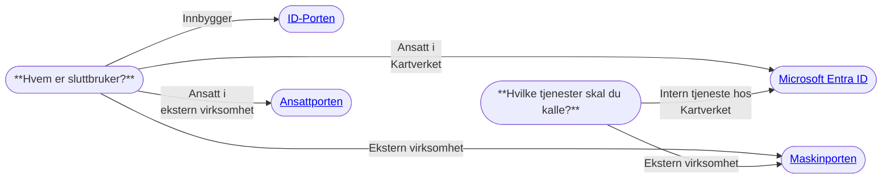

# Valg av identitetstilbyder

Du bør vurdere hvilke(n) identitetstilbyder(e) som passer best til behovene i din applikasjon. Microsoft Entra ID og
Digitaliseringsdirektoratets (Digdir) fellesløsninger; ID-Porten, Maskinporten og Ansattporten er identitetstilbyderne
vi mener dekker bredden av konsumentene av Kartverkets digitale tjenester. Hvis du har behov for en annen
identitetstilbyder enn de som er listet opp under, ta kontakt med Team Tilgangsstyring på [#gen-tilgangsstyring](https://kartverketgroup.slack.com/archives/C08CJLBLY2X).
Valg av identitetstilbyder(e) kan forenkles å stille seg spørsmålene: "*Hvem er sluttbruker?*" og
"*Hvilke tjenester skal du kalle?*".

_Valg av identitetstilbyder ved klientregistrering._

## Bruk av Altinn-delegering ifbm. Maskinporten
Altinn-delegering egner seg dersom du:
1. Ønsker å bruke Maskinporten for å sikre ditt API, og
2. Ønsker å tilgangsstyre tilgang til API-et ved å gi konsumenten eksplisitt tilgang via Maskinporten, og
3. Tillater at konsumenten delegerer tilgangen videre til en tredjepart, som da vil kunne hente tokens på vegne av
   konsumenten.

Nevnte tredjepart (f.eks en systemleverandør) skal _ikke_ ha eksplisitt tilgang til det aktuelle Maskinporten-scopet i
dette tilfellet, men vil kunne hente ut tokens på vegne av konsumenten så lenge konsumenten har tilgang til scopet og
har delegert denne tilgangen videre i Altinn.

[Her](./01-delegering.mdx) kan du lese mer om Altinn-delegering, både i rollen som API-tilbyder og API-konsument.

## Bruk av Systembruker og/eller Ressurser i Altinn
Systembruker i Altinn egner seg dersom du:
1. Ønsker å bruke Maskinporten for å sikre ditt API, og
2. Ønsker å tilgangsstyre tilgang til API-et ved å gi systemleverandører eksplisitt tilgang via Maskinporten, og
3. Ønsker å tilgangsstyre tilgang til API-et ved å definere en tilgangspakke eller rolle i Altinn, som så kan opprette
   systembrukere tilknyttet systemleverandørens fagsystem

[Her](./02-systembruker.mdx) kan du lese mer om systembrukere, systemer og ressurser i Altinn, både i rollen som
API-tilbyder og API-konsument.