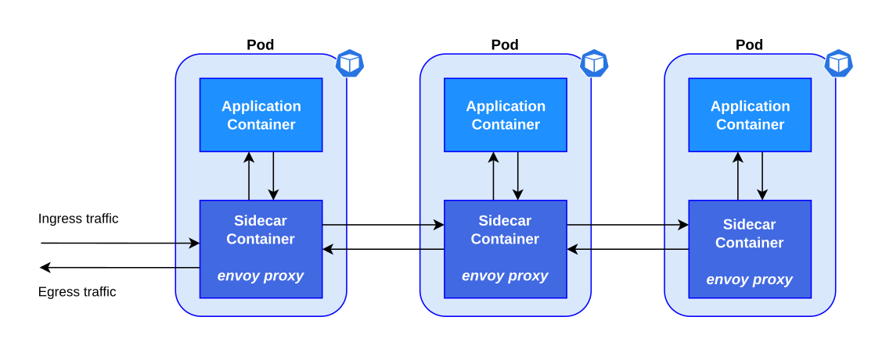

import Tabs from '@theme/Tabs';
import TabItem from '@theme/TabItem';
import Admonition from '@theme/Admonition';

# 🛡️ Token-validering og grovkornet autorisasjon

SKIP tilbyr innebygd støtte for å sette opp Kubernetes-ressurser som kan validere autentisiteten og autorisasjonen på
inkommende requests før den i det hele tatt når applikasjonen. Dette er mulig fordi SKIP benytter seg av [Istio](https://istio.io/) som service mesh
og instruerer Istio til å sette opp en [Istio-sidecar](https://istio.io/latest/docs/reference/config/networking/sidecar/)
i hver `pod`.

Fordelen med at hver `pod` har en `istio-sidecar` er at Istio introduserer flere nyttige CRD-er som kan berike kapabilitetene
til `istio-sidecar`. To av disse CRD-ene er [`RequestAuthentication`](https://istio.io/latest/docs/reference/config/security/request_authentication/)
og [`AuthorizationPolicy`](https://istio.io/latest/docs/reference/config/security/authorization-policy/), som blant annet kan brukes til å validere tokens (JWT) til innkommende requests og autorisere tilgang basert på claims.


*Kilde: [Kube by Example](https://kubebyexample.com/learning-paths/istio/intro)*

SKIP benytter seg av kubernetes operatoren [Ztoperator](https://github.com/kartverket/ztoperator) for å håndheve token-validering og grovkornet autorisasjon for tjenester som kjører på SKIP.

Hvis man ønsker å benytte seg av SKIP sin løsning for å sette opp token-validering og grovkornet autorisasjon, har man to valg.
Man kan benytte seg av [Skiperator](../03-skiperator/index.md) dersom man ønsker å holde konfigurasjonen nær Skiperator-manifestet.
Alternativt kan man bruke CRD-en fra [Ztoperator](https://github.com/kartverket/ztoperator) direkte.

Felles for begge alternativene er at de bygger inn to prinsipper i hvordan token-validering og grovkornet autorisasjon settes opp.
- **Gyldig JWT by default**: Med mindre endepunkt er eksplisitt spesifisert som åpne _må_
innkommende request ha en gyldig JWT.
- **Trygge standardinnstillinger**: Hvis man ved en feil spesifiserer et endepunkt som både åpent og autorisert, vil forespørselen som standard kreve et gyldig og autorisert JWT.

<Tabs groupId={"operator"}>
    <TabItem value="skiperator" label="Skiperator">
        🚧 **UNDER UTVIKLING** 🚧<br />
        Støtte for å sette opp token-validering og grovkornet autorisasjon via Skiperator-manifestet er under utvikling og er foreløpig ikke tilgjengelig.
    </TabItem>
    <TabItem value="ztoperator" label="Ztoperator">
        Ztoperator introduserer CRD-en `AuthPolicy`, som har i oppgave å sette opp token-validering og grovkornet autorisasjon.
        `AuthPolicy` har som hovedoppgave å opprette Istio-ressursene `RequestAuthentication` og `AuthorizationPolicy`
        på en måte som følger brukerens definerte *regler*, samtidig som de to prinsippene nevnt ovenfor ivaretas.

        Hvilken workload reglene definert i en `AuthPolicy` skal gjelde for spesifiseres ved å referere til *labels*.

        <Admonition type="tip" title="Visste du at...">
          Hvis du har en Skiperator-applikasjon med navn `some-application` vil den få labelen `app: some-application`.
        </Admonition>

        ## 🧾Spesifikasjonen til `AuthPolicy`

        <details>
          <summary><strong>spec</strong> _(object, required)_ – Spesifikasjon for `AuthPolicy`</summary>

            <p><strong>enabled</strong> _(boolean, required)_ – Angir om JWT-validering skal være aktivert. Hvis aktivert, vil innkommende JWT-er bli validert mot spesifisert utsteder og audience.</p>
            <p><strong>issuerURI</strong> _(string, required)_ – Forventet `iss`-claim i JWT. Må samsvare med den som ble brukt da tokenet ble utstedt.</p>
            <p><strong>jwksURI</strong> _(string, required)_ – URI for å hente JWKS (nøkkelsett brukt til å verifisere JWT-signatur).</p>
            <p><strong>audience</strong> _([]string, required)_ – Liste med aksepterte `aud`-verdier i JWT. Minst én verdi må finnes i tokenet for at det skal være gyldig.</p>
            <p><strong>forwardJwt</strong> _(boolean, optional)_ – Hvis satt til `true`, videresendes den originale JWT-en. Standard er `true`.</p>
            <p><strong>fromCookies</strong> _([]string, optional)_ – Lister hvilke cookies som skal undersøkes for JWT.</p>

            <details>
                <summary><strong>outputClaimToHeaders</strong> _([]object, optional)_ – Definerer hvordan claims fra verifisert JWT skal kopieres til HTTP-headere. Støtter enkle og nøstede verdier av typen `string`, `int` eller `bool.</summary>
                <p><strong>claim</strong> _(string, required)_ – Navn på claimet som skal hentes fra JWT.</p>
                <p><strong>header</strong> _(string, required)_ – Navn på HTTP-headeren som skal inneholde claim-verdien.</p>
            </details>

            <p><strong>acceptedResources</strong> _([]string, optional)_ – Liste med ressursindikatorer som må finnes i JWT (`aud`). Følger <a href="https://datatracker.ietf.org/doc/html/rfc8707" target="_blank" rel="noopener noreferrer">RFC8707</a>. Må være gyldige URI-er.</p>

            <details>
                <summary><strong>authRules</strong> _([]object, optional)_ – Regler for å tillate HTTP-forespørsler basert på påstander i JWT.</summary>
                <p><strong>paths</strong> _([]string, required)_ – Stier regelen skal gjelde for. Må starte med `/`, ikke slutte med `/`, og kan avsluttes med `*` som wildcard-operator.</p>
                <p><strong>methods</strong> _([]string, optional)_ – HTTP-metoder som regelen gjelder for. Hvis ikke angitt, tillates alle metoder. Tillatte metoder er `GET`, `POST`, `PUT`, `PATCH`, `DELETE`, `HEAD`, `OPTIONS`, `TRACE`, `CONNECT`.</p>

                <details>
                    <summary><strong>when</strong> _([]object, required)_ – Tilleggskrav basert på JWT-claims. Forespørselen tillates hvis minst ett av tilleggskravene er oppfylt.</summary>
                    <p><strong>claim</strong> _(string, required)_ – Navnet på JWT-claimet som skal kontrolleres.</p>
                    <p><strong>values</strong> _([]string, required)_ – Verdier som claimet må inneholde for å være gyldig. Tilleggskravet er møtt hvis claimet fra JWT inneholder én eller flere av disse verdiene (OR-logikk).</p>
                </details>
            </details>

            <details>
                <summary><strong>ignoreAuthRules</strong> _([]object, optional)_ – Definerer hvilke forespørsler som ikke krever JWT-autentisering.</summary>
                <p><strong>paths</strong> _([]string, required)_ – Stier regelen skal gjelde for. Må starte med `/`, ikke slutte med `/`, og kan avsluttes med `*` som wildcard-operator.</p>
                <p><strong>methods</strong> _([]string, optional)_ – HTTP-metoder som regelen gjelder for. Hvis ikke angitt, tillates alle metoder. Tillatte metoder er `GET`, `POST`, `PUT`, `PATCH`, `DELETE`, `HEAD`, `OPTIONS`, `TRACE`, `CONNECT`.</p>
            </details>

          <details>
            <summary><strong>selector</strong> _(object, required)_ – Bestemmer hvilke workloads policyen skal gjelde for.</summary>
            <p><strong>matchLabels</strong> _(map[string]string, optional)_ – Et sett med labels som brukes til å identifisere hvilke workloads policyen skal gjelde for. Gjelder bare innenfor samme namespace. Label-nøkler kan ikke være tomme eller inneholde wildcard-tegn.</p>
          </details>
        </details>

        ## 🧠 Wildcards for URL-stier (_paths_)
        Når man setter opp tilgangsstyring med Ztoperator, så kan man enten åpne opp tilgang eller autorisere tilgang mot endepunkter. Da spesifiserer man et sett med en eller flere URL-stier.
        Istio, og dermed også Ztoperator, støtter bruken av **wildcards** i disse stiene, men er noe uklar i bruken av disse i deres dokumentasjon.

        Ztoperator støtter bruken av _tre_ wildcard-operatorer: `*`, `{*}` og `{**}`, **der `*` er den _gamle_ wildcard-syntaksen, mens `{*}` og `{**}` er den _nye_ wildcard-syntaksen**.
        Ztoperator har følgende validering av stier:

        - En sti kan **ikke blande** gammel og ny wildcard-syntax.
        - Wildcardet `*`, (dvs. gammel wildcard-syntaks), kan **kun** brukes som enten prefiks, suffiks eller alene. Wildcardet vil da **matche null eller flere sti-segmenter (deler av stien mellom `/`)**.
        - Wildcardet `{*}`, (dvs. ny wildcard-syntaks), kan **kun brukes alene** i et sti-segment. Wildcardet vil da **matche ett sti-segment (deler av stien mellom `/`)**.
        - Wildcardet `{**}`, (dvs. ny wildcard-syntaks), kan **kun brukes alene** i et sti-segment. Wildcardet vil da **matche null _eller_ flere sti-segmenter (deler av stien mellom `/`)**. Hvis `{**}` benyttes så **må** den være den siste wilcard-operatoren.

        ### 📑 Eksempler på wildcards for URL-stier

        | Sti              | Gyldig | Forklaring                                                             |
        |-------------------|---------|-------------------------------------------------------------------------|
        | `*` | ✅ | Matcher alle stier|
        | `*/foo/bar`| ✅ | Matcher `/foo/bar`, `/api/foo/bar`, `/api/something/foo/bar`, `/api/something/else/foo/bar` |
        | `/foo/bar*` | ✅ | Matcher `/foo/bar`, `/foo/bar/baz`, `/foo/bar/baz.html` |
        | `/foo/{*}/` | ✅ | Matcher `/foo/bar`, men _ikke_ `/foo/bar/baz`. |
        | `/foo/{**}/` | ✅ | Matcher `/foo/bar/`, `/foo/bar/baz.txt`, og `/foo//`, men ikke `/foo/bar`. |
        | `/foo/{*}/bar/{**}` | ✅ | Matcher `/foo/buzz/bar/` og `/foo/buzz/bar/baz`. |
        | `foo/*/bar` | ❌ | Kun lov å bruke wildcardet `*` som enten prefiks, suffiks eller alene |
        | `/*/baz/{*}` | ❌ | Ikke lov å blande gammel og ny wildcard-syntaks. |
        | `/**/baz/{*}` | ❌ | Wildcard-operatoren `**` er ikke lov å bruke, men må være omsluttet av krøllparenteser, i.e. `{**}` |
        | `/{**}/foo/{*}` | ❌ | Ikke lov |
        | `/foo/{*}.txt` | ❌ | is invalid since there are characters other than `{*}` in the path segment |
    </TabItem>
</Tabs>

## 📖 Eksempler

Under følger en rekke eksempler på hvordan å konfigurere token-validering og grovkornet autorisasjon på SKIP.

<details>
  <summary><strong>Eksempel 1: Token-validering for _alle_ endepunkt</strong></summary>

    <Tabs groupId={"operator"}>
        <TabItem value="skiperator" label="Skiperator">
            🚧 **UNDER UTVIKLING** 🚧<br />
            Støtte for å sette opp token-validering og grovkornet autorisasjon via Skiperator-manifestet er under utvikling og er foreløpig ikke tilgjengelig.
        </TabItem>
        <TabItem value="ztoperator" label="Ztoperator">
            Følgende `AuthPolicy`-manifest konfigurerer token-validering for alle endepunktene inn til workloads med labelen `app: some-application` i namespacet `some-namespace`.

            ```yaml
            apiVersion: ztoperator.kartverket.no/v1alpha1
            kind: AuthPolicy
            metadata:
              name: some-auth-policy
              namespace: some-namespace
            spec:
              enabled: true
              audience:
                - some-audience
              issuerURI: https://some-issuer.com
              jwksURI: https://some-jwks-uri.com
              selector:
                matchLabels:
                  app: some-application
            ```
        </TabItem>
    </Tabs>
</details>

<details>
  <summary><strong>Eksempel 2: Legg til åpne endepunkt</strong></summary>

  <Tabs groupId={"operator"}>
          <TabItem value="skiperator" label="Skiperator">
              🚧 **UNDER UTVIKLING** 🚧<br />
              Støtte for å sette opp token-validering og grovkornet autorisasjon via Skiperator-manifestet er under utvikling og er foreløpig ikke tilgjengelig.
          </TabItem>
          <TabItem value="ztoperator" label="Ztoperator">
            Følgende `AuthPolicy`-manifest konfigurerer token-validering for alle endepunktene inn til `some-application`, **utenom** for `GET` til `/api/cars` og `/api/cars/public*`.

            <Admonition type="warning" title="Legg merke til...">
                Her er wildcard (`*`) brukt. Resultatet blir da at `GET` mot `/api/cars`, `/api/cars/public` og alle andre sub-paths av `/api/cars/public` vil være åpne,
                mens requests mot andre stier vil kreve autentisert JWT, dvs. JWT med claimet `iss: https://some-issuer.com` og `aud: some-audience`.
            </Admonition>


          ```yaml
          apiVersion: ztoperator.kartverket.no/v1alpha1
          kind: AuthPolicy
          metadata:
            name: some-auth-policy
            namespace: some-namespace
          spec:
            rules:
              - enabled: true
                audience:
                  - some-audience
                issuerURI: https://some-issuer.com
                jwksURI: https://some-jwks-uri.com
                ignoreAuthRules:
                  - paths:
                      - "/api/cars"
                      - "/api/cars/public*"
                    methods:
                      - "GET"
            selector:
              matchLabels:
                app: some-application
          ```
        </TabItem>
  </Tabs>

</details>


<details>
  <summary><strong>Eksempel 3: Legg til autoriserte endepunkt</strong></summary>

      <Tabs groupId={"operator"}>
              <TabItem value="skiperator" label="Skiperator">
                  🚧 **UNDER UTVIKLING** 🚧<br />
                  Støtte for å sette opp token-validering og grovkornet autorisasjon via Skiperator-manifestet er under utvikling og er foreløpig ikke tilgjengelig.
              </TabItem>
              <TabItem value="ztoperator" label="Ztoperator">
                Følgende `AuthPolicy`-manifest konfigurerer token-validering for alle endepunktene inn til `some-application`, **utenom** for endepunktene `/api/cars*` og `/api/cars/public` **for alle metoder**.
                I tillegg spesifiserer den at `POST`, `PUT` og `DELETE` mot `/api/cars/admin` kun er lov hvis JWT-claimet `roles` eksisterer med verdien `admin`.

          ```yaml
          apiVersion: ztoperator.kartverket.no/v1alpha1
          kind: AuthPolicy
          metadata:
            name: some-auth-policy
            namespace: some-namespace
          spec:
            rules:
              - enabled: true
                audience:
                  - some-audience
                issuerURI: https://some-issuer.com
                jwksURI: https://some-jwks-uri.com
                ignoreAuthRules:
                  - paths:
                      - "/api/cars*"
                      - "/api/cars/public"
                authRules:
                  - paths:
                      - "/api/cars/admin"
                    methods:
                      - POST
                      - PUT
                      - DELETE
                    when:
                      - claim: "roles"
                        values:
                          - "admin"
            selector:
              matchLabels:
                app: some-application
          ```

                <Admonition type="warning" title="Legg merke til...">
                  Stiene `/api/cars` og alle sub-stier er nå spesifisert som åpne, som **er i konflikt** med at `POST`, `PUT` og `DELETE` mot `/api/cars/admin`
                  krever autorisert JWT (`roles: admin`). Her spiller prinsippet om **trygge standardinnstillinger** inn, og Ztoperator vil falle tilbake til å kreve autorisert
                  JWT for `POST`, `PUT` og `DELETE` mot `/api/cars/admin`.
                </Admonition>

            </TabItem>
      </Tabs>
</details>

