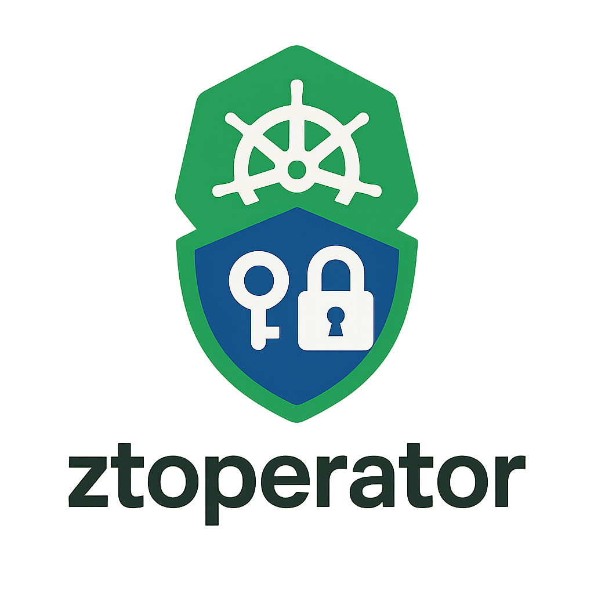

# Ztoperator

**Ztoperator** er en Kubernetes-operator som gjør det mulig å tilgangsstyre trafikk inn mot din applikasjon på en sikker og fleksibel måte gjennom CRD'en [`AuthPolicy`](02-api-docs.mdx#authpolicy). 
En `AuthPolicy` lar deg kontrollere hvilke forespørsler som får aksessere applikasjonen din basert på [Json Web Tokens (JWT)](https://datatracker.ietf.org/doc/html/rfc7519).
Hvilke felter som eksisterer og deres oppførsel er dokumentert i [Ztoperator sin API-dokumentasjon](02-api-docs.mdx). 
Hvordan du kan teste og verifisere oppførselen til en `AuthPolicy` finner du under [Test din AuthPolicy](01-test-authpolicy.mdx). 

