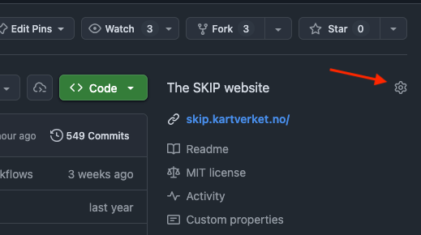
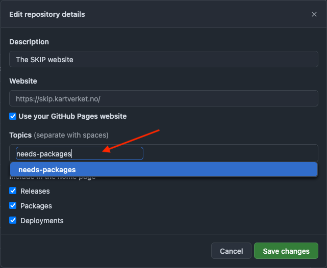

# Tilgang til interne pakker fra GitHub Actions

Når man jobber med avhengigheter til interne pakker i organisasjonen kan det være nødvendig å få tilgang til disse fra GitHub Actions. Dette er spesielt aktuelt når man bygger applikasjoner som avhenger av interne biblioteker eller pakker som ikke er publisert offentlig.

## Bakgrunn
GitHub tilbyr ikke en optimal mekanisme for å dele interne pakker på tvers av repoer i en organisasjon. Dette har ført til at utviklerne i ulike team må opprette egne PAT's manuelt, og disse blir liggende rundt om kring i ulike repoer til de utløper. 

Vi har vurdert og besluttet at en pragmatisk løsning er å tilby en secret på organisasjonsnivå som gir lesetilgang til pakker internt. Dette er en mellomløsning i påvente av bedre mekanismer fra GitHub.

:::info
Tokenet gir kun lesetilgang til pakker i organisasjonen, og skal ikke brukes til andre formål.
:::

## Slik får repoet ditt tilgang
For å få tilgang til secreten med tokenet for henting av interne pakker må du gjøre følgende:

### 1. Legg til topic på repoet
Legg til topic `needs-packages` på GitHub-repoet ditt. Dette gjøres ved å gå til repo-innstillingene på GitHub.





### 2. Kjør Terraform-workflow
Når topic er lagt til må du kjøre Terraform-workflowen i [github-iac](https://github.com/kartverket/github-iac/actions/workflows/shared_package_repos.yaml) for å oppdatere tilgangene. Dette sørger for at repoet ditt får tilgang til tokenet som en secret fra organisasjonen.

Workflowen kjøres også automatisk en gang daglig kl 12 for å fange opp nye repoer og fjerne tilgang fra repoer som ikke lenger har topicen.

### 3. Bruk tokenet i workflows
Etter at tilgangen er på plass kan du bruke tokenet i dine GitHub Actions workflows. Organization secret heter `SHARED_PACKAGES_READ_TOKEN` og kan brukes som en environment-variabel eller sendes inn til actions etter behov.

Hvordan du bruker tokenet avhenger av byggemiljøet og verktøyene du benytter. Her er noen eksempler:

#### Eksempel: Environment-variabel
```yaml
jobs:
  build:
    runs-on: ubuntu-latest
    steps:
      - uses: actions/checkout@v5
      
      - name: Build with access to internal packages
        env:
          PACKAGES_TOKEN: ${{ secrets.SHARED_PACKAGES_READ_TOKEN }}
        run: |
          # Bruk tokenet til å autentisere mot pakkeregisteret
          # Eksempel avhenger av pakkemanager (npm, maven, etc.)
```

#### Eksempel: Send inn til en action
```yaml
jobs:
  build:
    runs-on: ubuntu-latest
    steps:
      - uses: actions/checkout@v5
      
      - name: Setup with package access
        uses: some-action@v1
        with:
          token: ${{ secrets.SHARED_PACKAGES_READ_TOKEN }}
```
