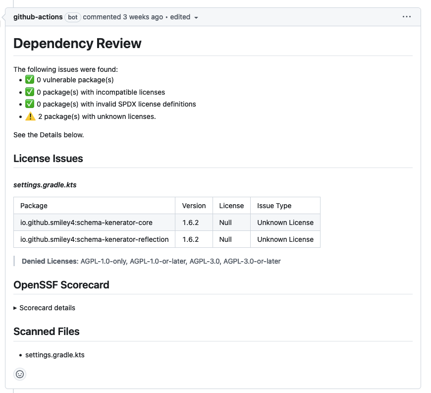

# Dependency review på PR

[Dependency review](https://kartverket.atlassian.net/wiki/spaces/SIK/pages/306810445/Dependency+Review) kan brukes for å få oversikt over sårbarheter og lisenser i nye eller oppdaterte avhengigheter.



GitHub actions kan brukes for å få beskjed om sårbarheter og lisenser på PR, slik som i eksempelet under. Dette forutsetter at dependency graph er riktig satt opp for økosystemet. Gradle-økosystemet må håndteres på en spesiell måte, som vist i [Transitive avhengigheter i Dependency Graph med Gradle](./gradle-dependency-graph.md). Se også [Dependency graph i Sikkerhetshåndboka](https://kartverket.atlassian.net/wiki/spaces/SIK/pages/306906088/Dependency+Graph).

```yaml
name: Review dependencies

on:
  pull_request:
    branches:
      - 'main'

jobs:
  dependency-review:
    permissions:
      contents: read # Required for reading repository
      pull-requests: write # Required for dependency review comments
    runs-on: ubuntu-latest
    steps:
      - name: Checkout repository
        uses: actions/checkout@v4

      - name: Perform dependency review
        uses: actions/dependency-review-action@v4
        if: github.event_name == 'pull_request'
        with:
          comment-summary-in-pr: always
          fail-on-severity: moderate
```

Team kan selv konfigurere hvordan dependency review skal fungere. For flere innstillinger, se [GitHubs egen dokumentasjon](https://docs.github.com/en/code-security/supply-chain-security/understanding-your-software-supply-chain/customizing-your-dependency-review-action-configuration).

For bruk sammen med dependency sumbission API-et, se [GitHub egne anbefalinger for bruk av dependency submission og dependency review sammen](https://docs.github.com/en/code-security/supply-chain-security/understanding-your-software-supply-chain/about-dependency-review#using-github-actions-to-access-the-dependency-submission-api-and-the-dependency-review-api).


