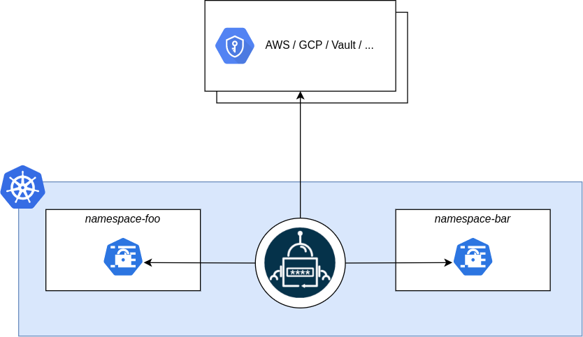

# Hente hemmeligheter fra hemmelighetshvelv


De aller fleste applikasjoner har hemmeligheter den trenger å få tilgang til. Dette kan for eksempel være API-nøkler og passord til databaser. Disse skal lagres på en forsvarlig måte i et hemmelighetshvelv, og dette er beskrevet i sikkerhetshåndboka under [Hemmeligheter](https://kartverket.atlassian.net/wiki/spaces/SIK/pages/499351621/Hemmeligheter) . Når hemmelighetene da ligger i hvelvet kommer spørsmålet om hvordan applikasjonen skal få tak i dem, og det er der ExternalSecrets kommer inn.

External Secrets Operator (ESO) er en operator som kjører i clusteret og har evnen til å hente hemmeligheter fra hvelv som Vault og Google Secret Manager (GSM). Disse blir synkronisert fra hvelvet til kubernetes secrets som kan mountes inn i podder. Synkroniseringen beskrives som en “fra-til” konfigurasjon hvor man sier hvor hemmelighetene ligger og hvordan de skal se ut når de er synkronisert til Kubernetes.

:::info
Merk at External Secrets brukes til **deploy-time** uthenting av hemmeligheter. Hvis du har en applikasjon som kjører og skal bruke hemmeligheter **runtime** bør du ikke bruke External Secrets og heller bruke biblioteker som [https://spring.io/projects/spring-cloud-gcp](https://spring.io/projects/spring-cloud-gcp). Se [Oppsett og bruk av Secret Manager](../03-oppsett-og-bruk-av-secret-manager.md).
:::

Mer om external secrets finnes på [https://external-secrets.io/](https://external-secrets.io/latest/).

## Hvordan bruke External Secrets

ESO lytter i clusteret etter [ExternalSecret](https://external-secrets.io/latest/api/externalsecret/) - og [SecretStore](https://external-secrets.io/latest/api/secretstore/) -manifester. I det øyeblikket disse blir plukket opp blir de lest som konfigurasjon for ESO og en synk mot hvelvet starter som vil ende opp med å opprette en Kubernetes Secret. Kubernetes Secreten vil også synkroniseres regelmessig slik at man kan f.eks. rullere hemmeligheter ved å endre dem i hvelvet.

## SecretStore

SecretStore-manifestet definerer et hvelv, slik som Vault eller GSM, og må settes opp først. Denne konfigurasjonen vil også inneholde hvordan ESO skal autentisere seg og kan gjenbrukes av flere ExternalSecret-manifester. Disse settes typisk opp av et produktteam for deres namespace for å definere hvor de har lagret sine hemmeligheter.

Se [GCPSMProvider](https://external-secrets.io/latest/api/spec/#external-secrets.io/v1.GCPSMProvider) for alle gyldige verdier.

```yaml
apiVersion: external-secrets.io/v1
kind: SecretStore
metadata:
  name: gsm
spec:
  provider:
    gcpsm:
      projectID: <YOUR_PROJECT_ID>
```

For at det skal være lov å hente ut secrets må i tillegg følgende gjøres:

1. Man må gå inn på secreten som skal eksponeres til ESO og gi rollen `roles/secretmanager.secretAccessor` til servicekontoen:

    - Dev - `eso-secret-accessor@skip-dev-7d22.iam.gserviceaccount.com`
    - Prod - `eso-secret-accessor@skip-prod-bda1.iam.gserviceaccount.com`

2. Namespacene dere oppretter må allowlistes for å kunne hente ut fra prosjektene deres, kontakt SKIP så setter vi `skip.kartverket.no/gcpProject` på prosjektene deres og synkroniserer Argo på nytt

## Synkronisering av hemmeligheter: ExternalSecret og PushSecret

External Secrets Operator (ESO) tilbyr to primære metoder for å håndtere hemmeligheter: **pull** og **push**. Den vanligste metoden er å hente (pull) hemmeligheter fra et eksternt hvelv som Google Secret Manager til Kubernetes, men i noen tilfeller er det også nyttig å kunne dytte (push) hemmeligheter fra Kubernetes til hvelvet.

### ExternalSecret (Pull)

Når du har definert et hemmelighetshvelv med `SecretStore`, kan du definere hvilke hemmeligheter som skal hentes ut. Dette gjøres med `ExternalSecret`-manifestet, som refererer til et `SecretStore` for å vite hvilken backend og autentisering som skal brukes. ESO vil bruke dette manifestet til å hente de definerte feltene fra den gitte hemmeligheten og putte dem inn i en Kubernetes `Secret` i det formatet som blir spesifisert. Dette lar deg for eksempel mappe om navn på nøkler.

I eksempelet under hentes en hemmelighet fra Google Secret Manager og synkroniseres inn som en Kubernetes `Secret`.

```yaml
apiVersion: external-secrets.io/v1
kind: ExternalSecret
metadata:
  name: dbpass
spec:
  # Refererer til SecretStore for autentisering mot Google Secret Manager
  secretStoreRef:
    kind: SecretStore
    name: gsm-backend

  # Definerer hvilke data som skal hentes
  data:
  - remoteRef:
      # Navnet på hemmeligheten i Google Secret Manager
      key: db-pass
    # Nøkkelen som skal brukes i Kubernetes Secret
    secretKey: DB_PASSWORD

  # Spesifiserer navnet på Kubernetes Secret som skal opprettes
  target:
    name: dbpass

  # Hvor ofte hemmeligheten skal synkroniseres
  refreshInterval: 1h
```

---

### PushSecret (Push)

I motsetning til `ExternalSecret` som *henter* hemmeligheter, lar `PushSecret` deg *dytte* hemmeligheter fra Kubernetes til et eksternt hvelv som Google Secret Manager. Dette er nyttig når en hemmelighet genereres inne i Kubernetes-klusteret – for eksempel et automatisk generert passord, en privat nøkkel eller et token – og du ønsker å lagre denne sikkert i et sentralt hvelv for gjenbruk, revisjon eller tilgang fra andre systemer.

`PushSecret` fungerer ved å overvåke en Kubernetes `Secret`. Når denne `Secret`-en opprettes eller endres, vil ESO dytte dataene til den spesifiserte hemmeligheten i hvelvet.

I eksempelet under vises hvordan man dytter en Kubernetes `Secret` kalt `my-app-secret` til Google Secret Manager.

```yaml
apiVersion: external-secrets.io/v1alpha1
kind: PushSecret
metadata:
  annotations:
    name: push-secret-navn
    namespace: app-namespace

spec:
  # Dette er secreten som pushes til i gsm.
  data:
  - conversionStrategy: None
    match:
      remoteRef:
        remoteKey: gsm-secret
  # Hvor ofte ESO skal sjekke om hemmeligheten har endret seg
  refreshInterval: 10m
  # Refererer til SecretStore for autentisering
  secretStoreRefs:
  - kind: SecretStore
    name: gsm
  # Velger hvilken Kubernetes Secret som skal overvåkes og dyttes
  selector:
    secret:
      name: kubernetes-secret
```

**Viktig:** For at `PushSecret` skal fungere, må Service Account-en som brukes av `SecretStore`-en ha skriverettigheter (f.eks. `secretmanager.secretVersionAdder`) til hemmelighetene i Google Secret Manager.

---


### Mounting av hemmelighet

Når ESO har synkronisert inn hemmeligheten og opprettet en Kubernetes Secret er det ofte slik at man ønsker å bruke dette i en Pod. Vanligvis gjennom å mounte dette som miljøvariabler eller som en fil på filsystemet, eksempelvis for sertfikater. Bruker man Skiperator er dette veldig rett frem.

Se også [Using Secrets as files from a Pod](https://kubernetes.io/docs/concepts/configuration/secret/#using-secrets-as-files-from-a-pod) og [Using Secrets as environment variables](https://kubernetes.io/docs/concepts/configuration/secret/#using-secrets-as-environment-variables) , men merk at spec er annerledes med Skiperator.

```yaml
apiVersion: skiperator.kartverket.no/v1alpha1
kind: Application
metadata:
  name: teamname-frontend
spec:
  # Each key will be set as an env var with its value as the value
  envFrom:
  - secret: dbpass

  # Each key will be created as a file with the key as filename and value as content
  filesFrom:
  - secret: dbpass
    mountPath: /var/run/secret
```

### Hva hindrer andre å hente min hemmelighet?

Med External Secrets gis en sentral servicekonto tilgang til å hente ut hemmelighetene i GSM. Man skulle derfor tro at det var mulig for andre som bruker den samme servicekontoen å hente ut hemmeligheten. Det er ikke tilfellet og er løst med andre policies i clusteret.

Ditt team oppretter en SecretStore, og det finnes policies i clusteret som sørger for at kun prosjekter som dere eier kan knyttes opp her. SecretStore-en er det som brukes for å hente fra GCP. Dermed er det kun prosjektet som ligger her som kan hentes fra, og kun ditt team som kan hente fra ditt prosjekt.
