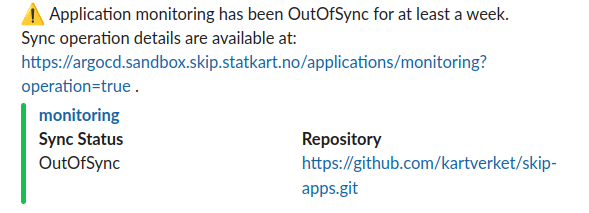
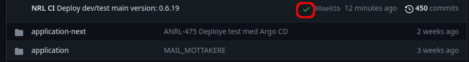
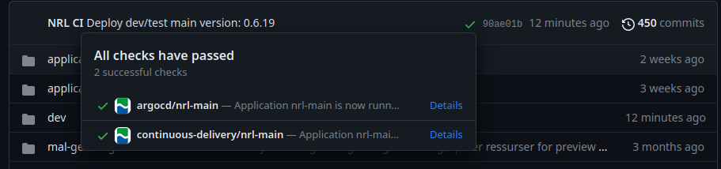

# Argo CD Notifications

Argo CD har støtte for å sende varslinger basert på forhåndsdefinerte triggere gjennom en rekke kanaler, deriblant Slack og GitHub. Eksempler på dette kan være triggere basert på at synkroniseringen av en applikasjon feilet, eller at en applikasjon har ligget i OutOfSync over et visst tidsrom.

[ArgoCD Notifications er dokumentert her](https://argo-cd.readthedocs.io/en/stable/operator-manual/notifications/).

Vår Argo CD-installasjon kommer med en rekke triggere og forhåndsinstallerte templates for utseende.

Se [https://github.com/kartverket/skip-apps/blob/main/bases/argocd/patches/argocd-notifications-templates.yml](https://github.com/kartverket/skip-apps/blob/main/bases/argocd/patches/argocd-notifications-templates.yml) for hvilke triggers som er tilgjengelig.

## Slack

For Slack er det satt opp en notifikasjonskanal for hvert team på mønster &lt;teamnavn&gt;-argocd-alerts, f.eks. #nrl-argocd-alerts. Disse kanalene er videre satt opp med integration mot Slack-appen “ArgoCD Notifications” som tar imot meldinger fra ArgoCD og dytter de inn i korrekt kanal.

(NB: Hvis du ikke finner en slik kanal for teamet ditt, kontakt en administrator for Kartverkets Slack og be om å få opprettet en kanal med korrekt navnemønster og integrasjon mot “ArgoCD Notifications”).



### GitHub

For GitHub er det satt opp en app kalt "KV ArgoCD Notifications" som har mulighet til å skrive workflow-statuser til GitHub for de forskjellige apps-repoene. Kontakt en av Kartverkets GitHub-administratorer dersom flere apps-repoer skal legges til her.

Eksempler på notifikasjoner:



### Standardnotifikasjoner

Følgende triggers er lagt til som standard for alle apps-repoer:

| **Trigger**                                                         | **Kommunikasjonskanal** | **Når trigges denne?**                                                                                                            |
| ------------------------------------------------------------------- | ----------------------- | --------------------------------------------------------------------------------------------------------------------------------- |
| `notifications.argoproj.io/subscribe.on-sync-failed.slack`          | Slack                   | Synkronisering av applikasjon feilet                                                                                              |
| `notifications.argoproj.io/subscribe.on-sync-failed.github`         | GitHub                  | Synkronisering av applikasjon feilet                                                                                              |
| `notifications.argoproj.io/subscribe.on-sync-succeeded.github`      | GitHub                  | Synkronisering av applikasjon gikk bra                                                                                            |
| `notifications.argoproj.io/subscribe.on-sync-running.github`        | GitHub                  | Synkronisering av applikasjon kjører                                                                                              |
| `notifications.argoproj.io/subscribe.on-health-degraded.github`     | GitHub                  | Helsesjekk av applikasjonen returnerer et “degraded”-resultat                                                                     |
| `notifications.argoproj.io/subscribe.on-sync-status-unknown.github` | GitHub                  | Ukjent synkroniseringsstatus                                                                                                      |
| `notifications.argoproj.io/subscribe.on-deployed.github`            | GitHub                  | Ny versjon av applikasjonen deployet til miljø                                                                                    |
| `notifications.argoproj.io/subscribe.on-outofsync-one-day.slack`    | Slack                   | Applikasjonen har status OutOfSync i minst en dag (det har blitt sjekket inn endringer i apps-repoet som ikke har blitt deployet) |
| `notifications.argoproj.io/subscribe.on-outofsync-one-week.slack`   | Slack                   | Applikasjonen har status OutOfSync i minst en uke (det har blitt sjekket inn endringer i apps-repoet som ikke har blitt deployet) |

### Ekstra triggers

I tillegg er det mulig å spesifisere andre triggere (så lenge disse er lagt inn i Argo CD) per team i objektet triggerSubscriptions i [https://github.com/kartverket/skip-apps/blob/65aaad8bba1f32c5b2942bdf7522cbde3100aa60/lib/argocd/teams.json](https://github.com/kartverket/skip-apps/blob/65aaad8bba1f32c5b2942bdf7522cbde3100aa60/lib/argocd/teams.json).

:::info
Husk å spesifisere om det er Slack- eller GitHub-varsling du ønsker, ved å legge til suffikset `.slack` eller `.github` på slutten av trigger-navnet. Husk å spesifisere kanalnavn ved bruk av Slack-varsling.
:::

```javascript
{
    name: 'teamnavn',
    oidcGroup: 'aabbbcc-123-321-ccbbbaa',
    allowlistedPrefixes: [{ name: 'teamnavn' }],
    triggerSubscriptions: {
      'notifications.argoproj.io/subscribe.on-sync-succeeded.slack': 'navn-paa-slack-kanal',
      'notifications.argoproj.io/subscribe.eksempel-trigger.github': '', # denne er blank siden det ikke er en kanal å sende til på github
    }
},
```
