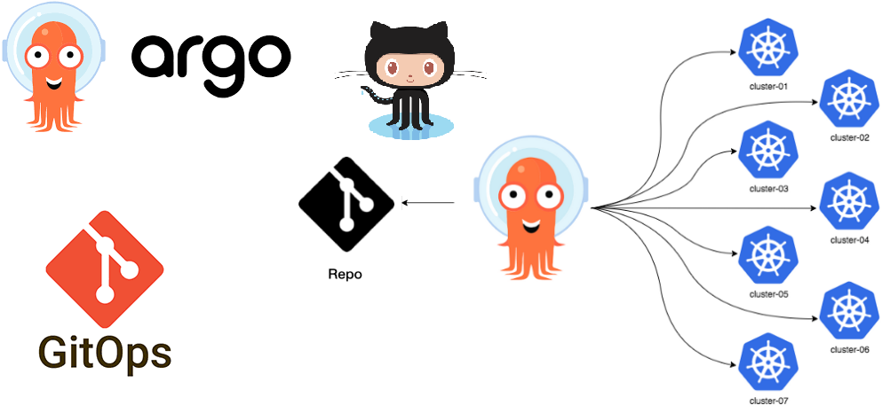
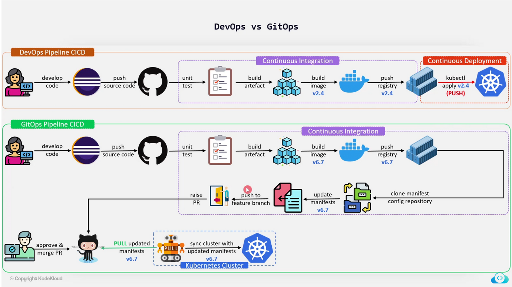

# 🚀 Argo CD

Argo CD er deployment-systemet som brukes for å synkronisere applikasjoner ut til SKIP. Dette gjøres ved å synkronisere manifest-filer i YAML- eller JSON-format ut på Kubernetes. Dette kan for eksempel være [Skiperator](https://github.com/kartverket/skiperator) Application-manifest-filer som bygger ut en fullstendig applikasjon.

Dokumentasjonen til Argo CD er også veldig god, så det kan være greit å gå gjennom den, og vi kommer til å referere mye til den i disse sidene. Vi kan anbefale [How it Works](https://argo-cd.readthedocs.io/en/stable/#how-it-works) og [Sidene under User Guide](https://argo-cd.readthedocs.io/en/stable/user-guide/application_sources/) .

## Lenker til Argo

Du må være på Kartverkets nettverk eller VPN for å kunne nå disse lenkene.

- [Dev (argo-dev.kartverket.dev)](https://argo-dev.kartverket.dev/)
- [Prod (argo-prod.kartverket.dev)](https://argo-prod.kartverket.dev/)

## GitOps

Argo CD er et GitOps-verktøy, det vil si at kilden til sannhet ligger i git og synkes inn i clusteret derfra. GitOps er beskrevet i bildet over og er en “Pull-basert” deployment-flyt kontra den tradisjonelle “Push-baserte” deployment-flyten. En operator kjører i clusteret og overvåker kontinuerlig ett eller flere git-repoer og synkroniserer YAML-filer inn i clusteret. På den måten kan produktteam forholde seg til noe så enkelt som filer i en mappe i git, og når disse filene endres gjøres en deploy helt automatisk.

GitOps vil gi mange fordeler, men det blir et paradigmeskifte for mange. I stedet for å tenke "Push"-basert deploy ved å kjøre et skript for å deploye vil man legge inn ønsket state i en fil og så vil systemet jobbe for å bringe clusteret i synk med ønsket state. Denne overgangen kan også sammenlignes litt med imperativ vs. deklarativ programmering, som jQuery vs. React. For de fleste som har jobbet med Kubernetes vil det føles veldig kjent, siden Kubernetes i praksis er en stor reconciliation loop som kontinuerlig driver clusteret mot ønsket state.

Det er mange fordeler med et slikt deployment-system. Når deployment og CI er to distinktive komponenter i systemet blir deployment-systemet mye mer spisset inn mot sin rolle og vil kunne perfeksjonere den, den såkalte [“Do one thing and do it well”](https://hackaday.com/2018/09/10/doing-one-thing-well-the-unix-philosophy/)-tankegangen.

I de neste sidene skal vi beskrive hvordan Argo CD fungerer og hvordan dere kan bruke det til å deploye til SKIP.

