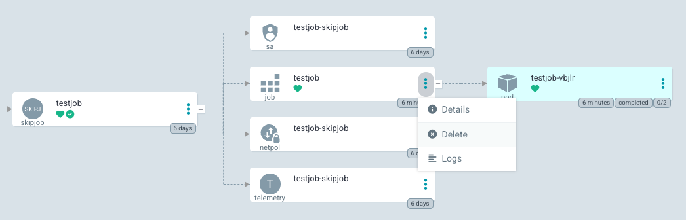

# 📅 Jobber på SKIP

SKIP tilbyr abstraksjonen `SKIPJob` for å kunne kjøre programmer én gang ("one-off") eller periodisk (kjent som "cron jobs"). 
Dette dokumentet hjelper deg med å ta i bruk jobber på SKIP. 

## Konfigurere en SKIPJob

En SKIPJob konfigureres i stor grad likt som applikasjoner. 
Inbound access policy og port skal derimot *ikke* konfigureres for jobber. 
Mer info om vanlig konfiguration av applikasjoner finner du [her](/docs/applikasjon-utrulling/skiperator/configuring).

### One-off jobb

```yaml
apiVersion: skiperator.kartverket.no/v1alpha1
kind: SKIPJob
metadata:
  name: min-jobb
spec:
  container:
    image: "ghcr.io/kartverket/min-jobb:latest"
```
Denne vil kjøre docker imaget `min-jobb:latest` en gang. 
Den vil kjøre hver gang den blir syncet i ArgoCD. 

### Cron jobb (periodisk)

```yaml
apiVersion: skiperator.kartverket.no/v1alpha1
kind: SKIPJob
metadata:
  name: min-cron-jobb
spec:
  container:
    image: "ghcr.io/kartverket/min-jobb:latest"
  cron:
    schedule: "0 * * * *"
```

Denne vil kjøre docker imaget `min-jobb:latest` én gang hver time. For å finne et passende cron-uttrykk anbefales [Crontab Guru](https://crontab.guru/).
**NB:** Alle jobber vil kjøre i UTC-tidssonen, med mindre feltet `timeZone` er spesifisert.

### Kompleks jobb

I dette eksempelet konfigureres en jobb som har tilgang til å aksessere ressurser i GCP (f.eks. Blob Storage) og som er avhengig av å prate med applikasjonen `min-applikasjon` i samme namespace. 
Jobben kjører ukedager (mandag-fredag) kl 21:30 i gjeldende tidssone for Norge.

```yaml
apiVersion: skiperator.kartverket.no/v1alpha1
kind: SKIPJob
metadata:
  name: min-cron-jobb
spec:
  cron:
    schedule: "30 21 * * 1-5"
    timeZone: "Europe/Oslo"
  container:
    image: "ghcr.io/kartverket/min-jobb:latest"
    gcp:
      auth:
        serviceAccount: "min-jobb@mitt-prosjekt.iam.gserviceaccount.com"
    accessPolicy:
      outbound:
        rules:
          - application: "min-applikasjon"
    env:
      - name: MIN_ENV_VAR
        value: "min-env-value"
    envFrom:
      - secret: "secret-navn"
```

## Trigge en jobb

Spesielt for one-off jobber er det aktuelt å trigge jobben manuelt uten at du har gjort endringer. 
Vi har ingen pen måte å trigge jobber på ennå, men du kan likevel trigge en jobb ved å gå inn i argo og slette `Job` ressursen (*ikke* `SKIPJob`). 

Trykk på "Delete", velg "Foreground Delete" (default) og trykk "Ok" så vil `Job` ressursen opprettes på nytt og jobben kjøres. 

For å trigge cron jobber manuelt kan du trykke på kebab meny knappen på "cronjob" ressursen og velge "Create Job". 

Ved å sette [`.spec.cron.suspend = true`](/docs/applikasjon-utrulling/skiperator/api-docs#skipjobspeccron) kan du hindre en cron jobb fra å kjøre periodisk og den kan dermed trigges manuelt via kebab meny. 
SKIPJoben vil da oppføre seg som en one-off jobb, men den vil ikke kjøre når den synces. 
