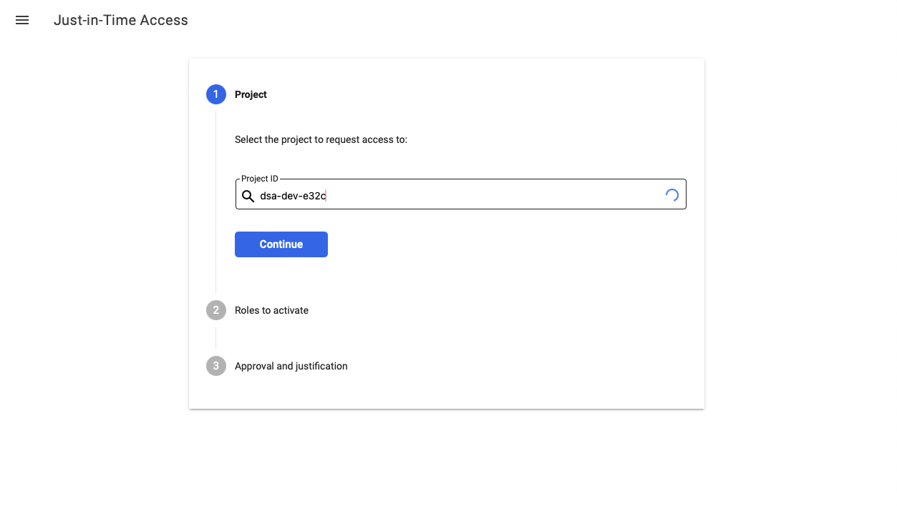

# Dynamisk tilgangskontroll (JIT)

Most developers will at some point experience not having the correct permissions to operate on Google Cloud resources. This is intentional and is part of the [principle of least privilege](https://en.wikipedia.org/wiki/Principle_of_least_privilege) .

In order to operate on the resources you want to access, you need to elevate your privileges. A system exists to make this operation self-service, and it is called Just-In-Time access. It can be accessed at [https://jit.skip.kartverket.no](https://jit.skip.kartverket.no/) .

After logging in with your Kartverket google account, it will take you to the below screen.

First step is filling in the ID of the project you wish to get access to. This can be found by searching in the box or by finding the ID from [console.cloud.google.com](http://console.cloud.google.com/).

Second step, select the roles you want. It is often possible to see which role you need from the error message you got when trying to do an operation and getting denied.

A common role that is used for administering secrets in Google Secret Manager is `secretmanager.admin`.

Select a suitable duration using the slider and click continue. Note that some sensitive roles are not compatible with longer durations.

Now for the final step, enter a reason for the access request. This is mostly for auditing, as generally speaking requests are granted automatically. The reason entered will be possible to see in the logs if we need to investigate a security breach.

In less common cases, for example when restricted roles are to be granted, a manual approval is required. In that case the reason will be visible to the person who approves the request.

When you click request access, you will be taken to a summary screen which gives you the result of your request. In the example above, my request was granted automatically.

You now have access, and that's just in time!
