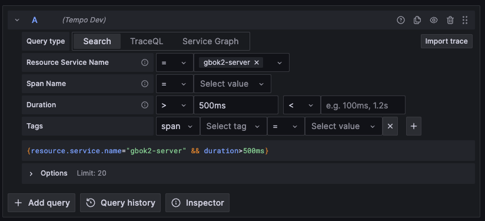
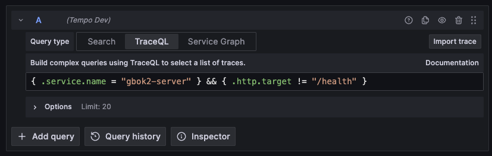

# Distribuert traces med Tempo

## Hva er distributed tracing?

I komplekse (og distribuerte) systemer er det til enhver tid mange pågående parallelle prosesser. Noen av disse er sammenkoblet eller trigger hverandre. For å finne ut hvilke operasjoner som stammer fra samme forespørsel, er det vanlig i mange systemer å ha en såkalt Trace ID. Med moderne distribuert traces er dette standardisert, og i tillegg støttes underoperasjoner (spans) per Trace ID. Når du bruker et standardisert oppsett for å trace applikasjoner, får du også tilgang til en stor og spennende verktøykasse.

Videre lesing:

- [OpenTelemetry](https://opentelemetry.io/)
- [Zipkin](https://zipkin.io/) (interessant fra et historisk perspektiv)
- [En generell guide for å komme i gang med distributed tracing](https://www.honeycomb.io/getting-started/getting-started-distributed-tracing)

## Hva tilbyr SKIP?

Som en del av vår implementering av LGTM-stacken, har SKIP valgt å tilby [Grafana Tempo](https://grafana.com/oss/tempo/) som en tjeneste. Dette er en komponent som er fullt integrert med resten av denne moderne observability-stacken, og deler samme brukergrensesnitt og autentisering som Grafana, Mimir og Loki.

## Hvordan kommer jeg i gang?

### Instrumentering (instrumentation)

:::warning
En kjent begrensning i måten vi har samlet inn traces på, er at vi frem til nylig ikke har hatt noen måte å ekskludere visse traces automatisk. Dette betyr at alle Prometheus-skrapinger (innsamling av metrics) og automatiske helsesjekker også vil bli samlet inn.

Nå som issue [#4628](https://github.com/grafana/agent/issues/4628) er implementert, kan dette endelig rettes opp. Følg [SKIP-1250](https://kartverket.atlassian.net/browse/SKIP-1250) for oppdateringer om når dette blir implementert i vårt oppsett.
:::

For å generere, videreføre og sende traces, må applikasjonen instrumenteres.

Instrumentering kan oppnås på flere måter, hvorav to er relevante for oss: manuell og automatisk instrumentering.

Manuell instrumentering krever bruk av et [bibliotek](https://opentelemetry.io/docs/instrumentation/java/manual/) som vet hvordan en gitt integrasjon oppfører seg, og som gjør det mulig å koble seg til hooks i den integrasjonen for å generere nye traces og/eller spans dersom disse ikke allerede eksisterer.

Den andre (og anbefalte) metoden er å bruke en automatisert tilnærming. For Java-applikasjoner (den eneste typen som er testet per nå), må du inkludere en Java-agent i Docker-imaget ditt, samt sette opp litt ekstra konfigurasjon når applikasjonen kjører (for eksempel gjennom Skiperator).

:::info
Det er verdt å nevne at Spring-økosystemet tilbyr en form for automatisk instrumentering via Micrometer Tracing og OpenTelemetry OTLP-eksportører. Per oktober 2023 er dette fortsatt under utvikling og anses ikke som en moden nok løsning til å tas i bruk i våre systemer.
:::

### Eksempel på Dockerfile

```dockerfile
FROM alpine:3.18.3@sha256:c5c5fda71656f28e49ac9c5416b3643eaa6a108a8093151d6d1afc9463be8e33 AS builder
ARG OTEL_AGENT_VERSION=1.29.0

# 1. Last ned påkrevd java-agent
RUN apk add --no-cache curl \
    && mkdir /agents \
    && curl -L https://github.com/open-telemetry/opentelemetry-java-instrumentation/releases/download/v${OTEL_AGENT_VERSION}/opentelemetry-javaagent.jar > /agents/opentelemetry.jar

ADD build/distributions/gbok-run*.tar /gbok

FROM eclipse-temurin:11-jdk-alpine
COPY cert/kartverket_root_ca.crt /usr/local/share/ca-certificates/kartverket_root_ca.crt

ENV USER_ID=150
ENV USER_NAME=apprunner

RUN apk add --no-cache tzdata \
    && addgroup -g ${USER_ID} ${USER_NAME} \
    && adduser -u ${USER_ID} -G ${USER_NAME} -D ${USER_NAME} \
    && keytool -import -v -noprompt -trustcacerts -alias kartverketrootca -file /usr/local/share/ca-certificates/kartverket_root_ca.crt -keystore $JAVA_HOME/lib/security/cacerts -storepass changeit

ENV TZ=Europe/Oslo
COPY --from=builder --chown=${USER_ID}:${USER_ID} /gbok /gbok
# 2. Kopier inn nedlastet agent
COPY --from=builder --chown=${USER_ID}:${USER_ID} /agents /agents

USER ${USER_NAME}
EXPOSE 8081
ENTRYPOINT ["sh", "-c", "/gbok/gbok-run*/bin/gbok-run"]
```

### Konfigurasjon ved kjøring (runtime configuration)

For å bruke Java-agenten må den konfigureres og lastes inn. Gjennom testing med Grunnboken har vi kommet frem til [den første versjonen av konfigurasjon som kan sees her](https://github.com/kartverket/digibok-apps/blob/879d3d34b4c1f6f28d961c59193cb965a922f71f/applications/gbok2.libsonnet#L6-L14).

Når denne konfigurasjonen er gjort, sendes den til `JAVA_TOOL_OPTIONS` [slik som dette](https://github.com/kartverket/digibok-apps/blob/879d3d34b4c1f6f28d961c59193cb965a922f71f/applications/gbok2.libsonnet#L38).

Det finnes for øyeblikket ingen innebygd mekanisme i [ArgoKit](https://github.com/kartverket/argokit) for å oppnå dette. Vi er åpne for PR-er på dette temaet hvis noen ønsker å bidra.

### Se traces

Traces kan sees gjennom vår Grafana-instans på [monitoring.kartverket.cloud](https://monitoring.kartverket.cloud/). Herfra velger du **Explore** i menyen og deretter den riktige **Tempo**-datakilden som tilsvarer miljøet du ønsker å se traces for.

Etter det har du valget mellom å bruke **Search** (grafisk verktøy for spørringer) eller **TraceQL** (manuelt verktøy for spørringer).


Over: "Search"-fanen er aktiv, og feltene er fylt ut ved hjelp av nedtrekksmenyer.


Over: "TraceQL"-fanen lar deg spesifisere en brukerdefinert spørring. Her vises en spørring for "gbok2-server"-traces, hvor helsesjekker er filtrert ut.
