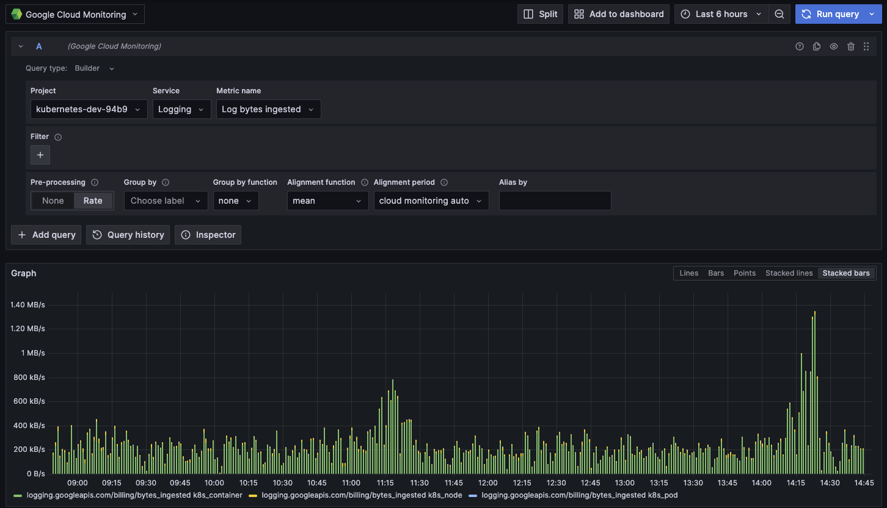
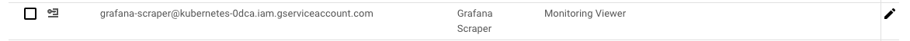

# Grafana og GCP

## Google Cloud Monitoring

Det er mulig å hente metrikker fra et Google Cloud-prosjekt ved å bruke Grafana-datakilden “Google Cloud Monitoring”.

Ved å bruke denne datakilden vil du kunne se alle metrikker som er eksponert gjennom ulike Google Cloud-tjenester, som CloudSQL, BigQuery, CloudKMS, Logging osv. Dette kan deretter legges til i dine dashboards og alarmer.

### Oppsett av datakilden

Selv om datakilden er tilgjengelig, vil den ikke skrape alle prosjekter i Kartverket-organisasjonen i GCP som standard. Per i dag (13. okt 2023) tilrettelegger ikke SKIP for dette oppsettet på noen spesiell måte, men du står fritt til å gjøre det på “SKIP-måten”.

For å legge til ditt GCP-prosjekt i listen over prosjekter, legger du ganske enkelt til GCP-rollen `monitoring.viewer` på Google-tjenestekontoen (Service Account) `grafana-scraper@kubernetes-0dca.iam.gserviceaccount.com`. Det bør se ut som bildet under.

Husk at hvis du ikke har tilgang til å redigere IAM for prosjektene dine som standard, kan du alltid eskalere tilgangen din ved å bruke [JIT Access](https://jit.skip.kartverket.no/) .

Merk at oppsettet for dette kan endre seg i fremtiden, da denne funksjonaliteten er noe uutforsket i skrivende stund.
