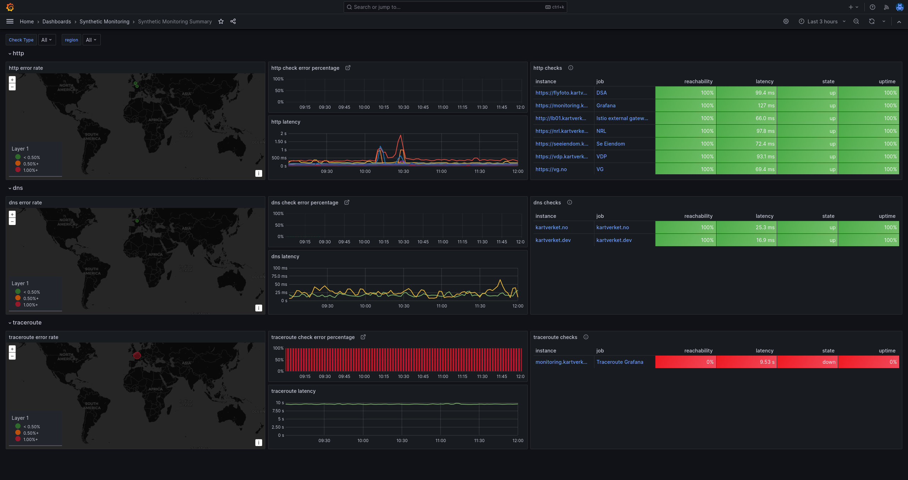
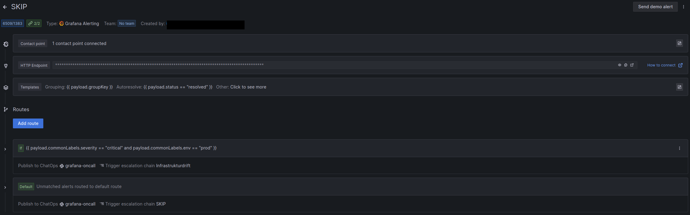
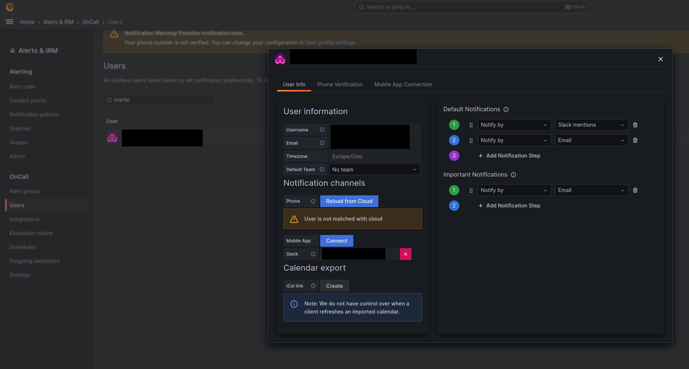

# Alerting with Grafana



Applications on SKIP use [Grafana](https://grafana.com/) for monitoring for unexpected changes in the system. When an alert is fired it can be either handled as a critical alert sent to several channels, including SMS and email, or as a non-critical alert that is handled during office hours by the product team.

Here are some useful links for handling alerts:

- [Alert config (grafana-alerts on GitHub)](https://github.com/kartverket/grafana-alerts)
- [Alert dashboard](https://monitoring.kartverket.cloud/alerting/list?view=state)
- [Critical alerts dashboard](https://monitoring.kartverket.cloud/d/dd79f2b5-feca-45ff-9396-f67d22adc3c5/alerts?orgId=1)
- [Current active incidents](https://monitoring.kartverket.cloud/a/grafana-oncall-app/alert-groups)
- [Synthetic Monitoring overview](https://monitoring.kartverket.cloud/d/fU-WBSqWz/synthetic-monitoring-summary?dashboard=summary&orgId=1)
- [Synthetic Monitoring checks](https://monitoring.kartverket.cloud/a/grafana-synthetic-monitoring-app/checks)
- [Planned alert silences (maintainance periods)](https://monitoring.kartverket.cloud/alerting/silences)
- [Alert Schedules](https://monitoring.kartverket.cloud/a/grafana-oncall-app/schedules?p=1)

## Creating alerts

The first step to start adding alerts to your application is to onboard that app to SKIP. Grafana is only used for SKIP, the rest of Kartverket uses Zabbix. Once you have been onboarded and deployed your app to SKIP you can request access to the [grafana-alerts](https://github.com/kartverket/grafana-alerts) repo.

The grafana-alerts repo is designed to be a repo that contains the alerts of all teams and handles deployment of alerts to Grafana. You will get a file which contains the configuration of your alerts in a Terraform format. For example, the file could look like this:

```hcl
resource "grafana_folder" "MYTEAMNAME_folder" {
  for_each = local.envs
  title    = "Alerts MYTEAMNAME ${each.key}"
}

module "MYTEAMNAME_alerts_kubernetes" {
  source   = "../modules/grafana_alert_group"
  for_each = local.envs

  name             = "kube-state-metrics"
  env              = each.value
  runbook_base_url = # URL to document describing each alert
  folder_uid       = grafana_folder.MYTEAMNAME_folder[each.key].uid
  team = {
    name = "MYTEAMNAME"
  }
  alerts = {
    KubernetesPodNotHealthy = {
      summary     = "Kubernetes Pod not healthy (instance {{ $labels.instance }})"
      description = "Pod has been in a non-ready state for longer than 15 minutes.\n  VALUE = {{ $value }}\n  LABELS = {{ $labels }}"
      severity    = "critical"
      for         = "15m"
      expr        = <<EOT
          sum by (namespace, pod) (kube_pod_status_phase{phase=~"Pending|Unknown|Failed", namespace=~"nrl-.*"})
      EOT
    },
    # ... more alerts
  }
}
```

In the above file we create an alert that monitors the health of a pod in all nrl namespaces. Pay attention to the `expr` field, which is the Prometheus query language PromQL. If you want to learn more about PromQL look at the [documentation](https://prometheus.io/docs/prometheus/latest/querying/basics/) as well as [some examples](https://prometheus.io/docs/prometheus/latest/querying/examples/) from the Prometheus documentation and the examples at [awesome prometheus alerts](https://samber.github.io/awesome-prometheus-alerts/) .

This is a file that you will be given CODEOWNER access to. This means that you and your team will be able to update this file and review your own changes without involving SKIP. Your team is expected to keep them at a level that verifies the running state of the application.

Updating this file in the GitHub repo will automatically deploy the changes to Grafana.

## Grafana Oncall Alerts

In addition to Grafana alerts, we have installed a plugin to Grafana called Oncall. This plugin gives us the possibility of adding schedules/shifts and custom alerting behaviour. It also gives your team an overview and a system to handle alerts.


### Integration

In order to start using Oncall you need an [oncall integration](https://grafana.com/docs/oncall/latest/integrations/) to Grafana. This integration will show up as a contact point in Grafana which can be used in notification policies to route alerts to your integration.

From the integration you can add [routes and escalation chains](https://grafana.com/docs/oncall/latest/escalation-chains-and-routes/) which decides how the integration will notify the team. The standard setup is to send all alerts to a slack channel, and also to a team member on schedule or shared inbox.




In the grafana-alerts repository we have created an `oncall_integration` module, which you can use to create your teams integration.

### Routes

In an integration you always have a default route, but you can also have a specified route. A route will decide which escalation chain the integration should use when it receives an alert. For example if you have a critical app that requires 24/7 alerting, you can create a route that checks for certain labels, and if found, it will route the alert to the “appdrift” escalation chain.

### Schedules

An [Oncall Schedule](https://grafana.com/docs/oncall/latest/on-call-schedules/web-schedule/) is a collection of “Shifts”. In short this means that you can assign a person to a shift, and that person will receive all alerts sent to the Oncall integration for the duration of their shift. In the grafana-alerts repository you can use the `oncall_team` integration to create both a schedule and escalation chain.


### Escalation Chains

[Escalation chains](https://grafana.com/docs/oncall/latest/escalation-chains-and-routes/) are instructions to Oncall on how to notify you when the connected integration receives an alert. The standard setup here is to contact the assigned person in the set way in Oncall.

The escalation chain below will contact the person which has an assigned shift in Schedule, in the way they have set in Oncall. Usually email or slack mentions.


In Oncall → Users → edit user, you can decide how you want the escalation chain to contact you.



### Terraform

A typical Grafana Oncall setup for a team will look like this:

```hcl
module "team_oncall" {
    source                      = "../modules/oncall_team"
    team_name                   = "team"
    use_schedule                = true
}

module "team_integration" {
    source                      = "../modules/oncall_integration"
    integration_name            = "team"
    slack_channel_name          = "grafana-oncall" //Not required, replace with your own
    vaktlag_enabled             = false
    default_escalation_chain_id = module.team_oncall.team_escalation_chain_id
}
```

:::note
The slack channel must already exist in grafana.

If you want to use predefined users instead of a schedule, then the users must already exist in Oncall.
:::

### Notification policies

You also have to configure notification policies to use your integration. Terraform doesn’t activate the contact point of the integration yet, so this has to be done manually before adding this to terraform(do this by navigating to your integration and activate the contact point). Add code [here.](https://github.com/kartverket/grafana-alerts/blob/main/atgcp1-prod/policies.tf)

Example:

```hcl
policy {
  contact_point = "watchdog"
  group_by      = ["cluster", "alertname"]
  matcher {
    label = "team"
    match = "="
    value = "Vaktlag"
  }
}
```

## 24/7 alerting

Once you have configured a set of alerts, you might want them to be monitored 24/7. Kartverket provides a solution for this in the form of “Vaktlaget”. Vaktlaget is a team consisting of various people in IT-drift that have a special agreement that allows them to be notified and follow up when an alert fires outside of normal working hours.

The first step for getting your alerts onboarded onto vaktlaget is to maintain a set of alerts that only fire when there is a serious outage. Keep in mind that an alert that fires will potentially wake people in the middle of the night, so it is paramount that this set of alerts don’t contain non-critical or “flaky” alerts. These alerts should be given a severity of “critical” to make them distinct from other alerts.

Once you have done this you need to contact vaktlaget to discuss the alerts you wish to onboard. They will comment on what is important enough to be onboarded and you will end up with a set of alerts that is a neat balance between ensuring the stability of our systems and preserving the mental health of the people on the alert schedule.

After you’ve discussed with vaktlaget you can contact SKIP in #gen-skip to have your alert integration be switched over. When this is done, all alerts labeled with env=prod and severity=critical will be sent to vaktlaget using the following schedule:

- The alerts will be sent to your slack channel all day
- The alerts will be sent to appdrift as email, SMS and phone call between 7 and 22
- The alerts will be sent to infrastrukturdrift as email, SMS and phone call between 22 and 7

You can also create a pull request in grafana-alerts with the vaktlag escalation chain added to your integration:

```hcl
module "skip" {
  source                      = "../modules/oncall_integration"
  integration_name            = "skip"
  slack_channel_name          = "grafana-oncall" //Not required, replace with your own
  vaktlag_enabled             = true
  vaktlag_escalation_chain_id = module.vaktlag.appdrift_escalation_chain_id
  default_escalation_chain_id = module.skip.team_escalation_chain_id
}
```

When you later add more alerts to the critical level you also need to discuss with vaktlaget so they can sign off on the new alerts before they are added.
