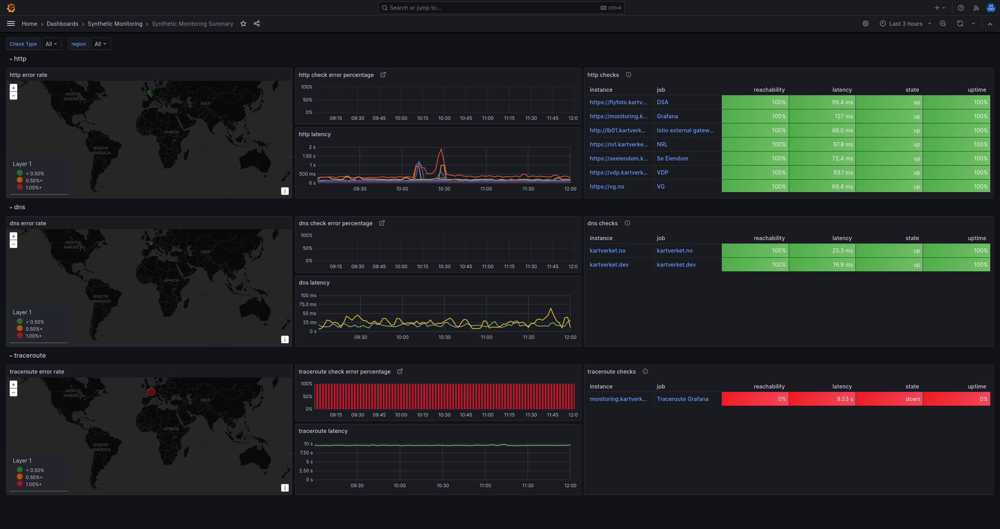
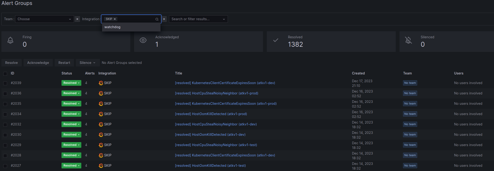
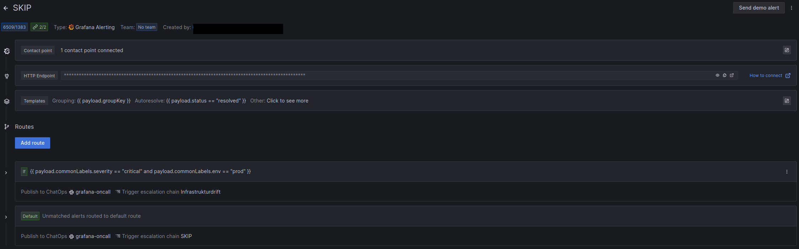
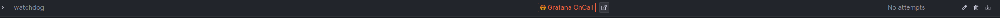
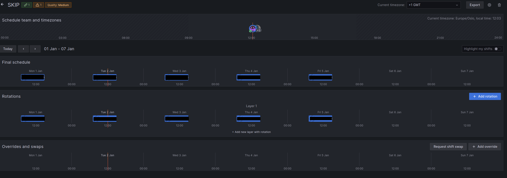
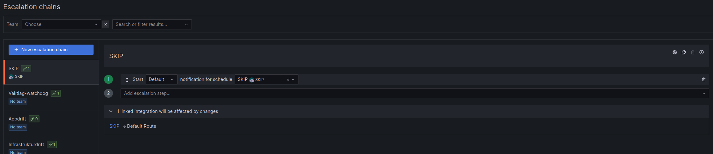
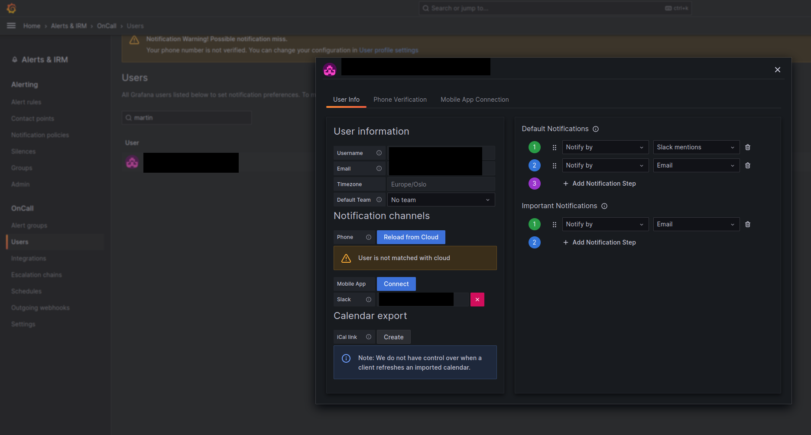

# Alerting med Grafana



Applikasjoner på SKIP bruker [Grafana](https://grafana.com/) for overvåking av uventede endringer i systemet. Når en alert blir utløst (fired), kan den enten håndteres som en kritisk alert sendt til flere kanaler, inkludert SMS og e-post, eller som en ikke-kritisk alert som håndteres i arbeidstiden av produktteamet.

Her er noen nyttige lenker for håndtering av alerts:

- [Alert-konfigurasjon (grafana-alerts på GitHub)](https://github.com/kartverket/grafana-alerts)
- [Alert-dashboard](https://monitoring.kartverket.cloud/alerting/list?view=state)
- [Dashboard for kritiske alerts](https://monitoring.kartverket.cloud/d/dd79f2b5-feca-45ff-9396-f67d22adc3c5/alerts?orgId=1)
- [Aktive hendelser (incidents) akkurat nå](https://monitoring.kartverket.cloud/a/grafana-oncall-app/alert-groups)
- [Oversikt over Synthetic Monitoring](https://monitoring.kartverket.cloud/d/fU-WBSqWz/synthetic-monitoring-summary?dashboard=summary&orgId=1)
- [Sjekker i Synthetic Monitoring](https://monitoring.kartverket.cloud/a/grafana-synthetic-monitoring-app/checks)
- [Planlagte alert-dempinger (silences/vedlikeholdsperioder)](https://monitoring.kartverket.cloud/alerting/silences)
- [Alert-planer (schedules)](https://monitoring.kartverket.cloud/a/grafana-oncall-app/schedules?p=1)

## Opprette alerts

Det første steget for å begynne å legge til alerts for din applikasjon er å onboade appen til SKIP. Grafana brukes kun for SKIP, resten av Kartverket bruker Zabbix. Når du har blitt onboardet og rullet ut appen din til SKIP, kan du be om tilgang til [grafana-alerts](https://github.com/kartverket/grafana-alerts)-repoet.

Repoet `grafana-alerts` er designet for å inneholde alerts for alle team og håndtere utrulling (deployment) av alerts til Grafana. Du vil få en fil som inneholder konfigurasjonen av dine alerts i et Terraform-format. For eksempel kan filen se slik ut:

```hcl
resource "grafana_folder" "MITT_TEAMNAVN_folder" {
  for_each = local.envs
  title    = "Alerts MITT_TEAMNAVN ${each.key}"
}

module "MITT_TEAMNAVN_alerts_kubernetes" {
  source   = "../modules/grafana_alert_group"
  for_each = local.envs

  name             = "kube-state-metrics"
  env              = each.value
  runbook_base_url = # URL til dokument som beskriver hver alert
  folder_uid       = grafana_folder.MITT_TEAMNAVN_folder[each.key].uid
  team = {
    name = "MITT_TEAMNAVN"
  }
  alerts = {
    KubernetesPodNotHealthy = {
      summary     = "Kubernetes Pod not healthy (instance {{ $labels.instance }})"
      description = "Pod har vært i en non-ready tilstand i mer enn 15 minutter.\n  VALUE = {{ $value }}\n  LABELS = {{ $labels }}"
      severity    = "critical"
      for         = "15m"
      expr        = <<EOT
          sum by (namespace, pod) (kube_pod_status_phase{phase=~"Pending|Unknown|Failed", namespace=~"nrl-.*"})
      EOT
    },
    # ... flere alerts
  }
}
```

I filen over oppretter vi en alert som overvåker helsen til en pod i alle nrl-namespaces. Vær oppmerksom på `expr`-feltet, som er spørrespråket PromQL for Prometheus. Hvis du vil lære mer om PromQL, se på [dokumentasjonen](https://prometheus.io/docs/prometheus/latest/querying/basics/) samt [noen eksempler](https://prometheus.io/docs/prometheus/latest/querying/examples/) fra Prometheus-dokumentasjonen og eksemplene hos [awesome prometheus alerts](https://samber.github.io/awesome-prometheus-alerts/).

Dette er en fil som du vil få CODEOWNER-tilgang til. Dette betyr at du og teamet ditt vil kunne oppdatere denne filen og godkjenne deres egne endringer uten å involvere SKIP. Teamet ditt forventes å holde disse på et nivå som verifiserer applikasjonens kjøretilstand.

Oppdatering av denne filen i GitHub-repoet vil automatisk rulle ut endringene til Grafana.

## Grafana Oncall Alerts

I tillegg til Grafana-alerts har vi installert en plugin til Grafana som heter Oncall. Denne plugin-en gir oss muligheten til å legge til vaktplaner (schedules/shifts) og egendefinert alert-oppførsel. Den gir også teamet ditt en oversikt og et system for å håndtere alerts.



### Integrasjon

For å begynne å bruke Oncall trenger du en [oncall integration](https://grafana.com/docs/oncall/latest/integrations/) til Grafana. Denne integrasjonen vil vises som et kontaktpunkt (contact point) i Grafana som kan brukes i varslingsregler (notification policies) for å rute alerts til din integrasjon.

Fra integrasjonen kan du legge til [ruter og eskaleringskjeder](https://grafana.com/docs/oncall/latest/escalation-chains-and-routes/) (routes and escalation chains) som bestemmer hvordan integrasjonen skal varsle teamet. Standardoppsettet er å sende alle alerts til en Slack-kanal, og også til et teammedlem på vaktplan eller delt innboks.





I repoet `grafana-alerts` har vi opprettet en `oncall_integration`-modul som du kan bruke til å opprette teamets integrasjon.

### Ruter (Routes)

I en integrasjon har du alltid en standardrute (default route), men du kan også ha en spesifisert rute. En rute bestemmer hvilken eskaleringskjede integrasjonen skal bruke når den mottar en alert. For eksempel, hvis du har en kritisk app som krever varsling 24/7, kan du opprette en rute som sjekker etter visse labels, og hvis de finnes, vil den rute alerten til "appdrift"-eskaleringskjeden.

### Vaktplaner (Schedules)

En [Oncall Schedule](https://grafana.com/docs/oncall/latest/on-call-schedules/web-schedule/) er en samling av "vakter" (shifts). Kort fortalt betyr dette at du kan tildele en person til en vakt, og den personen vil motta alle alerts sendt til Oncall-integrasjonen i løpet av vaktperioden. I repoet `grafana-alerts` kan du bruke `oncall_team`-integrasjonen til å opprette både en vaktplan og en eskaleringskjede.



### Eskaleringskjeder (Escalation Chains)

[Eskaleringskjeder](https://grafana.com/docs/oncall/latest/escalation-chains-and-routes/) er instruksjoner til Oncall om hvordan du skal varsles når den tilkoblede integrasjonen mottar en alert. Standardoppsettet her er å kontakte den tildelte personen på den måten som er satt i Oncall.

Eskaleringskjeden under vil kontakte personen som har en tildelt vakt i vaktplanen (schedule), på den måten de har satt opp i Oncall. Vanligvis e-post eller Slack-mentions.



Under Oncall → Users → edit user, kan du bestemme hvordan du vil at eskaleringskjeden skal kontakte deg.



### Terraform

Et typisk Grafana Oncall-oppsett for et team vil se slik ut:

```hcl
module "team_oncall" {
    source                      = "../modules/oncall_team"
    team_name                   = "team"
    use_schedule                = true
}

module "team_integration" {
    source                      = "../modules/oncall_integration"
    integration_name            = "team"
    slack_channel_name          = "grafana-oncall" //Ikke påkrevd, bytt ut med din egen
    vaktlag_enabled             = false
    default_escalation_chain_id = module.team_oncall.team_escalation_chain_id
}
```

:::note
Slack-kanalen må allerede eksistere i Grafana.

Hvis du vil bruke forhåndsdefinerte brukere i stedet for en vaktplan, må brukerne allerede eksistere i Oncall.
:::

### Varslingsregler (Notification policies)

Du må også konfigurere varslingsregler for å bruke integrasjonen din. Terraform aktiverer ennå ikke kontaktpunktet for integrasjonen, så dette må gjøres manuelt før det legges til i Terraform (gjør dette ved å navigere til integrasjonen din og aktivere kontaktpunktet). Legg til kode [her](https://github.com/kartverket/grafana-alerts/blob/main/atgcp1-prod/policies.tf).

Eksempel:

```hcl
policy {
  contact_point = "watchdog"
  group_by      = ["cluster", "alertname"]
  matcher {
    label = "team"
    match = "="
    value = "Vaktlag"
  }
}
```

## 24/7 varsling

Når du har konfigurert et sett med alerts, vil du kanskje at de skal overvåkes 24/7. Kartverket tilbyr en løsning for dette i form av "Vaktlaget". Vaktlaget er et team bestående av ulike personer i IT-drift som har en spesiell avtale som tillater dem å bli varslet og følge opp når en alert utløses utenfor normal arbeidstid.

Det første steget for å få dine alerts onboardet til vaktlaget er å vedlikeholde et sett med alerts som bare utløses ved alvorlige driftsavbrudd (outage). Husk at en alert som utløses potensielt vil vekke folk midt på natten, så det er avgjørende at dette settet med alerts ikke inneholder ikke-kritiske eller ustabile ("flaky") alerts. Disse bør gis en severity på "critical" for å skille dem fra andre alerts.

Når du har gjort dette, må du kontakte vaktlaget for å diskutere alertene du ønsker å onboade. De vil gi tilbakemelding på hva som er viktig nok, og dere vil ende opp med et sett med alerts som er en god balanse mellom å sikre systemstabilitet og å bevare den mentale helsen til personene på vaktplanen.

Etter at du har diskutert med vaktlaget, kan du kontakte SKIP i #gen-skip for å få alert-integrasjonen din byttet over. Når dette er gjort, vil alle alerts merket med env=prod og severity=critical bli sendt til vaktlaget etter følgende plan:

- Alertene vil bli sendt til din Slack-kanal hele dagen
- Alertene vil bli sendt til appdrift som e-post, SMS og telefonoppringing mellom kl. 07 og 22
- Alertene vil bli sendt til infrastrukturdrift som e-post, SMS og telefonoppringing mellom kl. 22 og 07

Du kan også opprette en pull request i `grafana-alerts` med eskaleringskjeden for vaktlaget lagt til i din integrasjon:

```hcl
module "skip" {
  source                      = "../modules/oncall_integration"
  integration_name            = "skip"
  slack_channel_name          = "grafana-oncall" //Ikke påkrevd, bytt ut med din egen
  vaktlag_enabled             = true
  vaktlag_escalation_chain_id = module.vaktlag.appdrift_escalation_chain_id
  default_escalation_chain_id = module.skip.team_escalation_chain_id
}
```

Når du senere legger til flere alerts på kritisk nivå, må du også diskutere disse med vaktlaget slik at de kan godkjenne de nye alertene før de legges til.
