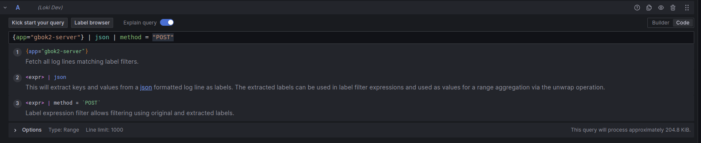

# Logs med Loki

SKIPs LGTM-stack er satt opp for å automatisk samle inn logs fra alle applikasjoner som kjører i våre Kubernetes-clustere. Det er ingenting spesielt du som utvikler trenger å konfigurere for å oppnå dette, bortsett fra å sørge for at applikasjonen din logs til `stdout`. Disse plukkes opp av Grafana Agent gjennom `PodLogs` custom resource, som spesifiserer hvilke namespaces det skal samles inn logs fra (alle i vårt tilfelle) og et sett med relabeling rules for å sikre at vi har et felles sett med labels for bruk i søk, dashboards og alerting.

Logs samles inn og lagres i Loki, som støttes av et lokalt S3-kompatibelt Scality storage bucket-system, ett for hvert cluster. Hver Loki-instans er definert som en datakilde (data source) i Grafana, som tilbyr verktøyene for søk, dashboards og alerting.

For en oversikt over Explore-seksjonen slik den gjelder for Loki, se [https://grafana.com/docs/grafana/latest/explore/logs-integration/](https://grafana.com/docs/grafana/latest/explore/logs-integration/). Denne og andre sider beskriver funksjonene og hvordan man bruker dem effektivt i relativt god detalj, så vi vil ikke prøve å gjenskape en slik guide her, men bare peke på noen få ting som gjelder for vårt eget oppsett.

Av nødvendighet er standardsettet med labels nokså begrenset sammenlignet med hva noen av dere kanskje ønsker. Dette er fordi et stort utvalg av labels kan ha en svært negativ innvirkning på ytelsen (performance) - se [https://grafana.com/docs/loki/latest/get-started/labels/bp-labels/](https://grafana.com/docs/loki/latest/get-started/labels/bp-labels/) for en forklaring.

Derfor anbefales det å bruke filter expressions i stedet. Du kan filtrere på logs som inneholder/ikke inneholder en gitt tekst, regex-uttrykk og en rekke andre muligheter.

Søkefunksjonen er også utstyrt med en JSON parser som gjør det enklere å filtrere på de feltene du ønsker.

Du kan velge mellom to moduser for søk: skrive inn en spørring (query) manuelt, eller bygge en spørring gjennom Grafanas grafiske query builder. Så lenge spørringen du har bygget eller skrevet er gyldig, kan du sømløst bytte mellom de to modusene.

Over: Bruk av JSON parser for å trekke ut felter og filtrere på metoden "POST"
