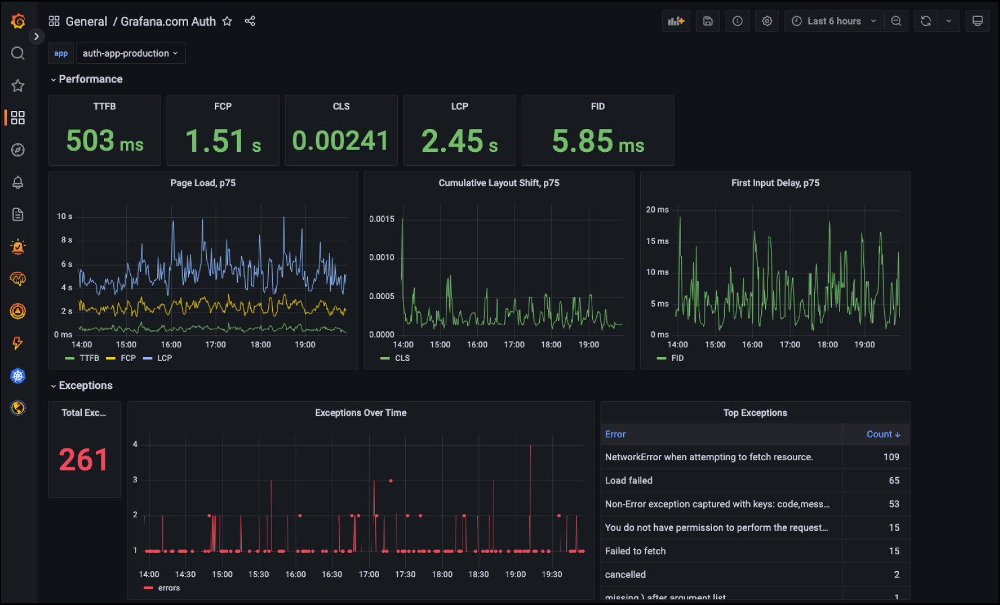

# Reell brukerovervåking med Faro



Det kan ofte være vanskelig å oppdage lastetider for sider og brukeratferd i nettleseren, ettersom det ikke genereres logger eller metrikker å inspisere. [Grafana Faro](https://grafana.com/oss/faro/) løser dette ved at du kan legge til en JavaScript-SDK i frontenden din som sender hendelser over HTTP til en mottaker som legger dataene inn i Grafana. På denne måten kan du observere reelle brukermetrikker i sanntid ved hjelp av Grafana, og sette opp varsler på dem slik du vanligvis ville gjort med Grafana Alerting.

Det er flere typer hendelser som støttes av Faro:

- Hendelser som Time To First Byte og First Contentful Paint kan hjelpe med feilsøking av trege frontend-sider
- Unntak (exceptions) samles inn og sendes, slik at du har en komplett oversikt over alle unntak som har blitt kastet i frontenden til appen din. Source maps brukes til å mappe linjenumre tilbake til kildekoden
- Sidebesøk telles slik at du kan se hvilke sider som besøkes av brukere
- Metadata som nettlesertype gjør det mulig å se hvilke nettlesere som er i bruk, og hvilke du ikke lenger trenger å støtte

Du har kanskje hørt om lignende tjenester som [Sentry.io](http://sentry.io/). Faro skal ikke forveksles med en analysetjeneste, og det anbefales å ha en egen instans for brukerinnsikt som Google Analytics eller Posthog. En analysetjeneste kan fortelle deg mer om brukeratferd, mens tjenester som Faro og Sentry er mer beregnet på overvåking og feilsøking.

## Kom i gang

Oppsett av Faro krever to steg som er forklart nedenfor:

1. Installere SDK-en
2. Konfigurere SDK-en

Det kan også være nyttig å starte med å lese [Faro hurtigstartguide](https://github.com/grafana/faro-web-sdk/blob/main/docs/sources/tutorials/quick-start-browser.md#install-grafana-faro-web-sdk). Se også [README](https://github.com/grafana/faro-web-sdk/blob/main/README.md) på Faros GitHub-side for flere lenker til relevant dokumentasjon.

### Installere SDK-en

Hvis du bruker React gjøres dette ved å kjøre en av følgende kommandoer:

```bash
# Med npm
npm i -S @grafana/faro-web-sdk

# Med Yarn
yarn add @grafana/faro-web-sdk
```

### Konfigurere SDK-en

Importer og konfigurer følgende alternativer i appens inngangspunkt (main.js eller lignende).

```js
import { initializeFaro } from "@grafana/faro-react";

initializeFaro({
  app: {
    name: "my_app_name",
    environment: getCurrentEnvironment(),
  },
  url: "https://faro.atgcp1-prod.kartverket.cloud/collect",
});
```

### Gyldige alternativer for `app`

|             | **Type**    | **Beskrivelse**                                                        | **Påkrevd?** |
| ----------- | ----------- | ---------------------------------------------------------------------- | ------------- |
| name        | string      | Navnet på applikasjonen slik det vil vises på dashbord i Grafana | Ja           |
| environment | "localhost" &vert; "dev" &vert; "test" &vert; "prod" | Miljøet frontenden kjører i. Dette brukes til å filtrere data i Grafana-dashbord | Ja |

### Konfigurere SDK-en med React Router-integrasjon

Grafana Faro støtter integrasjon med React Router. Dette gir deg hendelser for sidenavigasjon og re-renderinger. Se [Faro-dokumentasjonen](https://github.com/grafana/faro-web-sdk/blob/main/packages/react/README.md) for mer informasjon om dette.

## Vise dataene

Når metrikkene har begynt å bli samlet inn, vil de være synlige i et dedikert Grafana Faro-dashbord. Dette dashbordet finner du [her](https://monitoring.kartverket.cloud/d/CiroMopVz/grafana-faro-frontend-monitoring).

Det er også mulig å søke etter data i [utforsk-visningen](https://monitoring.kartverket.cloud/explore). Nyttige etiketter å søke etter er:

- `faro_app_name`
- `kind`
- `env`

## Personvern

:::note
Det er opp til deg og teamet ditt å vurdere hvordan Faro brukes med personopplysninger, i henhold til deres ROS-analyse og DPIA
:::

Når vi sender data til Faro, er det stort sett metrikker som ikke inneholder [personidentifiserbar informasjon (PII)](https://www.investopedia.com/terms/p/personally-identifiable-information-pii.asp). Det er mulig å inkludere PII som navn, IP-adresse eller annet som er tilgjengelig fra JavaScript i SDK-en, men dette gjøres ikke som standard og krever at du kaller `setUser`-funksjonen i SDK-en.

En sesjons-ID sendes med for å muliggjøre de-duplisering av hendelser som navigasjon mellom sider og rangering av toppbrukere. Dette er en tilfeldig generert streng og lagres i brukerens nettleser-SessionStorage. Merk at selv om dette ikke er en informasjonskapsel (cookie), betyr det at et «cookie-banner» er påkrevd i henhold til EUs [ePrivacy-direktiv](https://en.wikipedia.org/wiki/EPrivacy_Directive#Cookies).

Ettersom `SessionInstrumentation` er [inkludert som standard](https://github.com/grafana/faro-web-sdk/blob/28f2d0c6c3032ce56876045c5a92256f5f798605/packages/web-sdk/src/config/getWebInstrumentations.ts#L18) i webinstrumenteringen av JavaScript-SDK-en, krever deaktivering at du kaller SDK-en med `instrumentations` satt og utelater `SessionInstrumentation`-funksjonen.

Data lagres på SKIPs `atgcp1-prod`-cluster, som lagrer data i Google Cloud Storage europe-north1-regionen. Denne regionen ligger i Finland, og er dermed innenfor EU. Dette betyr at ingen data forlater EUs grenser, noe som gjør lagringen av dataene i samsvar med GDPR.

## Rate limiting

En hastighetsbegrensning for forespørsler er implementert og er for øyeblikket satt til `50` forespørsler per sekund. Denne deles mellom alle brukere av Faro, så det er mulig at vi etter hvert når grensen. Kontakt SKIP hvis du begynner å få forespørsler avvist med `HTTP 429 Too Many Requests`.

Algoritmen for hastighetsbegrensning er en token bucket-algoritme, der en bøtte har en maksimal kapasitet for opptil burst_size forespørsler og fylles på med en hastighet på rate per sekund.

Hver HTTP-forespørsel tapper kapasiteten til bøtten med én. Når bøtten er tom, avvises HTTP-forespørsler med statuskoden HTTP 429 Too Many Requests til bøtten har mer tilgjengelig kapasitet.

## Tracing

Faro støtter [sporing](https://grafana.com/docs/grafana-cloud/monitor-applications/frontend-observability/instrument/tracing-instrumentation/) av HTTP-forespørsler, men dette er foreløpig ikke implementert i mottakeren på SKIP. Kontakt SKIP hvis du ønsker dette!
