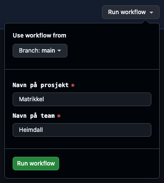

# PostHog

PostHog er et analyseverktøy som kan brukes til å forstå bruksmønstre i tjenester. 
Se [Retningslinjer for bruk av PostHog i Kartverket](https://kartverket.atlassian.net/wiki/spaces/DT/pages/1954676765/Retningslinjer+for+bruk+av+PostHog+i+Kartverket) for mer informasjon.

Gå til [eu.posthog.com](https://eu.posthog.com) og logg inn med din e-post (`@kartverket.no`).

## Onboarding

1. Legg til `enable_posthog: true` for team i [`entra-id-config`](https://github.com/kartverket/entra-id-config/blob/main/org.yaml)
2. Kjør onboarding workflow i [posthog-infrastructure](https://github.com/kartverket/posthog-infrastructure/actions/workflows/onboarding.yaml) med
    - **Prosjektnavn**: navnet prosjektet i PostHog skal få
    - **Teamnavn**: team navn som gitt i `name` feltet i [`entra-id-config`](https://github.com/kartverket/entra-id-config/blob/main/org.yaml)

:::info
Etter `posthog_enabled` er lagt til for teamet må brukere og roller synces, dette skjer automatisk hvert 40. minutt og må være på plass før prosjektet kan opprettes.
:::

Når dette er gjort vil medlemmer av teamet få brukere i PostHog og admin-tilgang til prosjektet.
Øvrige brukere vil få member-tilgang som gir editor-rettigheter på ressursene, med mindre dette er overstyrt et annet sted. 
En del innstillinger på prosjektnivå trenger admin-tilgang, og dette vil nå begrenses til teamet som eier prosjektet.

## Administrer prosjekt

Teamet står fritt til å konfigurere prosjektet etter behov, innenfor [retningslinjene](https://kartverket.atlassian.net/wiki/spaces/DT/pages/1954676765/Retningslinjer+for+bruk+av+PostHog+i+Kartverket).
Det er derimot en rekke instillinger som er definert via Terraform som ikke kan endres av teamene, de er:
- navn på prosjekt
- tidssone
- standard tilgangsnivå
- tilgangsnivå for team-rollen

Dersom du har behov for å endre noen av disse, kontakt SKOOP via [#gen-skoop](https://kartverketgroup.slack.com/archives/C05DVCJ222Y) kanalen på Slack. 
