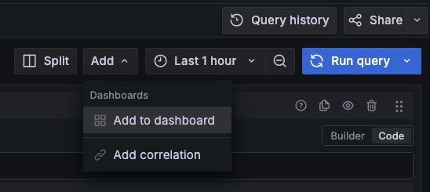
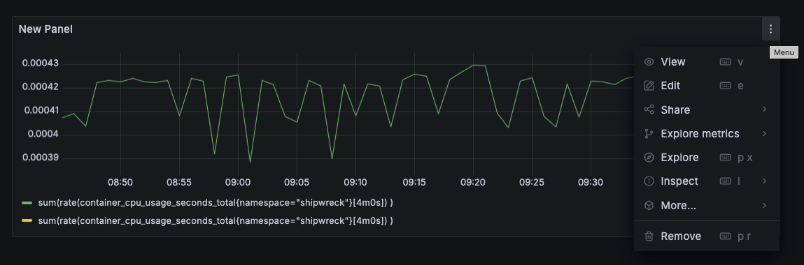
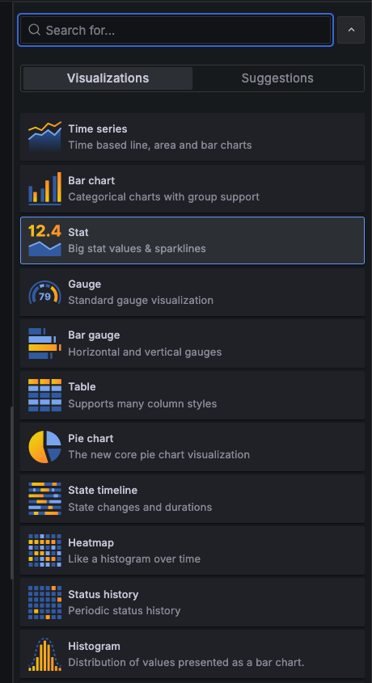
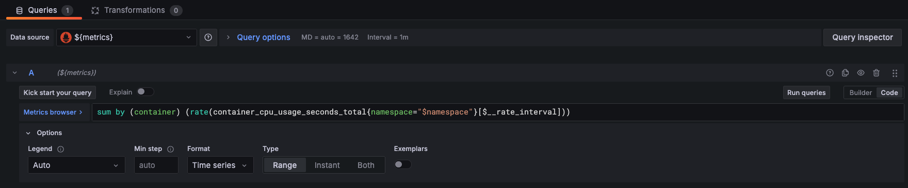

# Dashboards

Grafana har mange visualiseringsmuligheter i dashboards. I dashboards kan du kombinerre data fra ulike datakilder (f.eks. både logger og metrikker, eller logger fra ulike miljøer), visualisere med over 20 ulike innebygde [visualiseringstyper](https://grafana.com/docs/grafana/latest/panels-visualizations/visualizations/) og ha dynamiske visualiseringer med variabler.

## Rask intro til dashboards

Det er ofte enklere å eksperimentere raskt med data og lage gode spørringer i [Explore](https://monitoring.kartverket.cloud/explore). Herfra kan du fra "Add"-menyen øverst til høyre trykke "Add to dashboard" og deretter gjøre visualiseringen bedre derfra.

På dashboardet kan du klikke på de tre prikkene øverst til høyre på et panel, og velge "Edit".

Her kan du velge visualiseringstype oppe til høyre:

De ulike visualiseringstypene har ulike muligheter for tilpasning. De viktigste visualiseringstypene er [time series](https://grafana.com/docs/grafana/latest/panels-visualizations/visualizations/time-series/), [heatmap](https://grafana.com/docs/grafana/latest/panels-visualizations/visualizations/heatmap/), [logs](https://grafana.com/docs/grafana/latest/panels-visualizations/visualizations/logs/), [stat](https://grafana.com/docs/grafana/latest/panels-visualizations/visualizations/stat/) og [table](https://grafana.com/docs/grafana/latest/panels-visualizations/visualizations/table/).

## Dynamiske dashboards med variabler

Variabler kan brukes for å dynamisk velge miljø, namespace eller applikasjon. På denne måten kan dashboards brukes på tvers av team eller miljøer.

Legg til egne variabler ved å trykke på "Settings" oppe til høyre, deretter "Variables". 

Det viktigste variabeltypene er "Data source" og "Query". Førstnevnte lar deg velge ulike datakilder av samme type dynamisk. "Query" kan brukes for å f.eks. velge namespace.

### Eksempel med variabler

Her er fremgangsmåten for å lage en datasource variabel, `metrics`, og en query-variabel `namespace`.

Først data source-variabelen `metrics`:

1. Lag en ny variabel, med type "Datasource". Gi den navnet `metrics`.

2. Under "Data source options", velg "Type" Prometheus.

    * Helt nederst kommer det et preview av verdier, og her er det flere datakilder enn ønskelig. Dette kan fikses.

3. Under "Intance name filter", legg inn regex-en `/Mimir-.*(dev|prod|atgcp1)/`, som gir datakilder for både sky og on-prem clustre. Trykk "Run Query" helt nederst.

4. Sørg for at alle "Selection options" ikke er valgt, og trykk "Back to list".

Deretter `namespace`-variabelen:

1. Lag en ny variabel, med type "Query" og gi den navnet `namespace`.

2. Under "Query options" velg datasource `${metrics}`. Vi kan nå gjøre spørringer mot den datakilden som er valgt av `metrics`-variabelen.

3. Velg "Query type" "Label values".

4. I boksene som dukker opp, velg "Label" `namespace` og "Metric" `up`. Trykk deretter på run query.

    * Dette gir ganske mange verdier. Som produktteam vil alle namespaces ofte ha samme prefiks, eks. `matrikkel-`, `norgeskart-` eller annet. Vi kan igjen filtere ved hjelp av regex.

5. I "Regex"-feltet, bruk regex `/mittprefiks-.*/`. Har du flere prefiks, kan du bruke `/(prefiks1|prefiks2|prefiks3)-.*/`. Deretter trykk på "Run Query" og verifiser at du får opp namespace-navnene du forventer.

6. "Selection options" er her mer relevant, tenk over følgende:

    * Dersom du ønsker å vise ting på tvers av namespaces, velg "Multi-value". Dette er nyttig i noen tilfeller, men krever at du håndterer det i spørringene i dashboard-panelene.
    * Dersom du ønsker å la bruker skrive inn egne verdier, velg "custom values" (dette er ofte ikke relevant for namespace).
    * Dersom du vil la bruker velge alle namespaces, eller har en spesiell verdi for alle kan du velge denne. Dette krever også at spørringene håndterer det, tilsvarende "multi-value".

7. Når du er ferdig, trykk "Back to list" nederst for å lage flere variable, eller "Save dashboard" oppe til høyre for å lagre endringene.

Nå kan variablene brukes i dashboard-panelene:

1. Velg "Data source" `${metrics}`, og bruk `$namespace`-variabelen i spørringene.

📚 Se også [Grafanas dokumentasjon om variabler](https://grafana.com/docs/grafana/latest/dashboards/variables/)

## Dashboards som kode

Det er mulig å lage dashboards som kode, enten egenlaget eller hentet fra eksterne kilder, som f.eks. [Grafanas dashboardside](https://grafana.com/grafana/dashboards/). Du kan se eksempler på dette i [skip-dashboards](https://github.com/kartverket/skip-dashboards).

Dashboards om lages som kode bør ikke endres i GUI-et. For å eksperimentere med slike dashboards anbefaler vi å lage en kopi av dashboardet, eksperimentere og deretter gjøre tilsvarende endringer i kode-repoet. Dette kan gjøres f.eks. ved å trykke "Export > Export as JSON" oppe til høyre i dashboard UI-et.

## Andre ressurser

Det er mange måter å lage dashboards på, og det finnes gode artikler på det:

* 📚 [Enkel introduksjon fra Grafana for å lage dashboards](https://grafana.com/docs/grafana/latest/dashboards/build-dashboards/create-dashboard/)
* 📚 [Grafanas egne "best practices" for å lage dashboards](https://grafana.com/docs/grafana/latest/dashboards/build-dashboards/best-practices/)
* 📚 [The Four Golden Signals](https://sre.google/sre-book/monitoring-distributed-systems/#xref_monitoring_golden-signals) fra Googles SRE Book diskuterer de viktigste metrikkene å monitorere

