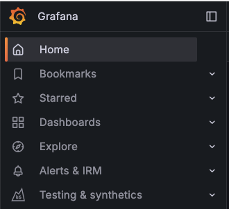

# Grafana

[Grafana](https://grafana.com/oss/) er et av de mer kjente verktøyene for overvåkning og observabilitet som er basert på åpen kildekode. Grafana lar deg finne data i de ulike datakildene i sanntid, og lar deg utforske og visualisere dataene.

Grafana Labs har en "Big Tent"-filosofi som gir oss fleksibilitet til å integrere mange ulike datakilder i ett og samme verktøy, på tvers av on-prem og sky.

## Rask rundtur i Grafana

Når du kommer til [vår Grafana-instans](https://monitoring.kartverket.cloud) kan du velge "Sign in with Azure AD". Om du ikke kommer inn kan det være du ikke er lagt til i teamets AD-gruppe, eller at teamet ditt ikke er onboardet på SKIP. Ta kontakt i [`#gen-skip` på Slack](https://kartverketgroup.slack.com/archives/C028ZEED280) for spørsmål.

Venstre sidemeny lar deg navigere dit du trenger, og viser de viktigste tingene du trenger i Grafana.

Som produktteam på SKIP er de viktigste egenskapene i Grafana:

 * Utforsk data i [Explore-mode](https://monitoring.kartverket.cloud/explore).
     * Her kan du utforske både logger, metrikker og traces.
     * Grafana har også en egen [Metrics explore](https://monitoring.kartverket.cloud/explore/metrics) som lar deg utforske hvilke metrikker som finnes.

 * Lag dashboards som gir oversikt over hva som skjer i applikasjonene dine.

 * Få oversikt over og håndter alarmer. Vi anbefaler at du har alarmer som kode, men du kan også konfigurere alarmer manuelt her.

 * Testing og synthetics brukes for syntetisk monitorering.
