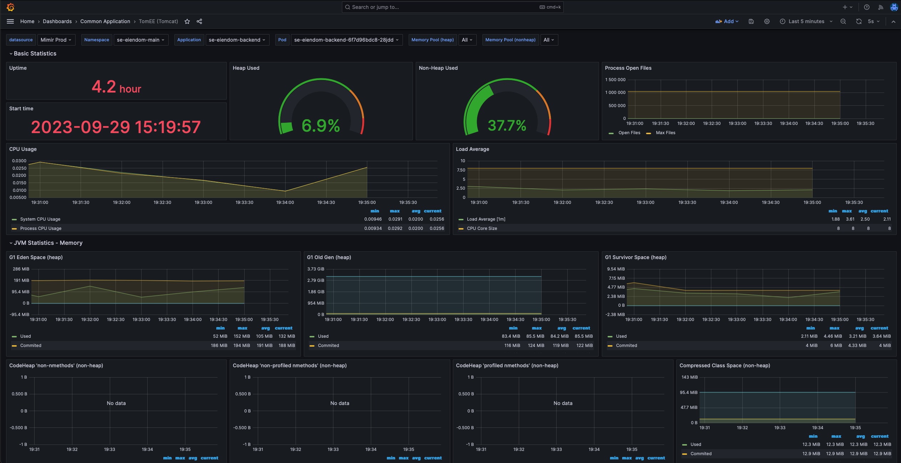

# 🔭 Observabilitet

## Hva er observabilitet?

Observabilitet handler om evnen til å forstå den indre tilstanden og
oppførselen til et system basert på de eksterne dataene det produserer, som
logger, metrikker og traces. Det gir team muligheten til å få
innsikt i hvordan systemet fungerer, identifisere problemer, og diagnostisere
årsakene til disse problemene uten å måtte endre systemets kode eller
overvåkingsmekanismer. Observabilitet går utover tradisjonell overvåkning ved å
tilby en mer fleksibel og dypere analyse av systemets ytelse og helsetilstand,
noe som gjør det mulig å stille og besvare nye spørsmål om systemet etter hvert
som de oppstår.

## Hva tilbyr SKIP?

SKIP tilbyr innsamling, visualisering og alarmering basert på telemetri
innsamlet fra applikasjonene på SKIP. Telemetrien vi samler inn er metrikker,
logger og traces.

[Grafana](https://monitoring.kartverket.cloud/) er verktøyet for å søke,
visualisere og sammenstille innsamlet telemetri fra ulike kilder. Her kan du
også se hvilke alarmer som er konfigurert, alarmhistorikk og hvilke alarmer som
går akkurat nå.

## Andre nyttige ressurser

- [Intro to o11y: What is Observability?](https://www.honeycomb.io/resources/intro-to-o11y-topic-1-what-is-observability)
- [What is Observability?](https://www.dash0.com/faq/what-is-observability)
- [Bloggen til Charity Majors](https://charity.wtf/tag/observability/)
