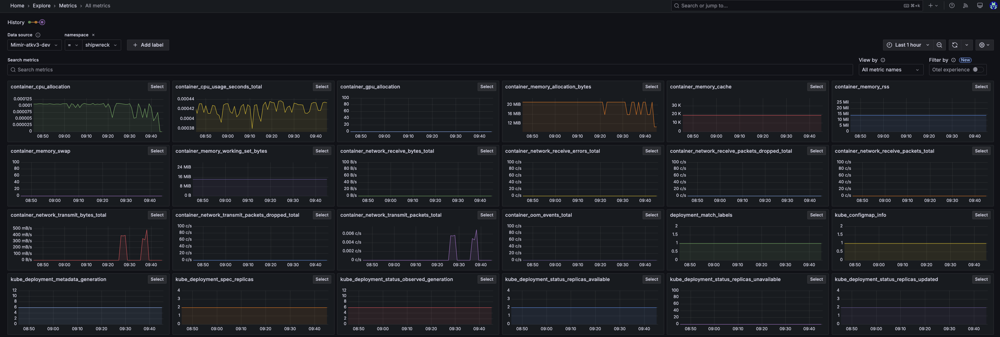
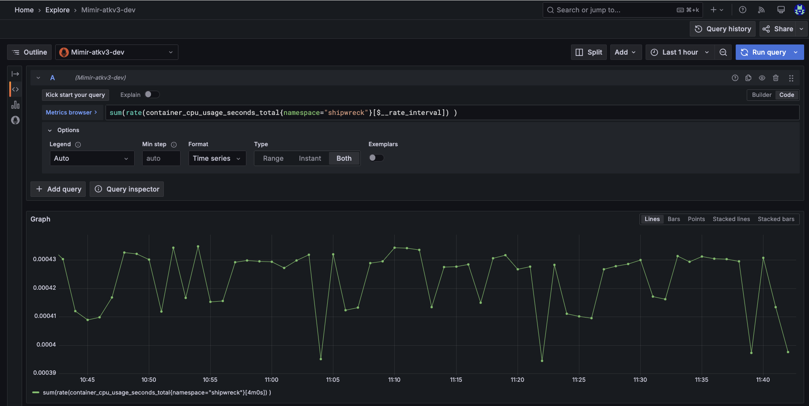

# Metrikker

SKIP bruker Grafana Mimir for å lagre og gjøre spørringer på metrikker. Disse lagres i 60 dager.

## Eksponer metrikker fra applikasjonen

For å kunne eksponere metrikker fra applikasjonen må du gjøre følgende:

* Eksponer metrikker på et eget endepunkt, f.eks. `/metrics`. Det beste her er også å eksponere metrikker på en egen port for å unngå at endepunktet uheldigvis eksponeres eksternt. Om du ikke kan gjøre dette, ta kontakt med SKIP for å sammen sørge for at data ikke eksponeres eksternt.

*  Endre `Skiperator`-manifestet ved å legge til en ekstra port og tillate innhenting av metrikker;

    ```yaml
    apiVersion: skiperator.kartverket.no/v1alpha1
    kind: Application
    metadata:
      name: super-app
      namespace: team-foo-main
    spec:
      image: "kartverket/example"
      port: 8080

      # Definer egen port
      additionalPorts:
        - name: management
          port: 8181
          protocol: TCP

      # Skru på innsamling av metrikker fra den nye porten
      prometheus:
        port: management
        path: "/metrics"
    ```

## Utforsk metrikker i Metrics Explore

For å finne ut hvilke metrikker du har tilgjengelig for applikasjonen, sjekk ut [Metrics Explore](https://monitoring.kartverket.cloud/explore/metrics).



* Bruk labels for å filtrere på f.eks. `namespace`, `application` eller `container` for å finne metrikker som er interessante, og søk på metrikknavn i feltet.

* Du kan velge "Select" for å se videre på en enkeltmetrikk, og trykke på kompassikonent for å gå videre til Explore for å gjøre metrikkspørringen mer nøyaktig.

Se også:

* 📚 [Grafanas egen dokumentasjon](https://grafana.com/docs/grafana/latest/explore/simplified-exploration/metrics/) beskriver alle detaljene.
* 🎬 Grafana har også en [demovideo](https://www.youtube.com/watch?v=UWTsYTe5Gy4).

## Lag spørringer i Explore

[Explore](https://monitoring.kartverket.cloud/explore) lar deg videreforedle spørringer, eksperimentere og grave raskt. 



Her kan du gjøre spørringer i split screen fra ulike datakilder, korrelere data fra både logger, metrikker og traces, samt legge ferdige spørringer som paneler i dashboards.


Se også:

* 📚 [Grafanas dokumentasjon](https://grafana.com/docs/grafana/latest/explore/get-started-with-explore/)

