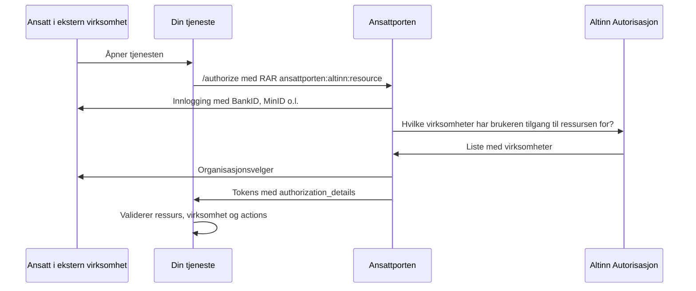

# Ansattporten med Altinn-roller
Egner seg dersom du:
1. Ønsker å la ansatte i eksterne virksomheter logge inn med Ansattporten, og
2. Ønsker å vite hvilken virksomhet brukeren representerer, og
3. Ønsker at virksomheten selv skal styre tilgangen i Altinn, basert på roller (f.eks. daglig leder), tilgangspakker
   eller enkeltrettigheter

Dette forutsetter at brukeren logger inn med fødselsnummer, altså `acr` `substantial` (MinID) eller `high` (BankID,
Buypass, Commfides). Representasjon ved bruk av Altinn-roller er _ikke_ tilgjengelig for brukere som logger inn med
Entra ID.

## Hvordan fungerer det?
Tilgangen styres per **Altinn-ressurs**. En ressurs er en oppføring i Altinn sitt ressursregister som representerer en
tjeneste, og som definerer hvilke roller og tilgangspakker som gir tilgang, og eventuelt hvilke handlinger (`actions`,
f.eks. `read` og `write`) som finnes. Virksomhetene gir sine ansatte tilgang i Altinn, enten gjennom en rolle i
Enhetsregisteret, en tilgangspakke eller direkte delegering av ressursen.

Ved innlogging ber tjenesten om representasjon for en gitt ressurs ved å sende RAR-typen `ansattporten:altinn:resource`
(Rich Authorization Requests) i `authorization_details`. Ansattporten slår opp i Altinn hvilke virksomheter brukeren har
tilgang til ressursen på vegne av, og viser en organisasjonsvelger. Valgt virksomhet returneres i tokenet.



## Som tjenesteeier (API-tilbyder)

### 1. Finn eller opprett en Altinn-ressurs
Ifølge Digdir må virksomheten være tjenesteeier i Altinn for å bruke tilgangsstyring basert på Altinn Autorisasjon i
Ansattporten. Du kan enten bruke en eksisterende ressurs, eller opprette en egen.

**Eksisterende ressurs:** Søk opp ressurser, tilgangspakker og roller på [tjenesteoversikten.no](https://tjenesteoversikten.no/search),
eller list ut ressursene via Altinn sitt ressursregister-API
([test](https://platform.tt02.altinn.no/resourceregistry/api/v1/resource/resourcelist?includeAltinn2=false&includeMigratedApps=true),
[produksjon](https://platform.altinn.no/resourceregistry/api/v1/resource/resourcelist?includeAltinn2=false&includeMigratedApps=true)).
Ressurs-ID-en er feltet `identifier`.

**Egen ressurs:** Opprettes som en _generisk tilgangsressurs_ i Altinn Studio eller via Altinn sine API-er.

### 2. Be om representasjon i innloggingsforespørselen
Du må sende med `authorization_details` som parameter ved innlogging med Ansattporten. Med Ztoperator gjøres
dette via `spec.autoLogin.loginParams`-feltet. Klientregistreringen er den samme som for
ordinær Ansattporten, se [klientregistrering for Ansattporten](../02-klientregistrering/04-ansattporten.mdx).

```yaml title="Utdrag fra AuthPolicy"
spec:
  wellKnownURI: https://test.ansattporten.no/.well-known/openid-configuration
  autoLogin:
    enabled: true
    logoutPath: /logout
    redirectPath: /oauth2/callback
    scopes:
      - openid
      - profile
// diff-add-start
    loginParams:
      acr_values: substantial
      authorization_details: |
        [
          {
            "type": "ansattporten:altinn:resource",
            "resource": "urn:altinn:resource:<resource-id>",
            "representation_is_required": true
          }
        ]
// diff-add-end
```

Følgende felter kan sendes med i `ansattporten:altinn:resource`, i tillegg til `type`:

| Felt | Påkrevd | Beskrivelse |
| --- | --- | --- |
| `resource` | Ja | Ressursen i Altinn, på formen `urn:altinn:resource:<resource-id>` |
| `actions` | Nei* | Kommaseparert liste med handlinger brukeren må ha for ressursen, f.eks. `"write,report"`. *Påkrevd dersom ressursen bruker tilgangslister |
| `representation_is_required` | Nei | Krev at brukeren representerer en virksomhet. Uten denne kan brukeren velge å representere seg selv. Standard er `false` |
| `allow_multiple_organizations` | Nei | Lar brukeren velge flere virksomheter i organisasjonsvelgeren. Standard er `false` |
| `organizationform` | Nei | Begrens organisasjonsvelgeren til hovedenheter (`enterprise`) eller underenheter (`business`) |
| `allow_deleted_organizations` | Nei | Vis også slettede virksomheter i organisasjonsvelgeren. Standard er `false` |

Du kan be om flere ressurser ved å legge flere objekter i listen.

:::note `actions` må forespørres ved innlogging
Tilgangssjekken mot Altinn (PDP) skjer under innloggingen. Du må derfor be om alle `actions` tjenesten din har bruk for
allerede i innloggingsforespørselen. Tokenet inneholder kun de actions du ba om som brukeren faktisk har tilgang til.
:::

### 3. Tolk tokenet
Tokenet inneholder et `authorization_details`-claim med ett objekt per forespurt ressurs brukeren har tilgang til:

```json
"authorization_details": [ {
  "type": "ansattporten:altinn:resource",
  "resource": "urn:altinn:resource:<resource-id>",
  "resource_name": "<navn på ressursen>",
  "authorized_parties": [ {
    "orgno": {
      "authority": "iso6523-actorid-upis",
      "ID": "0192:<orgnr>"
    },
    "name": "<navn på virksomheten>",
    "unit_type": "BEDR",
    "resource": "<resource-id>",
    "actions": [ "read", "write" ]
  } ]
} ]
```

| Claim | Beskrivelse |
| --- | --- |
| `authorized_parties` | Virksomheten(e) brukeren har valgt å representere |
| `orgno` | Organisasjonsnummeret til virksomheten, iht. ISO 6523 |
| `name` | Navnet på virksomheten |
| `unit_type` | Organisasjonsform, iht. [Brønnøysundregistrene](https://www.brreg.no/bedrift/organisasjonsformer/) |
| `actions` | Hvilke av de forespurte handlingene brukeren har for ressursen |

Dersom brukeren har valgt å representere seg selv, inneholder objektet kun `type`, uten `authorized_parties`:
```json
"authorization_details": [ { "type": "ansattporten:altinn:resource" } ]
```
{/* TODO: verifiser at authorization_details er med i access token (det er access token Ztoperator validerer og videresender), og ikke kun i id_token og token-responsen */}

### 4. Valider representasjon i tjenesten din
Selve tilgangssjekken mot roller, tilgangspakker og enkeltrettigheter (PDP-oppslaget) gjøres av Ansattporten mot Altinn
Autorisasjon _under innloggingen_, ikke av tjenesten din. Du trenger derfor ikke gjøre et eget PDP-kall mot Altinn –
resultatet er allerede bakt inn i `authorization_details` i tokenet. Utover ordinær token-validering bør du validere
at:
1. `authorization_details` inneholder et objekt med `type: ansattporten:altinn:resource` og riktig `resource`
2. Objektet har minst én `authorized_parties`, med mindre tjenesten skal kunne brukes uten representasjon
3. Eventuelle `actions` gir tilgang til den aktuelle handlingen
4. Eventuelt at `orgno.ID` er en virksomhet som skal ha tilgang, dersom ikke alle virksomheter skal slippe inn

Siden `authorization_details` er en liste med nøstede objekter, kan dette ikke valideres med claims-reglene i
Ztoperator. Vi anbefaler å bruke [request-evaluering med OPA](../05-finkornet-autorisasjon/05-pre-request-eval.mdx)
eller validering i applikasjonskoden.

## Testing
Du kan teste uten egen integrasjon med Digdir sin [demo-klient](https://demo-client.test.ansattporten.no/):
1. Velg `substantial` som acr-verdi
2. Lim inn følgende i feltet for authorization details. Ressursen `app_ttd_apps-test` er en testressurs i Altinn sitt
   testmiljø som Digdir anbefaler for testing av organisasjonsvelgeren:
   ```json
   [{"type":"ansattporten:altinn:resource","resource":"urn:altinn:resource:app_ttd_apps-test"}]
   ```
3. Logg inn med TestID, og bruk "Hent tilfeldig Daglig leder" for å få en syntetisk bruker med roller i Altinn

Du kan finne syntetiske testbrukere med bestemte roller i [Tenor testdata-søk](https://www.skatteetaten.no/skjema/testdata/).

:::tip Tom organisasjonsvelger?
Dersom testbrukeren ikke finnes fra før i Altinn sitt testmiljø, vil ikke organisasjonsvelgeren fungere. Logg inn i
[TT02](https://info.tt02.altinn.no) én gang med det syntetiske fødselsnummeret, og prøv igjen.
:::

## Videre lesning
- [Representasjon i Ansattporten (Digdir)](https://docs.digdir.no/docs/ansattporten/ansattporten_representasjon.html)
- [RAR-typer i Ansattporten (Digdir)](https://docs.digdir.no/docs/ansattporten/ansattporten_rar.html)
