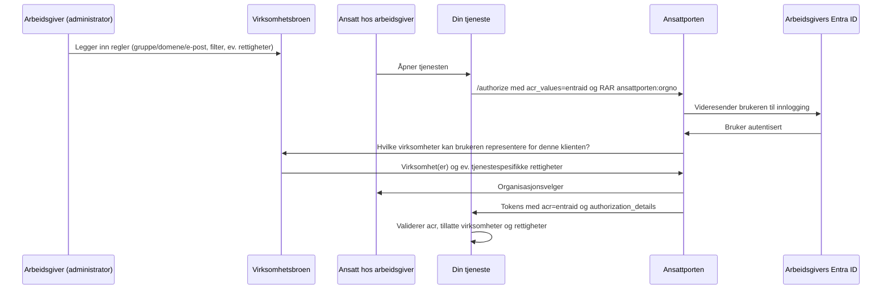

# Ansattporten med Entra ID og Virksomhetsbroen
Egner seg dersom du:
1. Ønsker å bruke innlogging med Entra ID i Ansattporten, og
2. Ønsker å vite hvilken virksomhet brukeren representerer, og
3. Ønsker at **arbeidsgiveren selv** skal styre hvilke av sine ansatte som kan representere virksomheten i tjenesten din,
   ved hjelp av egne Entra-grupper, e-postdomener eller e-postadresser, og
4. Ikke har behov for det høyere sikkerhetsnivået som følger av innlogging med fødselsnummer og tilgangsstyring i
   Altinn

:::caution Pilot, kun i test
Virksomhetsbroen og RAR-typen `ansattporten:orgno` er i pilotfase hos Digdir. Ifølge Digdir er `ansattporten:orgno`, som
representasjon via Virksomhetsbroen bygger på, foreløpig kun tilgjengelig i testmiljøet. Du kan teste og planlegge for
løsningen, men bør ikke designe en produksjonstjeneste som er avhengig av den før den er tilgjengelig i produksjon.
:::

## Hvordan fungerer det?
Innlogging med Entra ID sier i seg selv ikke noe om hvilken virksomhet brukeren representerer. Virksomhetsbroen er et
administrasjonsgrensesnitt hos Digdir der arbeidsgiveren legger inn regler for hvilke av sine Entra-brukere som kan
representere virksomheten i Ansattporten, i hvilke tjenester og eventuelt med hvilke rettigheter. Virksomhetsbroen er
dermed den autoritative kilden for representasjon når brukeren har logget inn med Entra ID, på samme måte som Altinn
Autorisasjon er det for innlogging med fødselsnummer.

For å få representasjon må to vilkår være oppfylt:
- Tjenesten må be om RAR-typen `ansattporten:orgno` i innloggingsforespørselen
- Arbeidsgiveren må ha konfigurert Virksomhetsbroen for sine ansatte



:::warning Ingen sentral begrensning av arbeidsgivere
Det finnes per i dag ingen mekanisme i Ansattporten for å begrense hvilke arbeidsgivere som kan logge inn i tjenesten
din: alle virksomheter som har konfigurert Virksomhetsbroen med "Tillat alle" vil kunne logge inn. Du må selv validere
hvilke virksomheter som skal ha tilgang, se [steg 2](#2-valider-representasjon-i-tjenesten-din).
:::

## Som tjenesteeier (API-tilbyder)

### 1. Be om representasjon i innloggingsforespørselen
I tillegg til `acr_values`, se [Ansattporten med Entra ID](./05-ansattporten-entra-id.mdx#aktiver-entra-id-i-innloggingsforespørselen),
må du be om RAR-typen `ansattporten:orgno` i `authorization_details`:

```yaml title="Utdrag fra AuthPolicy"
spec:
  autoLogin:
    loginParams:
      acr_values: entraid
// diff-add-start
      authorization_details: |
        [
          {
            "type": "ansattporten:orgno",
            "representation_is_required": true
          }
        ]
// diff-add-end
```

Følgende felter kan sendes med i `ansattporten:orgno`, i tillegg til `type`:

| Felt | Beskrivelse |
| --- | --- |
| `representation_is_required` | Krev at brukeren representerer en virksomhet. Anbefales satt til `true`. Standard er `false`. |
| `allow_multiple_organizations` | Lar brukeren velge flere virksomheter i organisasjonsvelgeren. Standard er `false`. |
| `organizationform` | Begrens organisasjonsvelgeren til hovedenheter (`enterprise`) eller underenheter (`business`). |

Tokenet vil da inneholde et `authorization_details`-claim:
```json
"authorization_details": [ {
  "type": "ansattporten:orgno",
  "authorized_parties": [ {
    "orgno": {
      "authority": "iso6523-actorid-upis",
      "ID": "0192:312206498"
    },
    "name": "NYBAKT IDIOTSIKKER ISBJØRN SA",
    "rights": [ "Report", "Write" ]
  } ]
} ]
```

`rights` er kun med dersom arbeidsgiveren har tildelt tjenestespesifikke rettigheter for din klient, se
[steg 3](#3-dokumenter-oppsettet-for-arbeidsgiverne).
{/* TODO: verifiser at authorization_details er med i access token (det er access token Ztoperator validerer og videresender), og ikke kun i id_token og token-responsen */}

### 2. Valider representasjon i tjenesten din
Utover ordinær token-validering bør du validere at:
1. `acr` er `entraid`
2. `authorization_details` inneholder et objekt med `type: ansattporten:orgno` med minst én `authorized_parties`
3. Organisasjonsnummeret i `orgno.ID` er en virksomhet som skal ha tilgang til tjenesten din
4. Eventuelle `rights` gir tilgang til den aktuelle handlingen
5. Eventuelt at `amr` inneholder `entraid_mfa`, dersom du krever tofaktorautentisering

Siden `authorization_details` er en liste med nøstede objekter, kan ikke punkt 2–4 valideres med claims-reglene i
Ztoperator alene. Vi anbefaler å bruke [request-evaluering med OPA](../05-finkornet-autorisasjon/05-pre-request-eval.mdx)
eller validering i applikasjonskoden.

### 3. Dokumenter oppsettet for arbeidsgiverne
Virksomhetsbroen konfigureres av arbeidsgiveren selv, uavhengig av deg som tjenesteeier. For at arbeidsgiveren skal
kunne sette opp en regel som gir riktige ansatte tilgang til **nettopp din tjeneste**, må du dokumentere følgende i
tjenesten eller API-dokumentasjonen din:

- **`client_id`** til Ansattporten-klienten din, se [klientregistrering for Ansattporten](../02-klientregistrering/04-ansattporten.mdx).
  Arbeidsgiveren trenger denne for å avgrense regelen sin til din tjeneste med filtertypen "Tillat kun" (se tabellen
  under), i stedet for en bred "Tillat alle"-regel som gir tilgang til alle Ansattporten-tjenester som støtter Entra ID
- Om tjenesten din krever eller støtter _tjenestespesifikke rettigheter_ (`rights`), og i så fall hvilke fritekstverdier
  som brukes (f.eks. `Les` og `Skriv`). Disse rettighetene gis kun via "Tillat kun"-filteret, og har ellers ingen
  betydning utenfor din tjeneste
- En lenke til [Digdir sin dokumentasjon av Virksomhetsbroen](https://docs.digdir.no/docs/ansattporten/ansattporten_virksomhetsbroen.html),
  samt URL-ene til Virksomhetsbroen i test og produksjon (se under), slik at arbeidsgiveren vet hvor de skal konfigurere
  regelen

Virksomhetsbroen konfigureres per miljø:
- Test: [virksomhetsbroen.test.samarbeid.digdir.no](https://virksomhetsbroen.test.samarbeid.digdir.no)
- Produksjon: [virksomhetsbroen.samarbeid.digdir.no](https://virksomhetsbroen.samarbeid.digdir.no)

En regel i Virksomhetsbroen angir hvilke ansatte som omfattes (f.eks. e-postadresse, domene eller en Entra-gruppe), og
en av følgende filtertyper:

| Filtertype | Betydning |
| --- | --- |
| Tillat alle | Kan representere virksomheten i alle Ansattporten-tjenester som støtter Entra ID |
| Tillat kun | Kan kun representere virksomheten i de angitte klientene (identifisert ved `client_id`). Her kan det også angis tjenestespesifikke rettigheter |
| Tillat alle utenom | Kan representere virksomheten i alle tjenester, unntatt de angitte klientene |

Siden modellen er additiv (en regel kan ikke begrense det en annen regel tillater), og "Tillat alle" dermed gir tilgang
til din tjeneste uavhengig av `client_id`, bør du oppfordre arbeidsgivere til å bruke "Tillat kun" med din `client_id`
fremfor "Tillat alle", slik at tilgangen til tjenesten din styres presist og ikke som et biprodukt av en bred regel satt
opp for en annen tjeneste.

## Sikkerhetsvurderinger
- **Arbeidsgiver eier tilgangen:** Du stoler på at arbeidsgiveren konfigurerer reglene riktig. En bred regel (f.eks.
  domene + "Tillat alle") gir alle ansatte tilgang.
- **Lavere sikkerhetsnivå enn Altinn:** Digdir beskriver Virksomhetsbroen som tiltenkt scenarioer uten behov for det
  høye sikkerhetsnivået som Altinn Autorisasjon gir.
- **Ingen tilgangsstyring av RAR-typer:** Alle Ansattporten-klienter kan be om `ansattporten:orgno`.

Se også [sikkerhetsvurderingene for Ansattporten med Entra ID](./05-ansattporten-entra-id.mdx#sikkerhetsvurderinger).

## Testing
1. Logg inn i [Virksomhetsbroen i test](https://virksomhetsbroen.test.samarbeid.digdir.no) med TestID som syntetisk
   daglig leder, og legg inn en regel for din egen e-postadresse med filtertypen "Tillat alle"
2. Bruk Digdir sin [demo-klient](https://demo-client.test.ansattporten.no/) med acr-verdi `entraid`, scope
   `openid profile` og følgende authorization details:
   ```json
   [{"type":"ansattporten:orgno","representation_is_required":true}]
   ```
3. Logg inn med din egen Entra-bruker, og kontroller at `authorization_details` inneholder den syntetiske virksomheten
{/* TODO: verifiser at denne testoppskriften fungerer (ekte Entra-bruker mot syntetisk virksomhet i Virksomhetsbroen i test) */}

## Videre lesning
- [Virksomhetsbroen (Digdir)](https://docs.digdir.no/docs/ansattporten/ansattporten_virksomhetsbroen.html)
- [Entra ID i Ansattporten (Digdir)](https://docs.digdir.no/docs/ansattporten/ansattporten_entraid.html)
- [RAR-typer i Ansattporten (Digdir)](https://docs.digdir.no/docs/ansattporten/ansattporten_rar.html)
