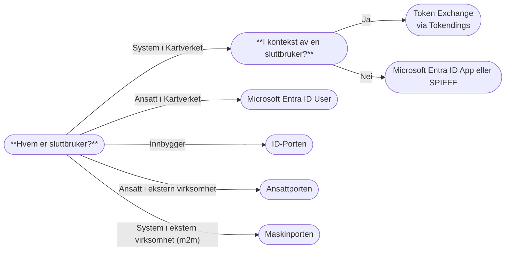
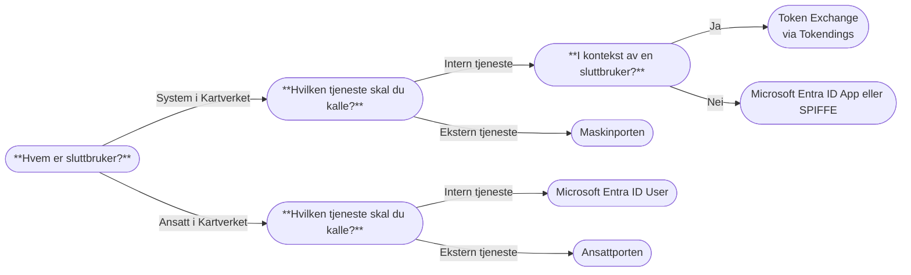

# Valg av identitetstilbyder

Du bør vurdere hvilke(n) identitetstilbyder(e) som passer best til behovene i din applikasjon. Microsoft Entra ID og
Digitaliseringsdirektoratets (Digdir) fellesløsninger; ID-Porten, Maskinporten og Ansattporten er identitetstilbyderne
vi mener dekker bredden av konsumentene av Kartverkets digitale tjenester. I tillegg vil vi innen kort tid tilby Token
Exchange for innveksling av tokens og bevaring av sluttbrukerkontekst i kall til underliggende tjenester. Hvis du har
behov for en annen identitetstilbyder enn de som er listet opp under, ta kontakt med Team Tilgangsstyring på [#gen-tilgangsstyring](https://kartverketgroup.slack.com/archives/C08CJLBLY2X).

Valg av identitetstilbyder(e) kan forenkles å stille seg spørsmålene:
- **"*Hvem er sluttbruker?*"**. Menneske- eller maskinbruker avgjør hvilke identitetstilbydere som er aktuelle
- **"*Hvilken tjeneste skal du kalle?*"**. Interne og eksterne tjenester sikres med ulike identitetstilbydere
- **"*Er jeg i kontekst av en sluttbruker?*"**. Vi ønsker å bevare sluttbrukerkontekst i kall til underliggende tjenester
    ved bruk av Token Exchange

## Som API-tilbyder

_Valg av identitetstilbyder som API-tilbyder._

Dersom samme API skal brukes av flere typer konsumenter, for eksempel et internt system i Kartverket som blir kalt både
i en sluttbrukerflyt og i en frittstående flyt (f.eks av en `Job`), anbefaler vi å eksponere de ulike tjeneste på ulike
rotstier, f.eks `/api/user/..` og `/api/m2m/..`, fremfor å benytte de samme endepunktene.

### Sikkerhetsnivå for identifikasjon av innbyggere
I følge [veilederen for identifikasjon og sporbarhet i elektronisk kommunikasjon](https://www.digdir.no/digital-samhandling/veileder-identifikasjon-og-sporbarhet-i-elektronisk-kommunikasjon-med-og-i-offentlig-sektor/2992)
skal sikkerhetsnivå velges basert på en risikovurdering. Du må altså ta stilling til hva som er nødvendig sikkerhetsnivå
i din tjeneste. Det defineres tre nivåer av sikkerhet:
- Høy: brukes ved særlig høye krav til sikkerhet. Tofaktorautentisering med identitetskontroll, f.eks BankID, Buypass, Commfides, eller eIDAS
- Betydelig: tilfredsstiller behovet for de fleste tjenester. Tofaktorautentisering basert på kontaktinformasjon i Folkeregistret, f.eks MinID
- Lav: enkel pålogging med en viss sikkerhet. Autentisering f.eks basert på kontaktinformasjon (epost eller telefonnummer) i Kontakt- og reservasjonsregisteret

### Utenlandske brukere
[Her finner du Digdir sin dokumentasjon om utenlanske brukere i ID-porten.](https://docs.digdir.no/docs/idporten/oidc/oidc_func_utanlandske_brukarar.html)
Anno mars 2026 er det kun eIDAS, som er EU sin standard for elektronisk identifikasjon, som støtter sikkerhetsnivå "Høy"
eller "Betydelig" for utenlandske brukere. For brukere utenfor EU, eller fra land som ikke støtter eIDAS, er det kun
bruk av egenregistrerte brukere basert på epost-adresse som kan benyttes. Dette tilsvarer sikkerhetsnivå "Lav". Digdir
har antydet at det vil komme en løsning basert på skanning av pass i løpet av 2026, som tilsvarer sikkerhetsnivå
"Betydelig".

### Utenlandske virksomheter
Maskinporten støtter bruk av utenlandske virksomhetssertifikater, basert på en forenklet tillitsmodell. Før du vurderer
å støtte utenlandske virksomheter via Maskinporten er det viktig  at du setter deg inn i begrensningene denne forenklede
tillitsmodellen medfører. [Her finner du Digdir sin dokumentasjon om utenlandske virksomheter i Maskinporten.](https://docs.digdir.no/docs/Maskinporten/maskinporten_func_european_eseals.html#informasjon-til-norske-api-tilbydere)

## Som API-konsument

_Valg av identitetstilbyder som API-konsument._

## Utvidet funksjonalitet hos enkelte identitetstilbydere
Maskinporten og Ansattporten kan i kombinasjon med Altinn tilby utvidet funksjonalitet. Disse kan være aktuelle dersom
du har behov for mer finkornet tilgangsstyring til, eller validering i, ditt API.

### Maskinporten + Altinn-delegering
Altinn-delegering egner seg dersom du:
1. Ønsker å bruke Maskinporten for å sikre ditt API, og
2. Ønsker å tilgangsstyre API-et ved å gi konsumenter (f.eks en kommune) eksplisitt tilgang via Maskinporten, og
3. Tillater at konsumenter delegerer tilgangen videre til en tredjepart (f.eks en systemleverandør eller et fagsystem),
   som da vil kunne hente tokens på vegne av konsumenten.

Tredjeparten skal _ikke_ ha eksplisitt tilgang til det aktuelle Maskinporten-scopet i dette tilfellet, men vil
kunne hente ut tokens på vegne av konsumenten så lenge konsumenten har tilgang til scopet og har delegert denne
tilgangen videre i Altinn.

[Her kan du lese mer om Altinn-delegering.](./01-delegering.mdx)

### Maskinporten + Systembrukere i Altinn
Systembrukere i Altinn egner seg dersom du:
1. Ønsker å bruke Maskinporten for å sikre ditt API, og
2. Ønsker å tilgangsstyre API-et ved å gi systemleverandører eksplisitt tilgang via Maskinporten, og
3. Ønsker å tilgangsstyre API-et ved at ansatte i konsumentens virksomhet (f.eks en kommune) med bestemte
   tilgangspakker eller roller i Altinn (f.eks daglig leder) kan opprette systembrukere tilknyttet systemleverandørens
   fagsystem

Konsumentene skal _ikke_ ha eksplisitt tilgang til det aktuelle Maskinporten-scopet i dette tilfellet. Systemleverandør
vil kunne hente ut tokens med konsumentens systembruker som `authorization_details`.

[Her kan du lese mer om systembrukere, systemer og ressurser i Altinn.](./02-systembruker.mdx)

### Ansattporten + Altinn-roller
Egner seg dersom du:
1. Ønsker å la ansatte i eksterne virksomheter logge inn med Ansattporten, og
2. Ønsker å tilgangsstyre tilgang til API-et basert på roller definert i Altinn

[Her kan du lese mer om hvordan du kan bruke Ansattporten i kombinasjon med Altinn-roller.](./03-altinn-roller.mdx)
