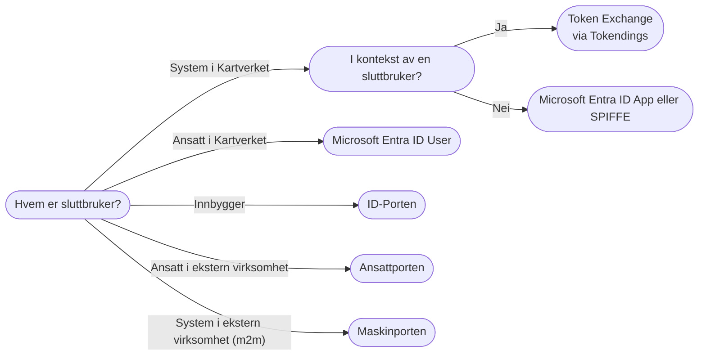
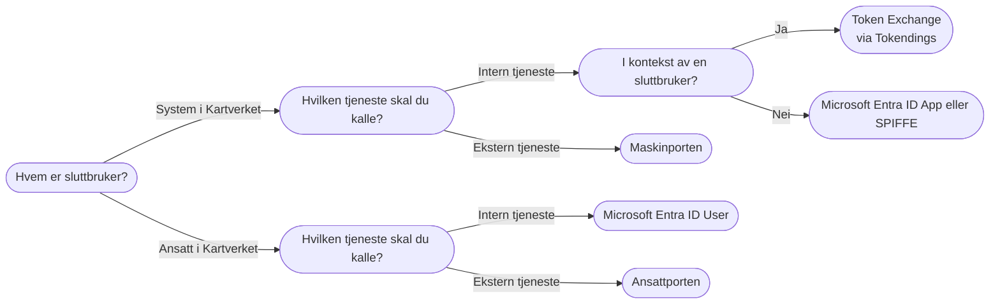

# Valg av identitetstilbyder

Du bør vurdere hvilke(n) identitetstilbyder(e) som passer best til behovene i din applikasjon. Microsoft Entra ID og
Digitaliseringsdirektoratets (Digdir) fellesløsninger; ID-Porten, Maskinporten og Ansattporten er identitetstilbyderne
vi mener dekker bredden av konsumentene av Kartverkets digitale tjenester. I tillegg vil vi innen kort tid tilby Token
Exchange for innveksling av tokens og bevaring av sluttbrukerkontekst i kall til underliggende tjenester. Hvis du har
behov for en annen identitetstilbyder enn de som er listet opp under, ta kontakt med Team Tilgangsstyring på [#gen-tilgangsstyring](https://kartverketgroup.slack.com/archives/C08CJLBLY2X).

Valg av identitetstilbyder(e) kan forenkles å stille seg spørsmålene:
- **"*Hvem er sluttbruker?*"**. Menneske- eller maskinbruker avgjør hvilke identitetstilbydere som er aktuelle
- **"*Hvilken tjeneste skal du kalle?*"**. Interne og eksterne tjenester sikres med ulike identitetstilbydere
- **"*Er jeg i kontekst av en sluttbruker?*"**. Vi ønsker å bevare sluttbrukerkontekst i kall til underliggende tjenester
    ved bruk av Token Exchange

## Som API-tilbyder

```mermaid
flowchart LR;
  konsument([Hvem er sluttbruker?]);
  flyt([I kontekst av en sluttbruker?]);

  konsument -- "System i Kartverket" --> flyt;
  flyt -- "Ja" --> tokendings([Token Exchange<br>via Tokendings]);
  flyt -- "Nei" --> entra-id-app([Microsoft Entra ID App eller SPIFFE]);
  konsument -- "Ansatt i Kartverket" --> entra-id-user([Microsoft Entra ID User]);
  konsument -- "Innbygger" --> id-porten([ID-Porten]);
  konsument -- "Ansatt i ekstern virksomhet" --> ansattporten([Ansattporten]);
  konsument -- "System i ekstern virksomhet (m2m)" --> maskinporten([Maskinporten]);

```
_Valg av identitetstilbyder som API-tilbyder._

Dersom samme API skal brukes av flere typer konsumenter, for eksempel et internt system i Kartverket som blir kalt både
i en sluttbrukerflyt og i en frittstående flyt (f.eks av en `Job`), anbefaler vi å eksponere de ulike tjeneste på ulike
rotstier, f.eks `/api/user/..` og `/api/m2m/..`, fremfor å benytte de samme endepunktene.

### Sikkerhetsnivå for identifikasjon av innbyggere
I følge [veilederen for identifikasjon og sporbarhet i elektronisk kommunikasjon](https://www.digdir.no/digital-samhandling/veileder-identifikasjon-og-sporbarhet-i-elektronisk-kommunikasjon-med-og-i-offentlig-sektor/2992)
skal sikkerhetsnivå velges basert på en risikovurdering. Du må altså ta stilling til hva som er nødvendig sikkerhetsnivå
i din tjeneste. Det defineres tre nivåer av sikkerhet:
- Høy: brukes ved særlig høye krav til sikkerhet. Tofaktorautentisering med identitetskontroll, f.eks BankID, Buypass, Commfides, eller eIDAS
- Betydelig: tilfredsstiller behovet for de fleste tjenester. Tofaktorautentisering basert på kontaktinformasjon i Folkeregistret, f.eks MinID
- Lav: enkel pålogging med en viss sikkerhet. Autentisering f.eks basert på kontaktinformasjon (epost eller telefonnummer) i Kontakt- og reservasjonsregisteret

### Utenlandske brukere
[Her finner du Digdir sin dokumentasjon om utenlanske brukere i ID-porten.](https://docs.digdir.no/docs/idporten/oidc/oidc_func_utanlandske_brukarar.html)
Anno mars 2026 er det kun eIDAS, som er EU sin standard for elektronisk identifikasjon, som støtter sikkerhetsnivå "Høy"
eller "Betydelig" for utenlandske brukere. For brukere utenfor EU, eller fra land som ikke støtter eIDAS, er det kun
bruk av egenregistrerte brukere basert på epost-adresse som kan benyttes. Dette tilsvarer sikkerhetsnivå "Lav". Digdir
har antydet at det vil komme en løsning basert på skanning av pass i løpet av 2026, som tilsvarer sikkerhetsnivå
"Betydelig".

### Utenlandske virksomheter
Maskinporten støtter bruk av utenlandske virksomhetssertifikater, basert på en forenklet tillitsmodell. Før du vurderer
å støtte utenlandske virksomheter via Maskinporten er det viktig  at du setter deg inn i begrensningene denne forenklede
tillitsmodellen medfører. [Her finner du Digdir sin dokumentasjon om utenlandske virksomheter i Maskinporten.](https://docs.digdir.no/docs/Maskinporten/maskinporten_func_european_eseals.html#informasjon-til-norske-api-tilbydere)

## Som API-konsument

```mermaid
flowchart LR;
  konsument([Hvem er sluttbruker?]);
  tjeneste-m2m([Hvilken tjeneste skal du kalle?]);
  tjeneste-h2m([Hvilken tjeneste skal du kalle?]);
  flyt([I kontekst av en sluttbruker?]);

  konsument -- "System i Kartverket" --> tjeneste-m2m;
  konsument -- "Ansatt i Kartverket" --> tjeneste-h2m;

  tjeneste-m2m -- "Ekstern tjeneste" --> maskinporten([Maskinporten]);
  tjeneste-m2m -- "Intern tjeneste" --> flyt;

  flyt -- "Ja" --> tokendings([Token Exchange<br>via Tokendings]);
  flyt -- "Nei" --> entra-id-app([Microsoft Entra ID App eller SPIFFE])

  tjeneste-h2m -- "Intern tjeneste" --> entra-id-user([Microsoft Entra ID User]);
  tjeneste-h2m -- "Ekstern tjeneste" --> ansattporten([Ansattporten]);
```
_Valg av identitetstilbyder som API-konsument._

## Utvidet funksjonalitet med Maskinporten+Altinn

### Maskinporten med Altinn-delegering
Altinn-delegering egner seg dersom du:
1. Ønsker å bruke Maskinporten for å sikre ditt API, og
2. Ønsker å tilgangsstyre API-et ved å gi konsumenter (f.eks en kommune) eksplisitt tilgang via Maskinporten, og
3. Tillater at konsumenter delegerer tilgangen videre til en tredjepart (f.eks en systemleverandør eller et fagsystem),
   som da vil kunne hente tokens på vegne av konsumenten.

Tredjeparten skal _ikke_ ha eksplisitt tilgang til det aktuelle Maskinporten-scopet i dette tilfellet, men vil
kunne hente ut tokens på vegne av konsumenten så lenge konsumenten har tilgang til scopet og har delegert denne
tilgangen videre i Altinn.

[Her kan du lese mer om Altinn-delegering.](./01-delegering.mdx)

### Maskinporten med Altinn-systembruker
Systembrukere i Altinn egner seg dersom du:
1. Ønsker å bruke Maskinporten for å sikre ditt API, og
2. Ønsker å tilgangsstyre API-et ved å gi systemleverandører eksplisitt tilgang via Maskinporten, og
3. Ønsker å tilgangsstyre API-et ved at ansatte i konsumentens virksomhet (f.eks en kommune) med bestemte
   tilgangspakker eller roller i Altinn (f.eks daglig leder) kan opprette systembrukere tilknyttet systemleverandørens
   fagsystem

Konsumentene skal _ikke_ ha eksplisitt tilgang til det aktuelle Maskinporten-scopet i dette tilfellet. Systemleverandør
vil kunne hente ut tokens med konsumentens systembruker som `authorization_details`.

[Her kan du lese mer om systembrukere, systemer og ressurser i Altinn.](./02-systembruker.mdx)

## Utvidet funksjonalitet med Ansattporten, Altinn og Entra ID
Ansattporten kan brukes til kun autentisering, eller til å la brukeren representerer en virksomhet. Du ber om bruk av
representasjon ved å sende en _RAR-type_ (Rich Authorization Requests) i `authorization_details` ved innlogging.
Hvilken kilde som avgjør representasjonen avhenger av hvordan brukeren logger inn:

| Innloggingsmetode | `acr` i token | RAR-type | Autoritativ kilde for representasjon | Status |
| --- | --- | --- | --- | --- |
| BankID, Buypass, Commfides | `high` | `ansattporten:altinn:resource` | Altinn Autorisasjon | I produksjon |
| MinID | `substantial` | `ansattporten:altinn:resource` | Altinn Autorisasjon | I produksjon |
| Jobbkonto i Entra ID | `entraid` | `ansattporten:orgno` | Virksomhetsbroen | Pilot, kun i test |
| Jobbkonto i Entra ID | `entraid` | – | – (kun autentisering) | Pilot, men i produksjon |

### Sammenligning av alternativene

Før du velger å ta i bruk Ansattporten i kombinasjon med enten Altinn-roller eller Entra ID, må du vurdere grundig
hvilke behov du har for autoriativ kilde for representasjon. Tabellen nedenfor sammenligner de ulike alternativene, med
fokus på innlogging, representasjon og administrasjon av tilgang.

| | Ansattporten med Altinn-roller | Ansattporten med Entra ID | Ansattporten med Entra ID og Virksomhetsbroen | Gjestebruker (B2B) i Kartverkets Entra ID |
| --- | --- | --- | --- | --- |
| **Innlogging** | BankID, MinID o.l. | Jobbkonto i Entra ID | Jobbkonto i Entra ID | Jobbkonto i Entra ID |
| **Vet hvilken virksomhet brukeren representerer** | Ja, via Altinn | Nei | Ja, via Virksomhetsbroen | Nei, med mindre Kartverket registrerer det |
| **Hvem administrerer tilgang?** | Arbeidsgiver, i Altinn | Tjenesteeier, i egen tjeneste | Arbeidsgiver, i Virksomhetsbroen | Kartverket |
| **Forutsetninger hos tjenesteeier** | Altinn-ressurs i ressursregisteret | Ansattporten-klient | Ansattporten-klient | Invitasjon og livsløpsforvaltning av gjester |

### Kombinere innloggingsmetoder
Du kan tilby flere innloggingsmetoder i samme tjeneste ved å sende f.eks. `acr_values: substantial,entraid` ved redirect
til Ansattporten-innlogging. Brukeren velger da selv, og du må håndtere begge utfallene. Valider alltid `acr`-claimet og
`authorization_details`-claimet i tokenet, slik at en bruker ikke får tilgang basert på en innloggingsmetode eller
representasjonskilde du ikke har tatt stilling til.

### Ansattporten med representasjon via Altinn-roller
Egner seg dersom du:
1. Ønsker å la ansatte i eksterne virksomheter logge inn med Ansattporten, og
2. Ønsker å vite hvilken virksomhet brukeren representerer, og
3. Ønsker at virksomheten selv skal styre tilgangen i Altinn, basert på roller (f.eks. daglig leder), tilgangspakker
   eller enkeltrettigheter

[Her kan du lese mer om hvordan du kan bruke Ansattporten i kombinasjon med Altinn-roller.](./03-altinn-roller.mdx)

### Ansattporten med Entra ID og representasjon via Virksomhetsbroen
Egner seg dersom du:
1. Ønsker å bruke innlogging med Entra ID i Ansattporten, og
2. Ønsker at arbeidsgiveren selv skal styre hvilke av sine ansatte som kan representere virksomheten i tjenesten din,
   ved hjelp av egne Entra-grupper, e-postdomener eller e-postadresser

Funksjonaliteten er i pilot, og RAR-typen `ansattporten:orgno` er ifølge Digdir foreløpig kun tilgjengelig i test.

[Her kan du lese mer om Ansattporten med Entra ID og Virksomhetsbroen.](./04-virksomhetsbroen.mdx)

### Ansattporten med Entra ID, uten representasjon
Egner seg dersom du:
1. Ønsker å la ansatte i eksterne virksomheter logge inn med Ansattporten, og
2. Ønsker å tilby innlogging med jobbkontoen i Microsoft Entra ID, i stedet for eller i tillegg til BankID/MinID, og
3. Ikke trenger at Ansattporten forteller deg hvilken virksomhet brukeren representerer

Innlogging med Entra ID gir autentisering, men ikke autorisasjon.

[Her kan du lese mer om innlogging med Entra ID i Ansattporten.](./05-ansattporten-entra-id.mdx)
