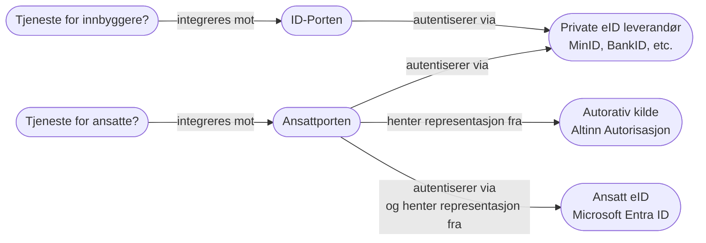

# Ansattporten

For å registrere en klient i Ansattporten har du to muligheter:
- Bruke Digdir sin [selvbetjeningsløsning](https://sjolvbetjening.samarbeid.digdir.no/login). Du søker om tilgang til
selvbetjeningsløsningen via Pureservice.
- Bruke Kubernetes-ressursen `AnsattportenClient`. Denne ressurstypen er tilgjengelig via Kubernetes-operatoren
[Digdirator](https://github.com/nais/digdirator), utviklet av [NAV sitt plattformteam (NAIS)](https://nais.io).

Ansattporten er en relativt ny fellesløsning utviklet av Digdir for innlogging for ansatte i offentlige og tilknyttede virksomheter. 
Der ID‑porten er for innbyggere, brukes Ansattporten når sluttbrukeren er en ansatt som skal få tilgang til en tjeneste på vegne av sin arbeidsgiver, såkalt **representasjon**. 
Representasjon for virksomheter styres i [Altinn](https://info.altinn.no/), og Ansattporten knytter sammen deg som person med representasjon tildelt til ulike virksomheter i Altinn. 
Du kan lese mer om Ansattporten på [Digdir sine sider](https://docs.digdir.no/docs/ansattporten/ansattporten_om.html).

## 🧪 Testmiljø for Ansattporten

Digdir tilbyr Ansattporten i et testmiljø, der du kan teste applikasjonen din med syntetiske brukere fra Test-Folkeregisteret og syntetiske organisasjoner. 
For å registrere en klient mot Ansattporten sitt testmiljø så kan du benytte deg av Digdir sin [selvbetjeningsløsning i test](https://sjolvbetjening.test.samarbeid.digdir.no/login) 
Du kan også teste ut å gi ulike representasjoner til syntetiske organisasjoner for test-brukere i [Altinn sitt test-miljø](https://info.tt02.altinn.no/).

## 🔹 Federering til Microsoft Entra ID

Digdir annerkjenner at Microsoft Entra ID brukes som intern identitetstilbyder for brorparten av offentlige virksomheter i Norge. 
Som et resultat av dette har de derfor implementert støtte for såkalt "federering" mellom Ansattporten og Microsoft Entra ID.
Dette betyr at når en sluttbruker skal logge inn via Ansattporten, og vedkommende sin arbeidsgiver bruker Microsoft Entra ID, 
så vil brukeren bli omdirigert til sin egen virksomhets Microsoft Entra ID for autentisering før de returneres til Ansattporten for autorisering og tildeling av riktige representasjoner. 
Dette gjør det enklere for en virksomhet å enkelt vedlikeholde hvem som skal ha hvilke rettigheter til andre virksomheter sine tjenester, samtidig som sluttbrukeren får en sømløs innloggingsopplevelse ved å bruke sin vante påloggingsmetode.


_Skisse over Ansattporten og ID-Porten._

## 🪪 Klientregistrering med `AnsattportenClient`

En `AnsattportenClient` er en CRD som lar brukere deklarativt opprette og vedlikeholde Ansattporten-klientregistreringer.

:::caution
Ztoperator støtter per nå kun klientregistreringer som identifiserer seg mot Ansattporten med `client_secret_post`.
Ettersom Digdirator kun oppretter klientregistreringer med `private_key_jwt`, så vil disse ikke fungere med Ztoperator.
Vi jobber med å få på plass støtte for `private_key_jwt` i Ztoperator.
:::

<details>
    <summary><strong>spec</strong> _(object, required)_ – Spesifikasjon til `AnsattportenClient`</summary>

    <p><strong>secretName</strong> _(string, required)_ – Navnet på den resulterende `Secret`-ressursen som vil bli opprettet.</p>

    <p><strong>frontchannelLogoutURI</strong> _(string, required)_ – URL som Ansattporten omdirigerer til når en utlogging utløses av en annen applikasjon.</p>

    <p><strong>redirectURIs</strong> _([]string, required)_ – Liste over redirect URI-er som skal registreres hos DigDir.</p>

    <p><strong>postLogoutRedirectURIs</strong> _([]string, optional)_ – Liste over gyldige URI-er hvor Ansattporten kan omdirigere etter utlogging.</p>

    <p><strong>accessTokenLifetime</strong> _(integer, optional)_ – Maksimal levetid i sekunder for `access_token` som returneres fra Ansattporten. Min: 1, maks: 3600.</p>

    <p><strong>clientURI</strong> _(string, optional)_ – URL til klienten brukt av DigDir når en 'tilbake'-knapp vises eller ved feil.</p>

    <p><strong>clientName</strong> _(string, optional)_ – Navnet på klienten registrert hos DigDir. Vises under innlogging for brukerorienterte flyter.</p>

    <p><strong>sessionLifetime</strong> _(integer, optional)_ – Maksimal øktlevetid i sekunder for en innlogget sluttbruker for denne klienten. Min: 3600, maks: 28800.</p>

</details>

Følgende eksempel registrerer en klientintegrasjon mot Ansattporten.
Når registrering er fullført vil Digdirator opprette Kubernetes-hemmeligheten `ansattporten-secret` i namespacet `tilgangsstyring-main`.

```yaml title="Klientregistrering mot Ansattporten med Digdirator"
apiVersion: nais.io/v1
kind: AnsattportenClient
metadata:
  name: test-client
  namespace: tilgansstyring-main
spec:
  clientName: Test Application
  clientURI: https://test-app.atgcp1-sandbox.kartverket-intern.cloud
  frontchannelLogoutURI: https://test-app.atgcp1-sandbox.kartverket-intern.cloud/oauth2/logout
  postLogoutRedirectURIs:
    - https://test-app.atgcp1-sandbox.kartverket-intern.cloud/
  redirectURIs:
    - https://test-app.atgcp1-sandbox.kartverket-intern.cloud/oauth2/callback
  secretName: ansattporten-secret
```

```yaml title="Hemmelighet opprettet av Digdirator etter fullført klientregistrering"
apiVersion: v1
kind: Secret
metadata:
  name: ansattporten-secret
  namespace: tilgangsstyring-main
data:
  ANSATTPORTEN_CLIENT_ID: ++++++++
  ANSATTPORTEN_CLIENT_JWK: ++++++++
  ANSATTPORTEN_ISSUER: ++++++++
  ANSATTPORTEN_JWKS_URI: ++++++++
  ANSATTPORTEN_REDIRECT_URI: ++++++++
  ANSATTPORTEN_TOKEN_ENDPOINT: ++++++++
  ANSATTPORTEN_WELL_KNOWN_URL: ++++++++
type: Opaque
```

