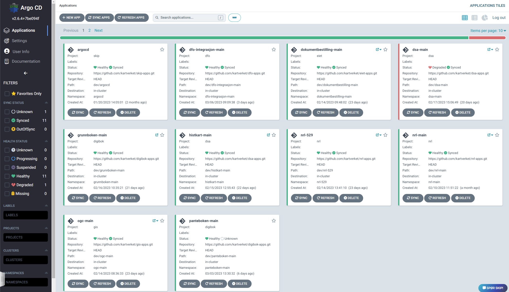
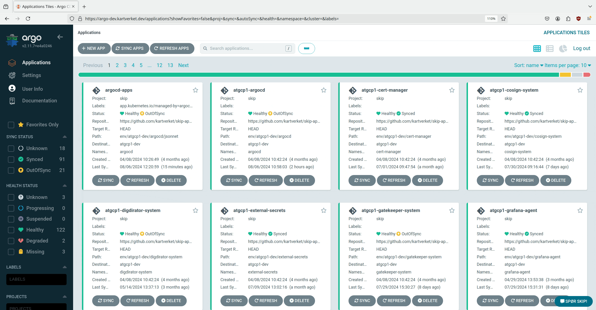

# Hvordan bruke Argo CD

Argo har et godt grensesnitt som gir godt innsyn inn i synkingen av manifester til SKIP, og her skal vi nevne noen funksjoner som er verdt å vite om. Det anbefales også å se på [Argo sin brukerdokumentasjon](https://argo-cd.readthedocs.io/en/stable/user-guide/) for Argo CD, den er godt skrevet og inneholder god informasjon om hvordan man skal bruke systemet.

Om man ellers skulle ha spørsmål rundt bruk av Argo CD anbefaler vi å spørre på [#gen-argocd](https://kartverketgroup.slack.com/archives/C04KH6A4FNW) -kanalen på Slack.

Vi kan også anbefale kurset [https://kodekloud.com/courses/argocd/](https://kodekloud.com/courses/argocd/) for de som ønsker en lengre gjennomgang.

## Applikasjoner

Det første man gjør når man skal ta i bruk Argo er å gå til nettsiden og logge inn. Lenkene til nettsiden finner man på [Argo CD](index.md) og alle kan logge inn med kartverket-brukeren sin hvis man er på et team som har fulgt [Komme i gang med Argo CD](komme_igang_med_argocd.md).



Det neste som møter deg er en oversikt over applikasjonene som Argo leser ut, avbildet over. Dersom man ikke sere noen applikasjoner her, sjekk om dere har fulgt alle stegene i [Komme i gang med Argo CD](komme_igang_med_argocd.md) og at dere har manifester som er satt opp til å bli synket inn fra [apps-repoet](02-hva-er-et-apps-repo.md) deres. Disse prosjektene blir automatisk opprettet basert på mappestrukturen i apps-repoet deres, så det er ingen behov for å opprette eller rydde opp prosjekter manuelt.

Klikk på et av kortene på denne siden og dere vil gå inn i en mer detaljert visning hvor man ser alle ressursene som blir synkronisert.


Dersom man bruker Skiperator og eksponererer en URL via `ingresses` vil man også kunne se små ikoner som er lenker og om man klikker på dem åpnes applikasjonen i nettleseren.

Det er også et sett med filtere på venstre side som er lurt å bli kjent med, spesielt dersom applikasjonene blir store og vanskelige å se på en skjerm uten å scrolle.

## Sync


:::info
Merk at i dev synkroniseres applikasjoner automatisk
:::

På prosjektsiden ser man alle kubernetes-ressurser som er en del av applikasjonen. Legg merke til de små fargede symbolene på hvert kort som sier noe om statusen på ressursen. Hvis de er grønne viser det at den ressursen er “healthy”. Dersom den er rød er det et tegn på at noe er galt med ressursen. Dersom den er gul er den “ute av synk”, og da må man synkronisere applikasjonen.

Bildet over viser hvordan man kan synkronisere ut endringene til kubernetes-miljøet. Sync-knappen i menylinjen lar deg velge hvordan ting skal synkroniseres ut, og man kan til og med gjøre en [Selective Sync](https://argo-cd.readthedocs.io/en/stable/user-guide/selective_sync/) av kun noen av ressursene. Det vanligste og tryggeste er vel å merke å synkronisere alt med default-innstillingene.

Dersom en synk ikke har fungert vil man se en feilmelding i menylinjen øverst. I det tilfellet kan det være lurt å trykke på “sync status”-knappen øverst for å få en mer detaljert oversikt over hva som har gått galt.

## Rollback


I noen tilfeller kan man tenke seg at en uønsket endring er kommet ut i kjøremiljøet. Da vil den raskeste og enkleste måten å gjenopprette funksjonaliteten for brukerene ofte være en rollback til en tidligere kjent fungerende versjon.

Rollbacks er det innebygget støtte for i Argo CD som en del av applikasjonsvisningen. Klikk “History and rollback” for å få en liste over alle tidligere synker som er gjort i denne applikasjonen. Dersom man ønsker å rulle tilbake finner man versjonen man ønsker i listen og trykker på de tre prikkene og velger rollback. “Revisjonene” i listen peker på en commit i git-historikken til apps-repoet.

Ved en rollback gjør Argo CD en synk som vanlig, men mot en tidligere kjent tilstand. Den vil da ikke bruke tilstanden som ligger i git, men tilstanden til en tidligere synk. Etter en rollback vil applikasjonen stå som “out of sync”, og det er forventet siden den ikke matcher tilstanden i git.

:::info
Husk at container imaget må finnes for at det skal være mulig å rulle tilbake. Om container imaget er slettet i [ghcr.io](http://ghcr.io/) , for eksempel av en oppryddingsjobb, så vil det ikke være mulig å starte opp den tidligere versjonen.
:::

## Detaljer og Web Terminal


Dersom man klikker på en ressurs i prosjektvisningen vil man se flere detaljer om denne ressursen. Man finner blant annet en oversikt over metadata, manfiest-filen som Argo CD skal synke ut, events og logger.

Det er også mulig å endre på manifestfilen som ligger i clusteret om man går på “live manifest” og trykker “edit”. Dette vil føre til at applikasjonen kommer ut av synk, og i miljøer hvor auto-synking er skrudd på vil det tilbakestilles med en gang. Men i noen tilfeller kan det være nyttig.


Legg også merke til “terminal”-fanen. Denne er kun synlig om man velger en pod. Velger man denne fanen får man en live terminaltilkobling inn til podden som man kan bruke til feilsøking.

:::info
Web terminal er ikke tilgjengelig i prod
:::

## Hvordan bruke Argo gjennom API
Visst du ønsker å automatisere oppgaver, for eksempel synk ved ny image versjon så kan det være greit å ha muligheten til å gjøre dette fra Github. Det første du trengre da er nettverkstilgang fra Github, det får du med [tailscale](https://kartverket.atlassian.net/wiki/spaces/SKIPDOK/pages/683376648). 

For å autentisere mot Argo så må du generere en JWT, dette kan du gjøre i Argo UIet. Gå inn på f.eks https://argo-dev.kartverket.dev, trykk på settings oppe til venstre → Projects → ditt prosjekt → trykk på “Roles” fanen, og deretter på apiuser. Scroll helt ned på modalen som kommer opp og trykk Create under JWT Tokens. Det er samme framgangsmåte i andre miljø.



Etter at token er generert kan du testen den med kommandoen:

```
curl https://argo-dev.kartverket.dev/api/v1/applications/<min-app> -H "Content-Type: application/json" -H "Authorization: Bearer <token>"
```

Argos API spec kan man finne her: https://argo-dev.kartverket.dev/swagger-ui
