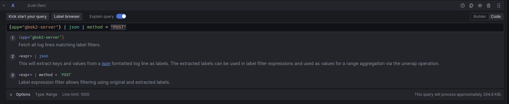

# Logs with Loki

SKIP’s LGTM stack is set up to automatically collect logs from all applications running in our Kubernetes clusters. There is nothing in particular you as a developer need to configure or set in order to achieve this, apart from ensuring that your application logs to `stdout` . These are picked up by the Grafana Agent through the `PodLogs` custom resource, which specifies which namespaces to collect logs for (all of them in this case) and a set of relabeling rules to ensure that we have a common set of labels for use in searching, dashboards and alerting.

Logs are collected and stored in Loki, which is backed by an on-premise S3-compatible Scality storage bucket system, one for each cluster. Each Loki instance is defined as a data source in Grafana, which provides the tools for search queries, dashboards and alerting.

For an overview of the Explore section as it pertains to Loki, see [https://grafana.com/docs/grafana/latest/explore/logs-integration/](https://grafana.com/docs/grafana/latest/explore/logs-integration/) . This and other pages outline the features and how to use it efficiently in relatively good detail, so we shall not attempt to reproduce such a guide here, only to point out a few things as they apply to our own setup.

By necessity, the default label set is rather limited compared to what some of you might wish. This is because a large selection of labels can be extremely detrimental to performance - see [https://grafana.com/docs/loki/latest/get-started/labels/bp-labels/](https://grafana.com/docs/loki/latest/get-started/labels/bp-labels/) for an explanation.

Hence, it is recommended to use filter expressions instead. You can filter on log lines containing/not containing a given text, regex expression and a host of other possibilities.

The search function is also equipped with a JSON parser which makes it easier to filter on the fields you want.

You can choose between two modes of searching: typing a query manually, or building a query through Grafana’s graphical query builder. As long as the query you have built or typed is valid, you can seamlessly switch between the two modes.

Above: Using JSON parser to extract fields and filtering on method “POST”
