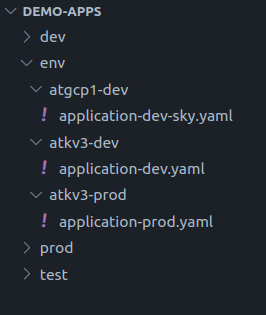

# Migrering fra atkv1 til atkv3

Vi har satt opp et nytt cluster! Dette clusteret er på ny fin hardware og med nye arkitekturløsninger.

## Deployment av applikasjoner til nye clustere

Vi har begynt å få mange cluster etterhvert, og har derfor valgt å gjøre om litt på mappestrukturen i apps repoet. I dag har vi en struktur som, litt forenklet, ser slik ut:

Vi kommer til å havne på en struktur hvor hvert cluster man ønsker å deployere til er representert med en egen mappe under env:

Legg merke til at de gamle mappene kan eksistere sammen med de nye, og det skjer ikke noe med det som ligger i atkv1-dev/prod før mappene fjernes.

## Åpninger til tjenester utenfor skip

For å kunne nå tjenester som er internt på kartverket, men utenfor skip, eller i et annet cluster må det også bestilles åpninger til disse på nytt, siden atkv3 clusteret er del av en annen brannmursone.

Har man i dag tilgang til et NFS share, eller en database må dette testes, og eventuelle åpninger bestilles før det kan fungere.

## DNS

Dev clusteret støtter kun adresser under domene atkv3-dev.kartverket-intern.cloud for interne og atkv3-dev.kartverket.cloud for eksterne. Produksjonsclusteret støtter atkv3-prod.kartverket-intern.cloud og atkv3-prod.kartverket.cloud. Men det vil i produksjonsclusteret også være mulig å definere sine egne domener eksternt. Egene vanity URL-er som f.eks nrl.kartverket.no som allerede eksisterer på atkv1 i dag, pekes i dag til lb01.kartverket.no må da pekes over til ny lastbalanserer (atkv3-prod.kartverket.cloud) for å kunne nås på atkv3.

## Test clusteret finnes ikke lenger!

Test clusteret finnes ikke lenger, alternativet her er å bruke namespace i enten dev eller prod cluster. Har man test-tjenester som skal være tilgjengelig for brukere utenfor kartverket, bør dette legges til produksjons clusteret, og dev clusteret støtter kun, som nevnt, adresser i domenet atkv3-dev.kartverket.cloud for ekstern tilgang, og atkv3-dev.kartverket-intern.cloud for interne.

## Endringer på ArgoCD

For å kunne administrere flere cluster, med færre ArgoCD instanser har vi valgt å konsolidere alle for dev og prod til en instans for prod, og en for dev. Disse legges i sky, sammen med den nye grafana instansen. Dette gjør at vi får en prefix for alle argo applikasjoner med clusteret, feks atkv3-KulApplikasjon eller atgcp1-KulApplikasjon, som vil kunne ligge på samme argoinstans, men på to forskjellige clustere. ArgoCD kan nås [HER](https://argo.kartverket.dev/).

## Endringer på Grafana

Egress fra sky koster penger, mens ingress er gratis. Så for å slippe å hente ut data fra sky cluster til on-prem for å vise det i grafana, velger vi å vise data onprem via sky. Det gjør at logger og metrikker som vises i den nye grafana visualisers i sky, men lagres fremdeles on-prem.

:::note
Hva betyr dette for deg? Logger lagres fremdeles på Kartverket men går via Google Cloud idet man leser dem. Dere må ha et forhold til loggenes innhold og bekrefte at dere forstår at de går via Google Cloud og aksepterer det før dere starter migrering til atkv3.
:::

:::info
Ny URL: [https://monitoring.kartverket.cloud](https://monitoring.kartverket.cloud/)
:::

### Trafikk-flyt ArgoCD og Grafana

