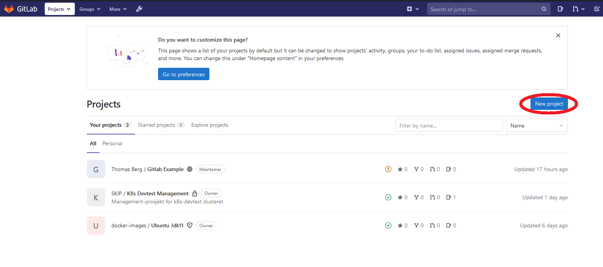
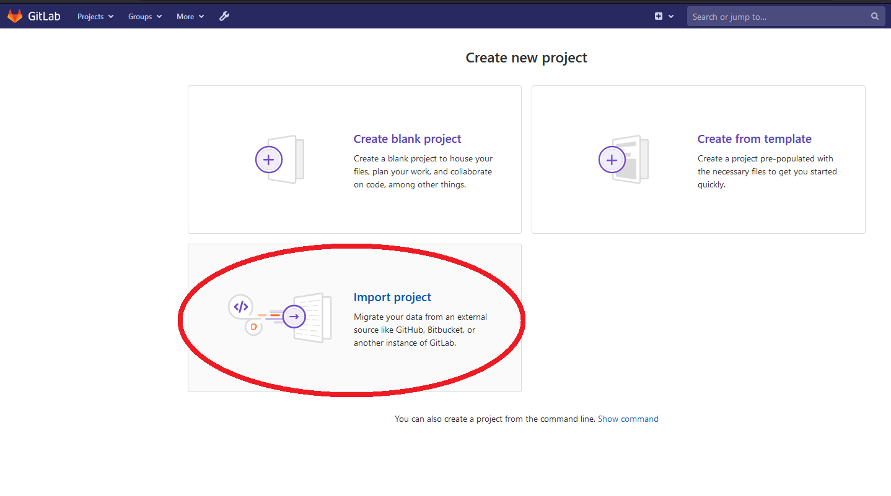
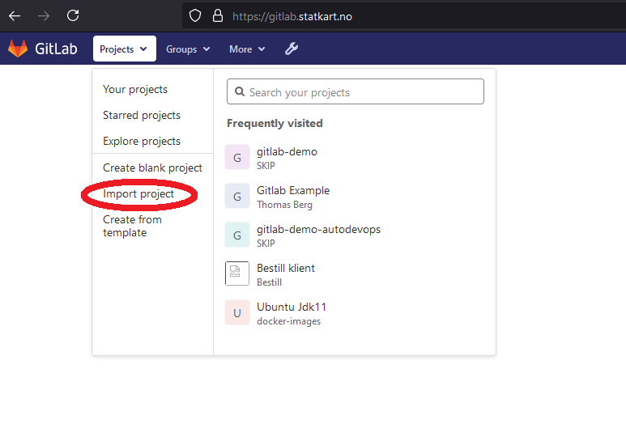

# Grupper og prosjekter i GitLab

GitLab er tilgjengelig på https://gitlab.statkart.no og vil være primært
kildekodelager (Git-repo) for Kartverkets utviklingsavdelinger framover.

En viktig forskjell mellom GitLab og Bitbucket å merke seg er følgende:

Bitbucket opererer med begrepene prosjekter og repoer, hvor prosjekter er en
ansamling repositories som naturlig henger sammen.

GitLab opererer med begrepene grupper og prosjekter Prosjekter i GitLab består
av ett enkelt repository pluss en ansamling verktøy for å støtte opp om dette
- CI/CD byggeløyper, wiki, issue tracking, miljøoversikt ++. Grupper i GitLab er
et overordnet nivå hvor man kan samle flere prosjekter og benytte nevnte
støtteverktøy på et overordnet nivå for samtlige prosjekter i gruppen. Typisk
vil hvert prosjekt i Bitbucket være en gruppe i GitLab, og hvert repo være et
prosjekt.

Alle brukere i GitLab har rettigheter til å opprette både grupper og prosjekter,
og brukere som administrerer prosjekter og grupper kan selv styre tilgangen til
disse, både på enkeltbruker og gruppenivå.

## Import av prosjekt fra Bitbucket Server

Man kan importere repoer fra Bitbucket ved å velge "Import project", enten fra
"Your projects"-skjermbildet og knappen "New project", eller fra dropdown-menyen
oppe i venstre hjørne.

Alternativ 1: via "Your projects" og "New Project"

Alternativ 2: via dropdown-meny

I "Import Project" skjermbildet velger man så "Bitbucket Server" (IKKE Bitbucket
Cloud). I neste skjermbilde legger man inn URL til Bitbucket, brukernavnet ditt
i Bitbucket samt en Personal Access Token.

Denne token får man ved å gå inn i Bitbucket-profilen sin, velge "Manage
account", velge "Personal access token" i lista til venstre, velge "Create
a token", gi den et navn og trykke "Create".

Kopier den kodenøkkelen du får og legg den inn i skjermbildet. Hvis du har behov
for denne senere, må du huske på å lagre den på et sikkert sted, da man ikke får
  lest ut eksisterende tokens på nytt via Bitbucket, men må isåfall lage nytt
  token.

Klikk så på "List your Bitbucket Server repositories", og klikk så på det
aktuelle repoet man ønsker å importere fra listen som dukker opp.

