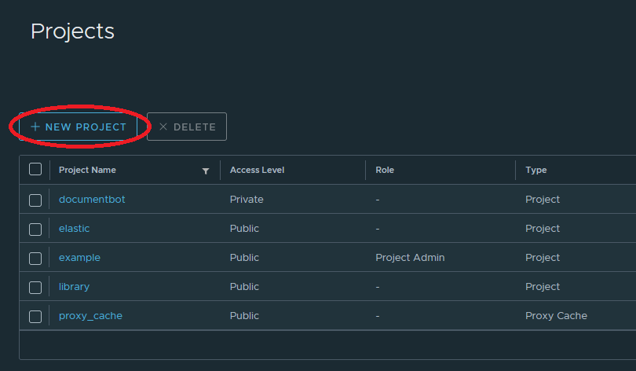
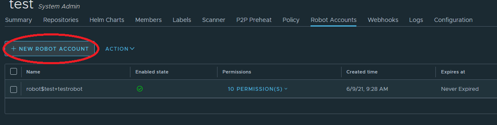

# Oppsett og bruk av Harbor

For å kunne publisere docker-images til registry i Harbor, må man ha opprettet
et prosjekt hvor disse kan ligge.

Et Harbor-prosjekt kan omfatte flere repoer, og det vil være naturlig at repoer
som naturlig henger sammen publiserer til samme prosjekt. Eksempelvis vil
Bestill bruke ett Harbor-prosjekt for alle sine repoer, NRL2 bruke et annet osv.


## Opprette nytt prosjekt

Alle brukere kan opprette prosjekter i Harbor. Logg inn på
https://harbor.statkart.no med standard AD-brukernavn/passord.


Velg "New project".



Skriv inn et passende navn på prosjektet, svarer ofte til navnet på
GitLab-gruppen hvor repoet man publiserer fra ligger under (bestill, nrl2, gbok,
osv.)


OBS! Huk av på "Public" under Access Level, slik at man kan pulle images fra repoet uten å måtte logge seg inn.

## Opprette robot-bruker for pushing av images fra GitLab

For å publisere docker images fra GitLab-jobber trengs en robot-bruker, slik at man slipper å måtte autentisere seg med personlig bruker for slike operasjoner. Hvert prosjekt skal ha sin egen robot-bruker.

Klikk inn på prosjektet man ønsker å lage robot-bruker for. Velg "Robot Accounts"-fanen, og klikk på knappen "New Robot Account". Gi roboten et kort, saklig navn, velg utløpstid i antall dager (eller "Never").




Merk at det fulle navnet på roboten er en kombinasjon av "robot$", pluss navnet på prosjektet, pluss navnet man skriver inn.

Klikk "Add". I neste skjermbilde kommer navn og token opp. Klikk "Export to file" og lagre denne på et sikkert sted. Man kan ikke hente ut eller endre token'et til roboten i etterkant, dersom man har mistet det og trenger robot-bruker, må man opprette ny.

## Bruk av proxy cache


Harbor kan også brukes som proxy cache på samme måte som vi har brukt Nexus tidligere, altså hente inn docker images utenfra gjennom Harbor istedenfor direkte fra GitHub. Dette muliggjør bl.a. sikkerhetsscanning av docker images utenfra også. Merk at per nå støttes det bare proxying av Docker Hub. Det kan ved behov legges til andre kilder også, men støtten for dette er meget begrenset (p.t. bare andre Harbor-registere).

Proxy cache brukes på samme måte som Nexus:

```
> docker pull harbor.statkart.no/proxy_cache/<reponavn>/<imagenavn>:<tag>
```

Reponavn erstattes med library dersom man puller fra single-level repoer:


```
> docker pull harbor.statkart.no/proxy_cache/library/ubuntu:20.04
```

https://goharbor.io/docs/2.1.0/administration/configure-proxy-cache/


